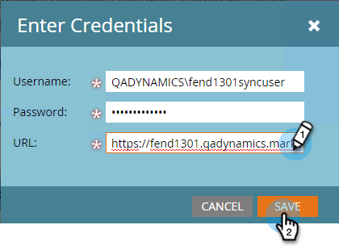

# Étape 3 sur 3 : Connect Marketo and Dynamics (2013 sur site) {#step-of-connect-marketo-and-dynamics-on-premises}

D&#39;accord ! Nous avons installé la solution et configuré l&#39;utilisateur de synchronisation. Ensuite, nous devons connecter Marketing et Dynamics.

>[!PREREQUISITES]
>
>* [Étape 1 sur 3 : Installer la solution Marketo dans Dynamics (local 2013)](step-1-of-3-install.md)
>* [Étape 2 sur 3 : Configurer l&#39;utilisateur de synchronisation pour Marketo (local 2013)](step-2-of-3-configure.md)

>

>[!NOTE]
>
>**Autorisations d’administrateur requises**

## Entrer les informations utilisateur de Dynamics Sync {#enter-dynamics-sync-user-information}

1. Connectez-vous à Marketing et cliquez sur **Admin**.

   

1. Cliquez sur **CRM**.

   

1. Sélectionnez **Microsoft**.

   

1. Cliquez sur **MODIFIER** à l’ **étape 1 : Saisissez des informations d’identification**.

   

   >[!CAUTION]
   >
   >Assurez-vous que vos informations d’identification sont correctes car nous ne pouvons pas annuler les modifications de schéma suivantes après l’envoi. Si des informations d’identification incorrectes sont enregistrées, vous devrez obtenir un nouvel abonnement Marketo.

1. Saisissez le **nom d&#39;utilisateur**, le **mot de passe** et l&#39; **URL** Microsoft Dynamics, puis cliquez sur **ENREGISTRER.**

   

   >[!NOTE]
   >
   >Le nom d’utilisateur dans Marketo doit correspondre au nom d’utilisateur de l’utilisateur synchronisé dans CRM. Le format peut être [`[email protected]`](http://docs.marketo.com/cdn-cgi/l/email-protection#631610061123070c0e020a0d4d000c0e) ou DOMAINE\utilisateur.

   >[!TIP]
   >
   >Vous ne connaissez pas l&#39;URL ? Nous vous montrerons comment trouver l&#39;URL [du service d&#39;organisation](../../../../../product-docs/crm-sync/microsoft-dynamics-sync/sync-setup/view-the-organization-service-url.md) Dynamics ici.

## Sélectionner les champs à synchroniser {#select-fields-to-sync}

Maintenant, nous devons sélectionner les champs sur lesquels nous voulons synchroniser.

1. Cliquez sur **MODIFIER **à l’ **étape 2 : Sélectionnez Champs à synchroniser**.

   

1. Sélectionnez les champs que vous souhaitez synchroniser avec Marketo afin qu’ils soient présélectionnés. Cliquez sur **Enregistrer**.

   

## Champs de synchronisation pour un filtre personnalisé {#sync-fields-for-a-custom-filter}

Si vous avez créé un filtre personnalisé, veillez à entrer et à sélectionner les nouveaux champs à synchroniser avec Marketo.

1. Accédez à Admin et sélectionnez **Microsoft Dynamics**.

   

1. Cliquez sur **Modifier** dans Détails de synchronisation des champs.

   

1. Faites défiler l’écran jusqu’au champ et cochez-le. Le nom réel doit être new_synctomkto, mais le nom d’affichage peut être n’importe quoi. Cliquez sur **Enregistrer**.

   

## Activer la synchronisation {#enable-sync}

1. Cliquez sur **MODIFIER **à l’ **étape 3 : Activez Synchroniser**.

   

   >[!CAUTION]
   >
   >Marketo ne dédupliquera pas automatiquement une synchronisation Microsoft Dynamics ou lorsque vous entrez manuellement des personnes ou des pistes.

1. Lisez tout ce qui se trouve dans la fenêtre contextuelle, entrez votre adresse électronique, puis cliquez sur **DÉBUT SYNC**.

   

1. La première synchronisation peut prendre quelques heures. Une fois que vous aurez terminé, vous recevrez une notification par courrier électronique.

   

Excellent travail ! Vous venez de libérer la puissance de la synchronisation bidirectionnelle entre Marketo et Microsoft Dynamics. Si vous avez acheté Marketo Sales Insight, il y a plus de plaisir à avoir :

>[!NOTE]
>
>**Articles connexes**
>
>* [Installation et configuration de Marketo Sales Insight dans Microsoft Dynamics 2013](../../../../../product-docs/marketo-sales-insight/msi-for-microsoft-dynamics/installing/install-and-configure-marketo-sales-insight-in-microsoft-dynamics-2013.md)

>

