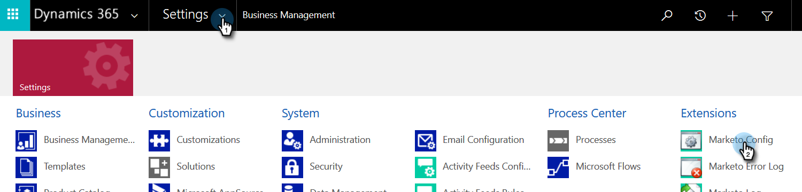

# Étape 2 sur 4 : configuration de la solution Marketo avec la connexion de contrôle de mot de passe du propriétaire de la ressource {#step-2-of-4-set-up-the-marketo-solution-ropc}

Commençons par créer un compte utilisateur.

>[!PREREQUISITES]
>
>[Étape 1 sur 4 : installation de la solution Marketo avec la connexion de contrôle de mot de passe du propriétaire de la ressource](/help/marketo/product-docs/crm-sync/microsoft-dynamics-sync/sync-setup/microsoft-dynamics-365-with-ropc-connection/step-1-of-4-install.md){target="_blank"}

## Création d’un utilisateur {#create-a-new-user}

1. Connectez-vous à Dynamics. Cliquez sur l’icône Paramètres et sélectionnez **[!UICONTROL Paramètres avancés]**.

   

1. Cliquez sur **[!UICONTROL Paramètres]** et sélectionnez **[!UICONTROL Sécurité]**.

   

1. Cliquez sur **[!UICONTROL Utilisateurs]**.

   

1. Cliquez sur **[!UICONTROL Nouveau]**.

   

1. Cliquez sur **[!UICONTROL Ajout d’utilisateurs et licence]** dans la nouvelle fenêtre.

   

1. Un nouvel onglet s’ouvre. Cliquez sur **[!UICONTROL Administration]** en haut de la page.

   

1. Un autre nouvel onglet s’ouvre. Cliquez sur **[!UICONTROL Ajout d’un utilisateur]**.

   

   >[!IMPORTANT]
   >
   >L’utilisateur de synchronisation doit disposer d’une autorisation en lecture sur la configuration Marketo.

1. Saisissez toutes vos informations. Lorsque vous avez terminé, cliquez sur **[!UICONTROL Ajouter]**.

   

   >[!NOTE]
   >
   >Ce nom doit être un utilisateur de synchronisation dédié et non un compte d’utilisateur CRM existant. Il ne doit pas nécessairement s’agir d’une adresse électronique réelle.

1. Saisissez l’e-mail de réception des nouvelles informations d’identification de l’utilisateur, puis cliquez sur **[!UICONTROL Envoyer un email et fermer]**.

   

## Attribution d’un rôle d’utilisateur de synchronisation {#assign-sync-user-role}

Attribuez le rôle Utilisateur de synchronisation Marketo uniquement à l’utilisateur de synchronisation Marketo. Vous n’avez pas besoin de l’affecter à d’autres utilisateurs.

>[!NOTE]
>
>Cela s’applique à Marketo version 4.0.0.14 et ultérieure. Pour les versions antérieures, tous les utilisateurs doivent disposer du rôle d’utilisateur de synchronisation. Pour mettre à niveau Marketo, voir [Mise à niveau de la solution Marketo pour Microsoft Dynamics](/help/marketo/product-docs/crm-sync/microsoft-dynamics-sync/sync-setup/update-the-marketo-solution-for-microsoft-dynamics.md){target="_blank"}.

>[!IMPORTANT]
>
>Paramètre de langue de l’utilisateur de synchronisation [doit être défini sur Anglais.](https://portal.dynamics365support.com/knowledgebase/article/KA-01201/en-us){target="_blank"}.

1. Revenez au **[!UICONTROL Utilisateurs activés]** et actualisez la liste des utilisateurs.

   

1. Passez la souris sur l’utilisateur de synchronisation Marketo nouvellement créé pour afficher une case à cocher. Cliquez pour le sélectionner.

   

1. Cliquez sur **[!UICONTROL Gestion des rôles]**.

   

1. Vérifier **[!UICONTROL Utilisateur de synchronisation Marketo]** et cliquez sur **[!UICONTROL OK]**.

   

   >[!NOTE]
   >
   >Toutes les mises à jour effectuées dans votre CRM par l’utilisateur de synchronisation _not_ être synchronisé à nouveau avec Marketo.

## Configuration de la solution Marketo {#configure-marketo-solution}

Presque là ! Il ne nous reste plus qu’à informer la solution Marketo sur le nouvel utilisateur créé.

1. Revenez à la section Paramètres avancés et cliquez sur le bouton  en regard de Paramètres, sélectionnez **[!UICONTROL Configuration Marketo]**.

   

   >[!NOTE]
   >
   >Si vous ne voyez pas **[!UICONTROL Configuration Marketo]** dans le menu Paramètres , actualisez la page. Si cela ne fonctionne pas, essayez de [publier la solution Marketo](/help/marketo/product-docs/crm-sync/microsoft-dynamics-sync/sync-setup/microsoft-dynamics-365-with-ropc-connection/step-1-of-4-install.md){target="_blank"} ou vous reconnectez-vous.

1. Cliquez sur **[!UICONTROL Par défaut]**.

   

1. Cliquez sur le bouton de recherche dans la **[!UICONTROL Utilisateur Marketo]** et sélectionnez l’utilisateur de synchronisation que vous avez créé.

   

1. Cliquez sur le bouton  dans le coin inférieur droit pour enregistrer les modifications.

   

1. Cliquez sur le bouton **X** dans le coin supérieur droit pour fermer l’écran.

   

1. Cliquez sur le bouton  en regard de Paramètres, sélectionnez **[!UICONTROL Solutions]**.

   

1. Cliquez sur le bouton **[!UICONTROL Publier toutes les personnalisations]** bouton .

   

>[!MORELIKETHIS]
>
>[Étape 3 sur 4 : Connexion de la solution Marketo à la connexion du contrôle de mot de passe du propriétaire de la ressource](/help/marketo/product-docs/crm-sync/microsoft-dynamics-sync/sync-setup/microsoft-dynamics-365-with-ropc-connection/step-3-of-4-set-up.md){target="_blank"}
