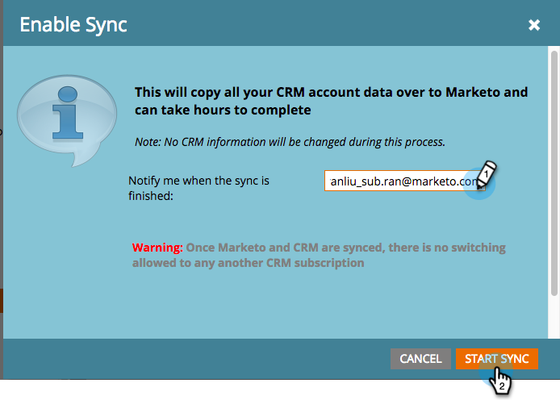

# Étape 4 de 4 : connecter la solution Marketo à la connexion de contrôle de mot de passe du propriétaire de la ressource {#step-4-of-4-connect-the-marketo-solution-ropc}

Il s’agit de la dernière étape de la synchronisation. Vous y êtes presque !

>[!PREREQUISITES]
>
>* [Étape 1 de 4 : installer la solution Marketo avec la connexion de contrôle de mot de passe du propriétaire de la ressource](/help/marketo/product-docs/crm-sync/microsoft-dynamics-sync/sync-setup/microsoft-dynamics-365-with-ropc-connection/step-1-of-4-install.md){target="_blank"}
>* [Étape 2 de 4 : configurer la solution Marketo avec une connexion de contrôle de mot de passe du propriétaire de la ressource](/help/marketo/product-docs/crm-sync/microsoft-dynamics-sync/sync-setup/microsoft-dynamics-365-with-ropc-connection/step-2-of-4-set-up.md){target="_blank"}
>* [Étape 3 sur 4 : configurer l’application cliente sur MS Dynamics](/help/marketo/product-docs/crm-sync/microsoft-dynamics-sync/sync-setup/microsoft-dynamics-365-with-ropc-connection/step-3-of-4-set-up.md){target="_blank"}

>[!NOTE]
>
>**Autorisations d’administrateur requises**

>[!NOTE]
>
>Si vous effectuez une mise à niveau de l’authentification de base vers OAuth, vous pouvez utiliser [cet article](/help/marketo/product-docs/crm-sync/microsoft-dynamics-sync/sync-setup/reconfigure-dynamics-authentication-method.md){target="_blank"} pour reconfigurer votre authentification.

## Saisir les informations sur l&#39;utilisateur de synchronisation Dynamics {#enter-dynamics-sync-user-information}

1. Connectez-vous à Marketo et cliquez sur **Admin**.

   

1. Cliquez sur **[!UICONTROL CRM]**.

   

1. Sélectionnez **[!UICONTROL Microsoft]**.

   

1. Cliquez sur **[!UICONTROL Modifier]** dans **[!UICONTROL Saisir les informations d’identification]**.

   

   >[!CAUTION]
   >
   >Assurez-vous que l’URL de votre organisation est correcte, car nous ne pouvons pas annuler les modifications de schéma suivantes après l’envoi. Si une URL d’organisation incorrecte est utilisée, vous devrez obtenir un nouvel abonnement Marketo. Si vous ne connaissez pas l’URL, [apprenez à la trouver ici](/help/marketo/product-docs/crm-sync/microsoft-dynamics-sync/sync-setup/view-the-organization-service-url.md){target="_blank"}.

   >[!NOTE]
   >
   >Avant de saisir de nouvelles informations d’identification, vous pouvez [les valider ici](/help/marketo/product-docs/crm-sync/microsoft-dynamics-sync/sync-setup/validate-microsoft-dynamics-sync.md){target="_blank"}.

1. Saisissez les valeurs **[!UICONTROL Nom d’utilisateur]**, **[!UICONTROL Mot de passe]**, Microsoft Dynamics **URL**, **[!UICONTROL Identifiant client]** et **[!UICONTROL Secret client]**. Cliquez sur **[!UICONTROL Enregistrer]** lorsque vous avez terminé.

   

   >[!NOTE]
   >
   >Le nom d’utilisateur dans Marketo doit correspondre au nom d’utilisateur pour l’utilisateur de synchronisation dans CRM. Le format peut être `user@domain.com` ou DOMAINE\utilisateur.

## Sélectionner les champs à synchroniser {#select-fields-to-sync}

1. Cliquez sur **[!UICONTROL Modifier]** dans **[!UICONTROL Sélectionner les champs à synchroniser]**.

   

1. Sélectionnez les champs que vous souhaitez synchroniser avec Marketo afin qu’ils soient présélectionnés. Cliquez sur **[!UICONTROL Enregistrer]**.

   

>[!NOTE]
>
>Marketo stocke une référence aux champs à synchroniser. Si vous supprimez un champ dans Dynamics, nous vous recommandons de le faire avec la [synchronisation désactivée](/help/marketo/product-docs/crm-sync/salesforce-sync/enable-disable-the-salesforce-sync.md){target="_blank"}. Ensuite, actualisez le schéma dans Marketo en modifiant et en enregistrant le [ Sélectionner les champs à synchroniser ](/help/marketo/product-docs/crm-sync/microsoft-dynamics-sync/microsoft-dynamics-sync-details/microsoft-dynamics-sync-field-sync/editing-fields-to-sync-before-deleting-them-in-dynamics.md){target="_blank"}.

## Synchroniser les champs pour un filtre personnalisé {#sync-fields-for-a-custom-filter}

Si vous avez créé un filtre personnalisé, veillez à y accéder et à sélectionner les nouveaux champs à synchroniser avec Marketo.

1. Accédez à Admin et sélectionnez **[!DNL Microsoft Dynamics]**.

   

1. Cliquez sur **[!UICONTROL Modifier]** dans Détails de synchronisation des champs.

   

1. Faites défiler jusqu’au champ et cochez-le. Le nom réel doit être new_synctomkto mais le Nom d&#39;affichage peut être n&#39;importe quoi. Cliquez sur **[!UICONTROL Enregistrer]**.

   

## Activer la synchronisation {#enable-sync}

1. Cliquez sur **[!UICONTROL Modifier]** dans **[!UICONTROL Activer la synchronisation]**.

   

   >[!CAUTION]
   >
   >Marketo ne déduplique pas automatiquement les données par rapport à une synchronisation Microsoft Dynamics ou lorsque vous saisissez manuellement des personnes ou des prospects.

1. Lisez tout ce qui se trouve dans le pop-up, saisissez votre adresse e-mail, puis cliquez sur **[!UICONTROL Démarrer la synchronisation]**.

   

1. Selon le nombre d’enregistrements, la synchronisation initiale peut prendre entre quelques heures et quelques jours. Vous recevrez une notification par e-mail une fois l’opération terminée.

   

>[!MORELIKETHIS]
>
>[Reconfigurer la méthode d&#39;authentification Dynamics](/help/marketo/product-docs/crm-sync/microsoft-dynamics-sync/sync-setup/reconfigure-dynamics-authentication-method.md){target="_blank"}
