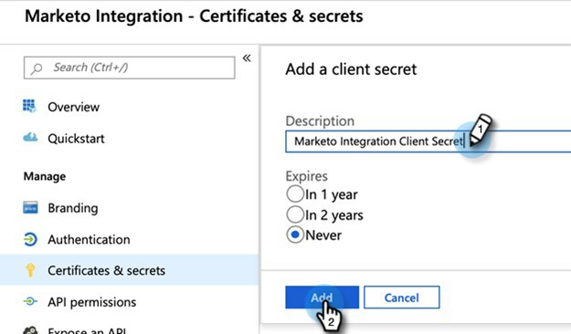

# Étape 2 de 3 : configurer la solution Marketo avec une connexion serveur à serveur {#step-2-of-3-set-up-marketo-sync-user-in-dynamics-s2s}

>[!PREREQUISITES]
>
>[Étape 1 de 3 : installer la solution Marketo avec une connexion serveur à serveur](/help/marketo/product-docs/crm-sync/microsoft-dynamics-sync/sync-setup/microsoft-dynamics-365-with-s2s-connection/step-1-of-3-install.md){target="_blank"}

## Créer une application cliente dans [!DNL Azure AD] {#create-client-application-in-azure-ad}

1. Accédez à [cet article Microsoft](https://docs.microsoft.com/en-us/powerapps/developer/common-data-service/walkthrough-register-app-azure-active-directory#create-an-application-registration){target="_blank"}.

1. Suivez toutes les étapes. Pour l&#39;étape 3, entrez un nom d&#39;application approprié (p. ex. « [!DNL Marketo Integration] »). Sous Types de compte pris en charge, sélectionnez **Compte dans cet annuaire organisationnel uniquement**.

1. Notez l’ID d’application (ClientId) et l’ID de client. Vous devrez le saisir dans Marketo ultérieurement.

1. Accordez le consentement administrateur en suivant les étapes [dans cet article](/help/marketo/product-docs/crm-sync/microsoft-dynamics-sync/sync-setup/grant-consent-for-client-id-and-app-registration.md){target="_blank"}.

1. Générez un secret client dans Admin Center en cliquant sur **[!UICONTROL Certificats et secrets]**.

   

1. Cliquez sur le bouton **[!UICONTROL Nouveau secret client]**.

   

1. Saisissez une description de secret client et cliquez sur **[!UICONTROL Ajouter]**.

   

>[!CAUTION]
>
>Veillez à prendre note de la valeur Secret client (affichée dans la capture d’écran ci-dessous), car vous en aurez besoin ultérieurement. Il n’est affiché qu’une seule fois et vous ne pourrez plus le récupérer.

## Création d’un utilisateur d’application dans Microsoft {#create-application-user-in-microsoft}

1. Suivez les étapes du lien suivant pour [configurer un utilisateur de l’application dans Microsoft](https://docs.microsoft.com/en-us/powerapps/developer/common-data-service/use-single-tenant-server-server-authentication#application-user-creation){target="_blank"}.

   >[!IMPORTANT]
   >
   >* Lors de l’octroi des autorisations à l’utilisateur de l’application, veillez à l’affecter au « rôle utilisateur de synchronisation Marketo ».
   >* Notez l’adresse e-mail de l’utilisateur de l’application dans l’option [afficher les détails](https://docs.microsoft.com/en-us/power-platform/admin/manage-application-users#view-or-edit-the-details-of-an-application-user) sur Power Platform. Cette adresse e-mail sera utilisée comme nom d’utilisateur lors de la configuration de la connexion à MS [!DNL Dynamics] dans Marketo.

## [!DNL Azure AD] Federated avec [!DNL AD FS On-prem] {#azure-ad-federated-with-ad-fs-on-prem}

Federated [!DNL Azure AD] to [!DNL ADFS Onprem] nécessite la création d’une politique de découverte de domaine d’accueil pour l’application spécifique. Avec cette politique, [!DNL Azure AD] redirigera la demande d’authentification vers le service de fédération. Pour cela, la synchronisation de hachage de mot de passe doit être activée dans [!DNL AD Connect]. Pour plus d’informations, consultez les sections [[!DNL OAuth] avec [!DNL ROPC]](https://docs.microsoft.com/en-us/azure/active-directory/develop/v2-oauth-ropc) et [Définir une politique Hrd pour une application](https://docs.microsoft.com/en-us/azure/active-directory/manage-apps/configure-authentication-for-federated-users-portal#example-set-an-hrd-policy-for-an-application).

Des références supplémentaires [ici](https://docs.microsoft.com/en-us/azure/active-directory/reports-monitoring/concept-all-sign-ins#:~:text=Interactive%20user%20sign%2Dins%20are,as%20the%20Microsoft%20Authenticator%20app.&text=This%20report%20includes%20includes%20federated,are%20federated%20to%20Azure%20AD.){target="_blank"} sont disponibles.

## Configuration de la solution Marketo {#configure-marketo-solution}

Presque là ! Il ne nous reste plus qu’à informer Marketo Solution de la création du nouvel utilisateur.

1. Revenez à la section [!UICONTROL Paramètres avancés] et cliquez sur l’icône  en regard de [!UICONTROL Paramètres], puis sélectionnez **[!UICONTROL Configuration Marketo]**.

   

   >[!NOTE]
   >
   >Si vous ne voyez pas « Configuration de Marketo » dans le menu Paramètres, actualisez la page. Si cela ne fonctionne pas, essayez de [publier à nouveau la solution Marketo](/help/marketo/product-docs/crm-sync/microsoft-dynamics-sync/sync-setup/microsoft-dynamics-365-with-s2s-connection/step-1-of-3-install.md){target="_blank"} ou déconnectez-vous et reconnectez-vous.

1. Cliquez sur **[!UICONTROL Par défaut]**.

   

1. Cliquez sur le bouton de recherche dans le champ **[!UICONTROL Utilisateur Marketo]** et sélectionnez l’utilisateur de synchronisation que vous avez créé.

   

1. Cliquez sur l’icône  dans le coin inférieur droit pour enregistrer les modifications.

   

1. Cliquez sur le **X** en haut à droite pour fermer l’écran.

   

1. Cliquez sur l’icône  en regard de [!UICONTROL Paramètres], puis sélectionnez **[!UICONTROL Solutions]**.

   

1. Cliquez sur le bouton **[!UICONTROL Publier toutes les personnalisations]**.

   

   >[!NOTE]
   >
   >Si vous effectuez une mise à niveau de l’authentification de base vers l’authentification [!DNL OAuth], vous pouvez utiliser [cet article](/help/marketo/product-docs/crm-sync/microsoft-dynamics-sync/sync-setup/reconfigure-dynamics-authentication-method.md) pour reconfigurer votre authentification.

## Avant de passer à l’étape 3 {#before-proceeding-to-step}

* Si vous souhaitez limiter le nombre d’enregistrements synchronisés, [configurez un filtre de synchronisation personnalisé](/help/marketo/product-docs/crm-sync/microsoft-dynamics-sync/create-a-custom-dynamics-sync-filter.md) maintenant.
* Exécutez le processus [Validate [!DNL Microsoft Dynamics] Sync](/help/marketo/product-docs/crm-sync/microsoft-dynamics-sync/sync-setup/validate-microsoft-dynamics-sync.md). Il vérifie que vos configurations initiales ont été correctement effectuées.
* Connectez-vous à l’utilisateur de synchronisation Marketo dans [!DNL Microsoft Dynamics] CRM.

>[!MORELIKETHIS]
>
>* [Étape 3 sur 3 : connecter la solution Marketo à la connexion serveur à serveur](/help/marketo/product-docs/crm-sync/microsoft-dynamics-sync/sync-setup/microsoft-dynamics-365-with-s2s-connection/step-3-of-3-connect.md)
>* [Reconfigure [!DNL Dynamics] Authentication Method](/help/marketo/product-docs/crm-sync/microsoft-dynamics-sync/sync-setup/reconfigure-dynamics-authentication-method.md)
