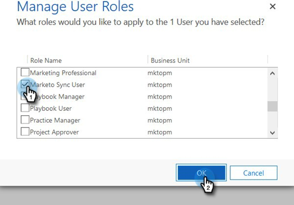

# Étape 2 sur 3 : Configuration de l’utilisateur de synchronisation Marketo dans Dynamics avec la connexion S2S{#step-2-of-3-set-up-marketo-sync-user-in-dynamics-s2s}

>[!PREREQUISITES]
>
>[Étape 1 sur 3 : Installation de la solution Marketo avec la connexion S2S](/help/marketo/product-docs/crm-sync/microsoft-dynamics-sync/sync-setup/microsoft-dynamics-365-with-s2s-connection/step-1-of-3-install.md)

## Création d’une application cliente dans Azure AD {#create-client-application-in-azure-ad}

1. Accédez à [cet article Microsoft](https://docs.microsoft.com/en-us/powerapps/developer/common-data-service/walkthrough-register-app-azure-active-directory#create-an-application-registration).

1. Suivez toutes les étapes. Pour l’étape 3, saisissez un nom d’application approprié (par exemple, &quot;Intégration Marketo&quot;). Sous Types de compte pris en charge, sélectionnez **Compte dans cet annuaire organisationnel uniquement**.

1. Notez l’ID de l’application (ClientId) et l’ID du client. Vous devrez le saisir ultérieurement dans Marketo.

1. Octroi du consentement de l’administrateur en suivant les étapes [dans cet article](/help/marketo/product-docs/crm-sync/microsoft-dynamics-sync/sync-setup/grant-consent-for-client-id-and-app-registration.md).

1. Générez un secret client dans le Centre d’administration en cliquant sur **Certificats et secrets**.

   

1. Cliquez sur le bouton **Nouveau secret client** bouton .

   

1. Saisissez une description du secret client, puis cliquez sur **Ajouter**.

   

>[!CAUTION]
>
>Veillez à prendre note de la valeur Secret client (vue dans la capture d’écran ci-dessous), car vous en aurez besoin ultérieurement. Elle n’est affichée qu’une seule fois et vous ne pourrez plus la récupérer.

1. Suivez les étapes du lien suivant pour [configuration d’un utilisateur d’application dans Microsoft](https://docs.microsoft.com/en-us/powerapps/developer/common-data-service/use-single-tenant-server-server-authentication#application-user-creation). Lors de l’attribution des autorisations à l’utilisateur de l’application, affectez-le à &quot;Rôle utilisateur de synchronisation Marketo&quot;.

## Azure AD Federated avec AD FS On-premise {#azure-ad-federated-with-ad-fs-on-prem}

Federated Azure AD à ADFS Onprem nécessite la création d’une stratégie de détection des domaines domestiques pour l’application spécifique. Avec cette stratégie, Azure AD redirigera la demande d’authentification vers le service de fédération. Pour ce faire, la synchronisation du hachage de mot de passe doit être activée dans AD Connect. Pour plus d’informations, voir [OAuth avec ROPC](https://docs.microsoft.com/en-us/azure/active-directory/develop/v2-oauth-ropc) et [Définition d’une stratégie tierce pour une application](https://docs.microsoft.com/en-us/azure/active-directory/manage-apps/configure-authentication-for-federated-users-portal#example-set-an-hrd-policy-for-an-application).

Références supplémentaires [peut être consulté ici](https://docs.microsoft.com/en-us/azure/active-directory/reports-monitoring/concept-all-sign-ins#:~:text=Interactive%20user%20sign%2Dins%20are,as%20the%20Microsoft%20Authenticator%20app.&amp;text=This%20report%20else%20include%20federated,are%20federated%20to%20Azure%20AD.).

## Attribution d’un rôle d’utilisateur de synchronisation {#assign-sync-user-role}

1. Attribuez le rôle Utilisateur de synchronisation Marketo à l’utilisateur de synchronisation Marketo uniquement.

>[!NOTE]
>
>Cela s’applique à Marketo version 4.0.0.14 et ultérieure. Pour les versions antérieures, tous les utilisateurs doivent disposer du rôle d’utilisateur de synchronisation. Pour mettre à niveau votre solution Marketo, [voir cet article](/help/marketo/product-docs/crm-sync/microsoft-dynamics-sync/sync-setup/update-the-marketo-solution-for-microsoft-dynamics.md).

1. Revenez à l’onglet Utilisateurs de l’application et actualisez la liste des utilisateurs.

   

1. Passez la souris sur l’utilisateur nouvellement créé de l’application et une case à cocher s’affiche. Cliquez pour le sélectionner.

   

1. Cliquez sur **Gestion des rôles**.

   

1. Vérifier **Utilisateur de synchronisation Marketo** et cliquez sur **OK**.

   

## Configuration de la solution Marketo {#configure-marketo-solution}

Presque là ! Il ne nous reste plus qu’à informer la solution Marketo sur le nouvel utilisateur créé.

>[!IMPORTANT]
>
>Si vous effectuez une mise à niveau de l’authentification de base vers OAuth, vous devrez contacter [Prise en charge de Marketo](https://nation.marketo.com/t5/support/ct-p/Support) pour obtenir de l’aide sur la mise à jour des paramètres supplémentaires. L’activation de cette fonction interrompt temporairement la synchronisation jusqu’à ce que de nouvelles informations d’identification soient saisies et que la synchronisation soit réactivée. La fonctionnalité peut être désactivée (jusqu’à avril 2022) si vous souhaitez revenir à l’ancien mode d’authentification.

1. Revenez à la section Paramètres avancés et cliquez sur le bouton  en regard de Paramètres, sélectionnez **Configuration Marketo**.

   

   >[!NOTE]
   >
   >Si vous ne voyez pas **Configuration Marketo** dans le menu Paramètres , actualisez la page. Si cela ne fonctionne pas, essayez de [publier la solution Marketo](/help/marketo/product-docs/crm-sync/microsoft-dynamics-sync/sync-setup/microsoft-dynamics-365-with-s2s-connection/step-1-of-3-install.md) de nouveau ou de se déconnecter puis de se reconnecter.

1. Cliquez sur **Par défaut**.

   

1. Cliquez sur le bouton de recherche dans la **Utilisateur Marketo** et sélectionnez l’utilisateur de synchronisation que vous avez créé.

   

1. Cliquez sur le bouton  dans le coin inférieur droit pour enregistrer les modifications.

   

1. Cliquez sur le bouton **X** dans le coin supérieur droit pour fermer l’écran.

   

1. Cliquez sur le bouton  en regard de Paramètres, sélectionnez **Solutions**.

   

1. Cliquez sur le bouton **Publier toutes les personnalisations** bouton .

   

## Avant de passer à l’étape 3 {#before-proceeding-to-step}

* Si vous souhaitez limiter le nombre d&#39;enregistrements synchronisés, [configuration d’un filtre de synchronisation personnalisé](/help/marketo/product-docs/crm-sync/microsoft-dynamics-sync/create-a-custom-dynamics-sync-filter.md) maintenant.
* Exécutez la variable [Validation de la synchronisation Microsoft Dynamics](/help/marketo/product-docs/crm-sync/microsoft-dynamics-sync/sync-setup/validate-microsoft-dynamics-sync.md) processus. Il vérifie que vos premières configurations ont été effectuées correctement.
* Connectez-vous à l’utilisateur de synchronisation Marketo dans Microsoft Dynamics CRM.

>[!MORELIKETHIS]
>
>[Étape 3 sur 3 : Connexion de la solution Marketo à la connexion S2S](/help/marketo/product-docs/crm-sync/microsoft-dynamics-sync/sync-setup/microsoft-dynamics-365-with-s2s-connection/step-3-of-3-connect.md)
