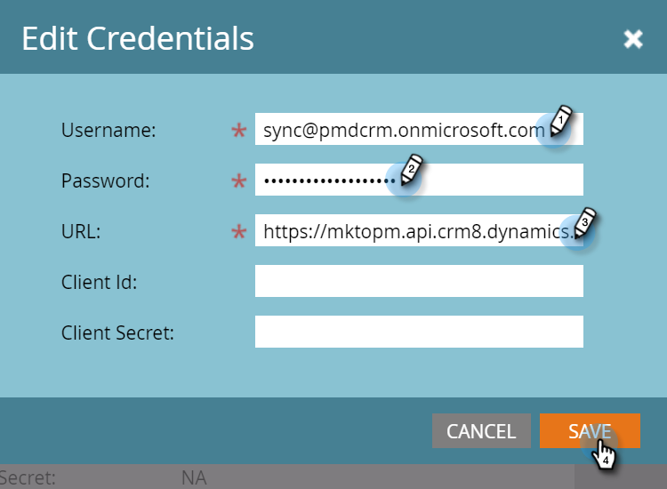

# Étape 3 sur 3 : Connexion de la solution Marketo à la connexion S2S {#step-3-of-3-connect-microsoft-dynamics-with-marketo-solution-s2s}

Il s’agit de la dernière étape de la synchronisation. Nous y sommes presque !

>[!PREREQUISITES]
>
>* [Étape 1 sur 3 : Installation de la solution Marketo avec la connexion S2S](/help/marketo/product-docs/crm-sync/microsoft-dynamics-sync/sync-setup/microsoft-dynamics-365-with-s2s-connection/step-1-of-3-install.md)
>* [Étape 2 sur 3 : Configuration de la solution Marketo avec la connexion S2S](/help/marketo/product-docs/crm-sync/microsoft-dynamics-sync/sync-setup/microsoft-dynamics-365-with-s2s-connection/step-2-of-3-set-up.md)

>[!NOTE]
>
>**Autorisations d’administrateur requises**

## Entrer les informations sur l’utilisateur de synchronisation Dynamics {#enter-dynamics-sync-user-information}

1. Connectez-vous à Marketo et cliquez sur **Administration**.

   

1. Cliquez sur **CRM**.

   

1. Sélectionner **Microsoft**.

   

1. Cliquez sur **Modifier** in **Étape 1 : Saisie des informations d’identification**.

   

   >[!CAUTION]
   >
   >Assurez-vous que vos informations d’identification sont correctes, car nous ne pouvons pas annuler les modifications de schéma suivantes après l’envoi. Si des informations d’identification incorrectes sont enregistrées, vous devrez obtenir un nouvel abonnement Marketo.

1. Saisissez le **Nom d’utilisateur**, **Mot de passe**, et Microsoft Dynamics **URL**. Cliquez sur **Enregistrer** une fois terminé.

   

   >[!NOTE]
   >
   >* Si votre Marketo a été configuré avant octobre 2020, l’identifiant du client et le secret sont des champs facultatifs. Sinon, elles sont obligatoires. L’obtention de ces informations dépend de la version de MSD que vous utilisez.
   >* Le nom d’utilisateur dans Marketo doit correspondre au nom d’utilisateur de l’utilisateur synchronisé dans le CRM. Le format peut être `user@domain.com` ou DOMAIN\user.
   >* Si vous ne connaissez pas l’URL, [découvrez comment le trouver ici](/help/marketo/product-docs/crm-sync/microsoft-dynamics-sync/sync-setup/view-the-organization-service-url.md).

## Sélectionner les champs à synchroniser {#select-fields-to-sync}

1. Cliquez sur **Modifier** in **Étape 2 : Sélectionner les champs à synchroniser**.

   

1. Sélectionnez les champs que vous souhaitez synchroniser avec Marketo afin qu’ils soient pré-sélectionnés. Cliquez sur **Enregistrer**.

   

>[!NOTE]
>
>Marketo stocke une référence aux champs à synchroniser. Si vous supprimez un champ dans Dynamics, nous vous recommandons de le faire avec la variable [sync désactivé](/help/marketo/product-docs/crm-sync/salesforce-sync/enable-disable-the-salesforce-sync.md). Actualisez ensuite le schéma dans Marketo en modifiant et en enregistrant le [Sélectionner les champs à synchroniser](/help/marketo/product-docs/crm-sync/microsoft-dynamics-sync/microsoft-dynamics-sync-details/microsoft-dynamics-sync-field-sync/editing-fields-to-sync-before-deleting-them-in-dynamics.md).

## Champs de synchronisation pour un filtre personnalisé {#sync-fields-for-a-custom-filter}

Si vous avez créé un filtre personnalisé, veillez à entrer et sélectionner les nouveaux champs à synchroniser avec Marketo.

1. Accédez à Admin et sélectionnez **Microsoft Dynamics**.

   

1. Cliquez sur **Modifier** sur Détails de synchronisation du champ.

   

1. Faites défiler l’écran jusqu’au champ et cochez-le. Le nom réel doit être new_synctomkto, mais le nom d’affichage peut être de n’importe quel type. Cliquez sur **Enregistrer**.

   

## Activer la synchronisation {#enable-sync}

1. Cliquez sur **Modifier** in **Étape 3 : Activer la synchronisation**.

   

   >[!CAUTION]
   >
   >Marketo ne procède pas automatiquement à la déduplication par rapport à une synchronisation Microsoft Dynamics, ou lorsque vous saisissez manuellement des personnes ou des pistes.

1. Lisez tout ce qui se trouve dans la fenêtre contextuelle, entrez votre adresse électronique, puis cliquez sur **Démarrer la synchronisation**.

   

1. La première synchronisation peut prendre quelques heures. Une fois cette opération terminée, vous recevrez une notification par e-mail.

   

Excellent travail !
