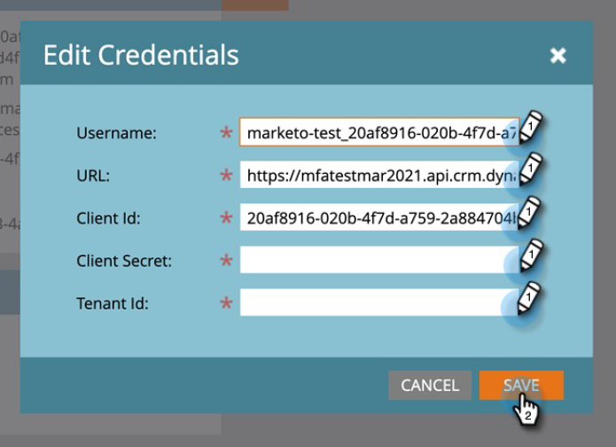

# Étape 3 sur 3 : connecter la solution Marketo à l’aide de la connexion serveur à serveur {#step-3-of-3-connect-microsoft-dynamics-with-marketo-solution-s2s}

Il s’agit de la dernière étape de la synchronisation. On y est presque !

>[!PREREQUISITES]
>
>* [Étape 1 de 3 : installer la solution Marketo avec une connexion serveur à serveur](/help/marketo/product-docs/crm-sync/microsoft-dynamics-sync/sync-setup/microsoft-dynamics-365-with-s2s-connection/step-1-of-3-install.md){target="_blank"}
>* [Étape 2 de 3 : configurer la solution Marketo avec une connexion serveur à serveur](/help/marketo/product-docs/crm-sync/microsoft-dynamics-sync/sync-setup/microsoft-dynamics-365-with-s2s-connection/step-2-of-3-set-up.md){target="_blank"}

>[!NOTE]
>
>**Autorisations d’administrateur requises**

>[!IMPORTANT]
>
>Si vous effectuez une mise à niveau de l’authentification de base vers [!DNL OAuth], vous devez contacter le support technique de [Marketo](https://nation.marketo.com/t5/support/ct-p/Support) pour obtenir de l’aide sur la mise à jour des paramètres supplémentaires. L’activation de cette fonctionnalité arrête temporairement la synchronisation jusqu’à ce que de nouvelles informations d’identification soient saisies et que la synchronisation soit réactivée. La fonctionnalité peut être désactivée (jusqu’en avril 2022) si vous souhaitez revenir à l’ancien mode d’authentification.

>[!NOTE]
>
>Avant de saisir de nouvelles informations d’identification, vous pouvez [les valider ici](/help/marketo/product-docs/crm-sync/microsoft-dynamics-sync/sync-setup/validate-microsoft-dynamics-sync.md){target="_blank"}.

## Saisir les informations sur l’utilisateur de la synchronisation [!DNL Dynamics] {#enter-dynamics-sync-user-information}

1. Connectez-vous à Marketo et cliquez sur **[!UICONTROL Admin]**.

   

1. Cliquez sur **[!UICONTROL CRM]**.

   

1. Sélectionnez **[!UICONTROL Microsoft]**.

   

1. Cliquez sur **[!UICONTROL Modifier]** à l’étape **[!UICONTROL 1 : Saisie des informations d’identification]**.

   

   >[!CAUTION]
   >
   >Assurez-vous que l’URL de votre organisation est correcte, car nous ne pouvons pas annuler les modifications de schéma suivantes après l’envoi. Si une URL d’organisation incorrecte est utilisée, vous devrez obtenir un nouvel abonnement Marketo. Si vous ne connaissez pas l’URL, [apprenez à la trouver ici](/help/marketo/product-docs/crm-sync/microsoft-dynamics-sync/sync-setup/view-the-organization-service-url.md){target="_blank"}.

1. Saisissez les informations sur l’utilisateur de la synchronisation [!DNL Dynamics] et cliquez sur **[!UICONTROL Enregistrer]** lorsque vous avez terminé.

   

   >[!NOTE]
   >
   >Le nom d’utilisateur dans Marketo doit correspondre à l’[adresse e-mail](https://docs.microsoft.com/en-us/power-platform/admin/manage-application-users#view-or-edit-the-details-of-an-application-user){target="_blank"} de l’utilisateur de l’application dans le CRM. Le format peut être `user@domain.com` ou DOMAINE\utilisateur.

## Sélectionner les champs à synchroniser {#select-fields-to-sync}

1. Cliquez sur **[!UICONTROL Modifier]** à l’étape **[!UICONTROL 2 : sélection des champs à synchroniser]**.

   

1. Sélectionnez les champs que vous souhaitez synchroniser avec Marketo afin qu’ils soient présélectionnés. Cliquez sur **[!UICONTROL Enregistrer]**

   

>[!NOTE]
>
>Marketo stocke une référence aux champs à synchroniser. Si vous supprimez un champ dans [!DNL Dynamics], nous vous recommandons de le faire avec la [synchronisation désactivée](/help/marketo/product-docs/crm-sync/salesforce-sync/enable-disable-the-salesforce-sync.md). Ensuite, actualisez le schéma dans Marketo en modifiant et en enregistrant le [ Sélectionner les champs à synchroniser ](/help/marketo/product-docs/crm-sync/microsoft-dynamics-sync/microsoft-dynamics-sync-details/microsoft-dynamics-sync-field-sync/editing-fields-to-sync-before-deleting-them-in-dynamics.md).

## Synchroniser les champs pour un filtre personnalisé {#sync-fields-for-a-custom-filter}

Si vous avez créé un filtre personnalisé, veillez à y accéder et à sélectionner les nouveaux champs à synchroniser avec Marketo.

1. Accédez à [!UICONTROL Admin] et sélectionnez **[!UICONTROL Microsoft Dynamics]**.

   

1. Cliquez sur **[!UICONTROL Modifier]** sur [!UICONTROL Détails de la synchronisation des champs].

   

1. Faites défiler jusqu’au champ et cochez-le. Le nom réel doit être new_synctomkto mais le Nom d&#39;affichage peut être n&#39;importe quoi. Cliquez sur **[!UICONTROL Enregistrer]**

   

## Activer la synchronisation {#enable-sync}

1. Cliquez sur **[!UICONTROL Modifier]** à l’**[!UICONTROL Étape 3 : activer la synchronisation]**.

   

   >[!CAUTION]
   >
   >Marketo ne déduplique pas automatiquement les données par rapport à une synchronisation [!DNL Microsoft Dynamics] ou lorsque vous saisissez manuellement des personnes ou des prospects.

1. Lisez tout ce qui se trouve dans le pop-up, saisissez votre adresse e-mail, puis cliquez sur **[!UICONTROL Démarrer la synchronisation]**.

   

1. Selon le nombre d’enregistrements, la synchronisation initiale peut prendre entre quelques heures et quelques jours. Vous recevrez une notification par e-mail une fois l’opération terminée.

   
