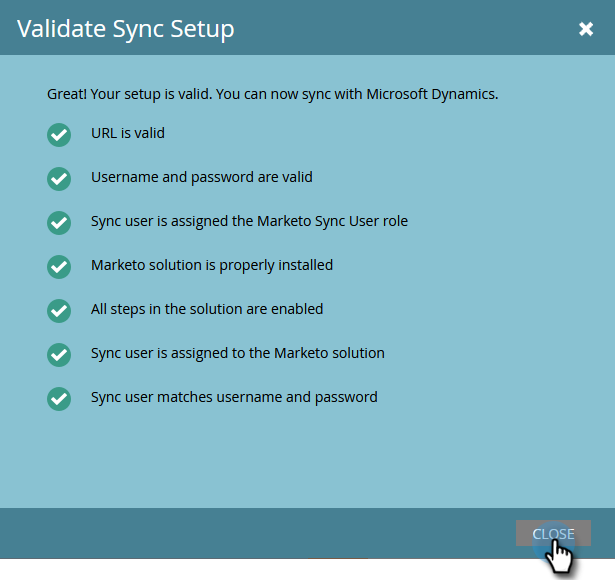

# Configuration de l’application Microsoft Dynamics CRM pour Online {#set-up-microsoft-dynamics-crm-app-for-online}

## Configurer {#set-up}

1. Accédez à https://docs.microsoft.com/en-us/powerapps/developer/common-data-service/walkthrough-register-app-azure-active-directory#create-an-application-registration.

1. Suivez toutes les étapes. Pour l’étape 3, saisissez un nom d’application approprié (par exemple, &quot;Intégration Marketo&quot;). Sous Types de compte pris en charge, sélectionnez Compte dans cet annuaire organisationnel uniquement.

1. Notez l’ID de l’application (ClientId). Vous devrez le saisir ultérieurement dans Marketo.

1. Octroyez le consentement de l’administrateur en suivant les étapes de la section [cet article](/help/marketo/product-docs/crm-sync/microsoft-dynamics-sync/sync-setup/grant-consent-for-client-id-and-app-registration.md).

1. Générez un secret client dans le Centre d’administration en cliquant sur **Certificats et secrets**.

   

1. Cliquez sur **Nouveau secret client**.

   

1. Ajoutez une description du secret client et cliquez sur **Ajouter**.

   

   >[!CAUTION]
   >
   >Veillez à prendre note de la valeur Secret client (vue dans la capture d’écran ci-dessous), car vous en aurez besoin ultérieurement. Elle n’est affichée qu’une seule fois et vous ne pourrez plus la récupérer.

   

Marketo s’authentifie auprès d’Azure AD avec OAuth à l’aide de la méthode grant_type Resource Owner Password Credentials( ROPC). Ce scénario nécessite la création d’une stratégie Home Realm Discovery pour l’application spécifique. Avec cette stratégie, Azure AD redirigera la demande d’authentification vers le service de fédération. Pour ce faire, la synchronisation du hachage de mot de passe doit être activée dans AD Connect. Pour plus d’informations, voir [OAuth avec ROPC](https://docs.microsoft.com/en-us/azure/active-directory/develop/v2-oauth-ropc) et [Définition d’une stratégie tierce pour une application](https://docs.microsoft.com/en-us/azure/active-directory/manage-apps/configure-authentication-for-federated-users-portal#example-set-an-hrd-policy-for-an-application).

Références supplémentaires [peut être consulté ici](https://docs.microsoft.com/en-us/azure/active-directory/reports-monitoring/concept-all-sign-ins#:~:text=Interactive%20user%20sign%2Dins%20are,as%20the%20Microsoft%20Authenticator%20app.&amp;text=This%20report%20else%20include%20federated,are%20federated%20to%20Azure%20AD.).

Quand tu as fini, il est temps de **Saisissez l’ identifiant du client généré par Dynamics CRM et le secret dans Marketo.**.

## Saisissez l’ identifiant du client généré par Dynamics CRM et le secret dans Marketo. {#enter-the-dynamics-crm-generated-client-id-and-secret-into-marketo}

Les étapes suivantes s’appliquent à la mise en ligne _et_ Versions on-premise.

1. Dans Marketo, cliquez sur **Administration**.

   

1. Cliquez sur **Microsoft Dynamics**.

   

1. Cliquez sur **Désactiver la synchronisation**.

   

1. En regard des informations d’identification, cliquez sur **Modifier**.

   

1. Saisissez le **ID client** et **Secret du client** vous avez récupéré précédemment et appuyez sur **Enregistrer**.

   

1. Cliquez sur **Validation de la configuration de la synchronisation**.

   

1. Cliquez sur **Suivant**.

   

1. Vous devriez voir toutes les coches vertes. Cliquez sur **Fermer**.

   

   >[!NOTE]
   >
   >Si vous voyez un X rouge parmi vos coches vertes, reportez-vous à la section [cet article](/help/marketo/product-docs/crm-sync/microsoft-dynamics-sync/sync-setup/validate-microsoft-dynamics-sync/fix-dynamics-validation-sync-issues.md) pour les options de correctif.

1. Cliquez sur **Activer la synchronisation**.

   

Et voilà !
