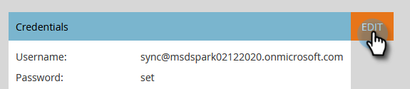

# Configurer MSD pour Azure AD Federated avec AD FS On-prem, locant et Microsoft Online {#set-up-msd-for-azure-ad-federated-with-ad-fs-on-prem-tenant-and-microsoft-online}

## Configuration de l&#39;application Microsoft Dynamics CRM {#set-up-microsoft-dynamics-crm-app}

1. Accédez à https://docs.microsoft.com/en-us/powerapps/developer/common-data-service/walkthrough-register-app-azure-active-directory#create-an-application-registration.

1. Suivez toutes les étapes. Pour l’étape 3, saisissez un nom d’application approprié (par exemple, &quot;Intégration Marketo&quot;). Sous Types de compte pris en charge, sélectionnez Compte dans ce répertoire d’organisation uniquement.

1. Notez le ID de l&#39;application (ClientId). Vous devrez l&#39;entrer à Marketo plus tard.

1. Accordez le consentement de l’administrateur en suivant les étapes décrites dans [cet article](/help/marketo/product-docs/crm-sync/microsoft-dynamics-sync/sync-setup/set-up-oauth-authentication-for-dynamics/grant-consent-for-client-id-and-app-registration.md).

1. Générez une clé secrète client dans le Centre d’administration en cliquant sur **Certificats et secrets**.

   

1. Cliquez sur **Nouveau secret client**.

   

1. Ajoutez une description de la clé secrète client et cliquez sur **Ajouter**.

   

   >[!CAUTION]
   >
   >Pensez à prendre note de la valeur de la clé secrète client (vue dans la capture d’écran ci-dessous), car vous en aurez besoin plus tard. Il n&#39;est affiché qu&#39;une seule fois, et vous ne pourrez plus le récupérer.

   

Marketo s&#39;authentifie auprès d&#39;Azure AD avec OAuth à l&#39;aide de grant_type Resource Owner Password Credentials( ROPC). Ce scénario nécessite la création d’une stratégie de détection de domaine domestique pour l’application spécifique. Avec cette stratégie, Azure AD redirigera la demande d&#39;authentification vers le service de fédération. Pour ce faire, la synchronisation du hachage de mot de passe doit être activée dans AD Connect. Pour plus d&#39;informations, consultez les sections [OAuth with ROPC](https://docs.microsoft.com/en-us/azure/active-directory/develop/v2-oauth-ropc) et [Définir une stratégie matérielle pour une application](https://docs.microsoft.com/en-us/azure/active-directory/manage-apps/configure-authentication-for-federated-users-portal#example-set-an-hrd-policy-for-an-application).

D&#39;autres références [se trouvent ici](https://docs.microsoft.com/en-us/azure/active-directory/reports-monitoring/concept-all-sign-ins#:~:text=Interactive%20user%20sign%2Dins%20are,as%20the%20Microsoft%20Authenticator%20app.&amp;text=Ce%20rapport%20inclut%20fédérée, sont%20fédérés%20à%20Azure%20AD.).

Lorsque vous avez terminé, il est temps d&#39;**entrer l&#39;ID client et le secret générés par Dynamics CRM dans Marketo**.

## Entrez l&#39;ID client et le secret générés par Dynamics CRM dans Marketo {#enter-the-dynamics-crm-generated-client-id-and-secret-into-marketo}

1. Dans Marketo, cliquez sur **Admin**.

   

1. Cliquez sur **Microsoft Dynamics**.

   

1. Cliquez sur **Désactiver la synchronisation**.

   

1. En regard des informations d’identification, cliquez sur **Modifier**.

   

1. Saisissez les **ID client** et **Secret client** que vous avez récupéré précédemment et appuyez sur **Enregistrer**.

   

1. Cliquez sur **Valider la configuration de synchronisation**.

   

1. Cliquez sur **Suivant**.

   

1. Vous devriez voir toutes les coches vertes. Cliquez sur **Fermer**.

   

   >[!NOTE]
   >
   >Si un X rouge apparaît parmi vos coches vertes, consultez [cet article](/help/marketo/product-docs/crm-sync/microsoft-dynamics-sync/sync-setup/validate-microsoft-dynamics-sync/fix-dynamics-validation-sync-issues.md) pour connaître les options de correction.

1. Cliquez sur **Activer la synchronisation**.

   

Et c&#39;est tout !
