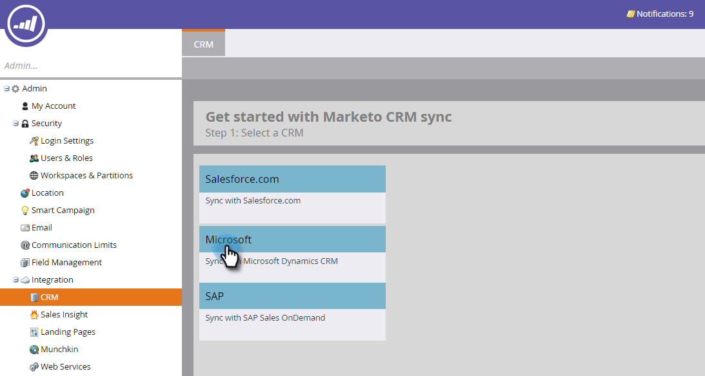

# Valider Microsoft Dynamics Sync {#validate-microsoft-dynamics-sync}

>[!CAUTION]
>
>Si l&#39;authentification multifacteur (MFA) est activée pour Dynamics Sync, vous devez la désactiver pour que Dynamics se synchronise correctement avec Marketo. Pour de plus amples informations, veuillez contacter l&#39;assistance marketing.

## Exécuter la validation de la synchronisation dans Marketo {#run-validate-sync-in-marketo}

Il est très important d&#39;exécuter l&#39;outil Valider la synchronisation pour s&#39;assurer que Microsoft Dynamics Sync avec Marketo est configuré correctement avant d&#39;établir la connexion finale entre eux. Le processus génère une liste de contrôle de sept étapes de configuration qui identifie les problèmes existants. La vérification de ces informations correctement effectuée peut vous faire gagner beaucoup de temps par la suite.

1. Cliquez sur l&#39;onglet **Admin** , puis sur le lien **Microsoft Dynamics** dans la zone Intégration.

   

1. Sélectionnez **Microsoft**.

   

1. Cliquez sur l’onglet **Valider la configuration** de synchronisation.

   

1. Saisissez votre nom d’utilisateur, votre mot de passe et votre URL (l’ID de client et la clé secrète client sont facultatifs). Lorsque vous avez terminé, cliquez sur **Suivant** .

   

   >[!NOTE]
   >
   >Si vous avez déjà effectué la synchronisation, **CRM** dans l&#39;arborescence de gauche lit **Microsoft Dynamics** et les données du formulaire ci-dessus peuvent être préremplies.

1. Si tout va bien, la fonction Valider la synchronisation génère une liste de contrôle pleine de coches vertes .

   

1. Si vous voyez un , alors cette étape a un problème. Voir [Correction des problèmes](validate-microsoft-dynamics-sync/fix-dynamics-validation-sync-issues.md) de synchronisation de validation de Dynamics pour identifier et résoudre le problème. Ensuite, réexécutez les étapes de validation de synchronisation jusqu’à ce que le résultat ressemble à l’image ci-dessus.

   >[!CAUTION]
   >
   >Actuellement, nous ne prenons pas en charge l&#39;actualisation de sandbox pour Marketing Dynamics Sync. Si vous devez actualiser votre sandbox Dynamics CRM, un nouveau sandbox Marketo sera nécessaire. Pour plus d’informations, contactez votre responsable de succès client.

>[!NOTE]
>
>**Articles connexes**
>
>[Correction des problèmes de synchronisation de validation de Dynamics](validate-microsoft-dynamics-sync/fix-dynamics-validation-sync-issues.md)

