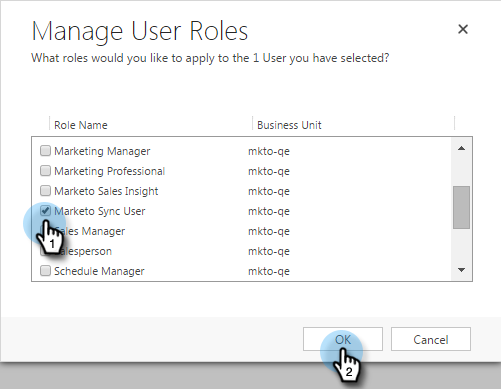

# Correction des problèmes de synchronisation de validation de Dynamics {#fix-dynamics-validation-sync-issues}

## Validation des résultats de l’outil de synchronisation {#validate-sync-tool-results}

Lorsque vous exécutez la synchronisation de validation Dynamics, elle génère un rapport. S’il existe un  en regard d’une étape, voir les options ci-dessous pour identifier et résoudre le problème. Ensuite, relancez les étapes de validation de synchronisation jusqu’à ce que le résultat n’affiche que des coches vertes.

## L’URL est valide {#url-is-valid}

Si vous avez une  ici, vérifiez que l’URL est valide. Trouvez-le ici dans Ressources pour les développeurs et consultez le service d’organisation. L’URL peut être invalide pour plusieurs raisons.

1. Connectez-vous à Dynamics. Cliquez sur l’icône Paramètres et sélectionnez **Paramètres avancés**.

   

1. Cliquez sur Paramètres , puis sélectionnez **Personnalisations**.

   

1. Cliquez sur **Ressources pour les développeurs**.

   

1. L’URL du service d’organisation se trouve sous Points de terminaison du service.

   

## L’identifiant et le mot de passe sont valides {#username-and-password-are-valid}

Si vous avez une  ici, vérifiez que votre nom d’utilisateur et votre mot de passe Microsoft Dynamics sont valides.

## L’utilisateur de synchronisation est affecté au rôle Utilisateur de synchronisation Marketo {#sync-user-is-assigned-to-the-marketo-sync-user-role}

Si vous avez une  ici, il pourrait s&#39;agir de l&#39;un des trois problèmes ci-dessous.

**Option 1 - Vérifiez que le rôle utilisateur de synchronisation Marketo est coché dans Microsoft Dynamics**:

1. Dans Dynamics, cliquez sur l’icône Paramètres et sélectionnez **Paramètres avancés**.

   

1. Cliquez sur **Paramètres** et sélectionnez **Sécurité**.

   

1. Cliquez sur **Utilisateurs.**

   

1. Cliquez sur le lien correspondant à l’utilisateur de synchronisation.

   

1. Cliquez sur **Gestion des rôles**.

   

1. Vérifiez que le rôle Utilisateur de synchronisation Marketo est coché. Si ce n’est pas le cas, cochez-le et cliquez sur **OK.**

   

**Option 2 - Confirmer l’octroi**:

1. Consultez la section [Octroi du consentement pour l’ID de client et l’enregistrement de l’application](/help/marketo/product-docs/crm-sync/microsoft-dynamics-sync/sync-setup/grant-consent-for-client-id-and-app-registration.md) pour confirmer que l’application a le consentement de l’administrateur pour appeler des API.

**Option 3 - utilisateur de synchronisation**:

1. Vérifiez que l’utilisateur de synchronisation est ajouté à la configuration Marketo.

## La solution Marketo est bien installée {#marketo-solution-is-properly-installed}

Si vous avez une  ici, accédez à Microsoft Dynamics pour vérifier que l’installation de Marketo s’y trouve. Voir l’étape 1 de la documentation de configuration de Microsoft Dynamics.

1. Dans Dynamics, cliquez sur l’icône Paramètres et sélectionnez **Paramètres avancés**.

   

1. Cliquez sur **Paramètres** et sélectionnez **Solutions.**

   

1. Vérifiez que la solution est répertoriée.

   

## Toutes les étapes de la solution sont activées {#all-steps-in-the-solution-are-enabled}

Si vous avez une  ici, vérifiez qu’aucune des étapes par défaut n’a été désactivée. Toutes les étapes sont automatiquement activées lors de l’installation, mais elles peuvent être désactivées lors d’une personnalisation.

## L’utilisateur synchronisé est attribué à la solution Marketo {#sync-user-is-assigned-to-the-marketo-solution}

Si vous avez une  ici, assurez-vous que l’utilisateur de synchronisation est affecté à la page Marketo par défaut dans Microsoft Dynamics.

1. Dans Dynamics, cliquez sur l’icône Paramètres et sélectionnez **Paramètres avancés**.

   

1. Cliquez sur **Paramètres** et sélectionnez **Configuration Marketo**.

   

1. Vérifiez que l’utilisateur de synchronisation est désigné comme valeur par défaut.

   

## L’utilisateur synchonisé correspond au nom d’utilisateur et au mot de passe {#sync-user-matches-username-and-password}

Si vous avez une  ici, veillez à affecter l’utilisateur de synchronisation approprié dans le champ Utilisateur Marketo de l’étape de configuration par défaut de la configuration Marketo dans Microsoft Dynamics.

>[!MORELIKETHIS]
>
>[Validation de la synchronisation Microsoft Dynamics](/help/marketo/product-docs/crm-sync/microsoft-dynamics-sync/sync-setup/validate-microsoft-dynamics-sync.md)
