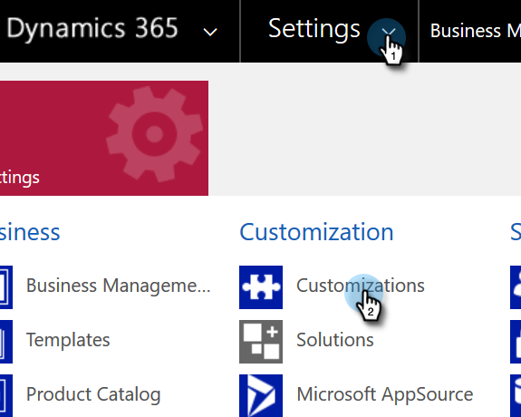

# Afficher l’URL de service d’organisation {#view-the-organization-service-url}

Marketo Engage a besoin de l’URL du service d’organisation pour se synchroniser avec les instances MD. Voici comment le trouver dans Dynamics.

1. Connectez-vous à [!DNL Dynamics]. Cliquez sur l’icône Paramètres et sélectionnez **[!UICONTROL Paramètres avancés]**.

   

1. Cliquez sur **[!UICONTROL Paramètres]** puis sélectionnez **[!UICONTROL Personnalisations]**.

   

1. Cliquez sur **[!UICONTROL Ressources pour les développeurs]**.

   

1. L’URL du service d’organisation se trouve sous **[!UICONTROL Points d’entrée de service]**.

   

1. Copiez et collez cette URL dans Marketo, et profitez du reste de la synchronisation.
