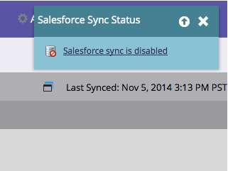

# Activer/désactiver la synchronisation Salesforce {#enable-disable-the-salesforce-sync}

Lorsque vous apportez des modifications importantes à vos paramètres de synchronisation ou de champ, désactivez la synchronisation pendant la configuration. Voici comment procéder :

1. Accédez à la section **Admin**.

   

1. Sous **Salesforce**, cliquez sur **Désactiver la synchronisation**.

   

1. La synchronisation bidirectionnelle est maintenant désactivée et inactive jusqu’à ce que vous la réactiviez. Les actions de flux Salesforce continueront à fonctionner.

   

1. Effectuez les modifications et réactivez la synchronisation. C&#39;est le même bouton.
