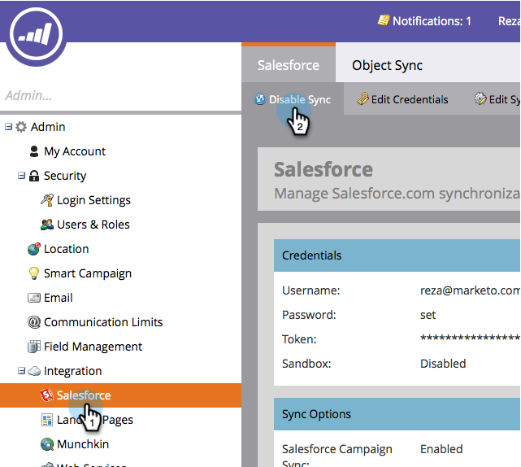

# Activation/désactivation de la synchronisation [!DNL Salesforce] {#enable-disable-the-salesforce-sync}

Lorsque vous apportez des modifications majeures à vos paramètres de synchronisation ou de champ, vous devez désactiver la synchronisation pendant la configuration. Voici comment procéder :

1. Accédez à la section **[!UICONTROL Admin]**.

   

1. Sous **[!UICONTROL Salesforce]**, cliquez sur **[!UICONTROL Désactiver la synchronisation]**.

   

1. La synchronisation bidirectionnelle est désormais désactivée et inactive jusqu’à ce que vous la réactiviez. Les actions de flux [!DNL Salesforce] continueront à fonctionner.

   

1. Apportez vos modifications et réactivez la synchronisation. C&#39;est le même bouton.
