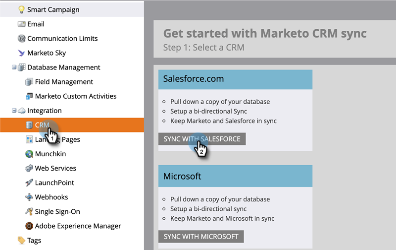

# Connexion à l’aide d’OAuth 2.0 {#log-in-using-oauth-2-0}

Salesforce utilise le protocole OAuth pour permettre aux utilisateurs des applications d’accéder en toute sécurité (authentifier l’application à l’aide d’OAuth 2.0) aux données sans avoir à révéler les informations de connexion. Vous trouverez ci-dessous les étapes à suivre pour vous connecter et synchroniser en toute sécurité Marketo avec Salesforce.

>[!IMPORTANT]
>
>Pour connecter Marketo et Salesforce à l’aide d’OAuth, connectez-vous à Marketo par le biais d’un navigateur privé (incognito) afin d’éviter toute connexion à Salesforce avec un nom d’utilisateur incorrect.

## Configuration d’une application connectée {#set-up-connected-app}

1. Dans Salesforce, sous Configuration, dans les outils de plateforme, accédez à Applications, App Manager, puis cliquez sur **Nouvelle application connectée**.

   

1. Renseignez les détails et cliquez sur **Enregistrer**.

   

1. Cliquez sur le bouton **Activation des paramètres OAuth** . Pour l’URL de rappel, saisissez `https://app.marketo.com/salesforce/getSfdcOAuthTokensRedirect`. Sélectionnez toutes les portées OAuth disponibles, puis cliquez sur **Ajouter**.

   

1. Cliquez sur **Enregistrer**.

   

1. Cliquez sur **Continuer**.

   

1. Copiez la clé du client et le secret du client (vous en aurez besoin ultérieurement pour l’utiliser dans Marketo Engage).

   

>[!CAUTION]
>
>Pendant que vous êtes toujours sur la page Nouvelle application connectée, faites défiler l’écran vers le bas et assurez-vous que la case &quot;Require BAT Key for Code Exchange (PKCE)&quot; (Exiger la clé de bon à tirer pour l’échange de code) est cochée. _NOT_ coché, car cela interférerait avec la configuration.

## Configuration de Marketo {#set-up-marketo}

>[!PREREQUISITES]
>
>* L’accès à l’API doit être activé pour l’utilisateur de synchronisation Salesforce (si vous êtes un utilisateur de Salesforce Professional Edition, cet accès n’est pas disponible par défaut ; veuillez contacter votre gestionnaire de compte Salesforce).
* L’utilisateur de synchronisation Marketo doit être créé dans Salesforce.
* Pour les clients existants, la fonctionnalité &quot;Activer OAuth pour la synchronisation SFDC&quot; est activée sur l’abonnement du client.
* Les bloqueurs de fenêtres contextuelles sont désactivés.
* L’application connectée est créée et nous disposons de la clé client et du secret client disponibles.

>[!CAUTION]
>
Veillez à masquer tous les champs dont vous n’avez pas besoin dans Marketo de l’utilisateur de synchronisation avant de cliquer sur **Champs de synchronisation**. Une fois que vous avez cliqué sur Synchroniser les champs, tous les champs visibles par l’utilisateur dans SFDC sont créés en permanence dans Marketo et ne peuvent pas être supprimés.

1. Dans la section Marketo Admin, cliquez sur **CRM**, puis **Synchroniser avec Salesforce**.

   

1. Ajoutez la clé du client et les informations secrètes du client que vous avez précédemment enregistrées, puis cliquez sur et **Enregistrer**.

   

1. Sur la page de synchronisation Marketo Salesforce, cliquez sur le bouton **Connexion avec Salesforce** bouton .

   

   >[!CAUTION]
   >
   Si vous voyez des champs Nom d’utilisateur/Mot de passe/Jeton et non un bouton &quot;Connexion avec Salesforce&quot;, votre abonnement Marketo est activé pour l’authentification de base. Reportez-vous à [Configuration de Marketo avec authentification de base](/help/marketo/product-docs/crm-sync/salesforce-sync/setup/enterprise-unlimited-edition/step-3-of-3-connect-marketo-and-salesforce-enterprise-unlimited.md). Une fois que la synchronisation commence à utiliser un ensemble d’informations d’identification, il n’y a plus de changement d’informations d’identification ou d’abonnement Salesforce. Si vous souhaitez utiliser Oauth 2.0, contactez l’équipe du compte Adobe (votre gestionnaire de compte).

1. Une fenêtre contextuelle contenant la page de connexion Salesforce s’affiche. Clé dans vos informations d’identification &quot;Utilisateur de synchronisation Marketo&quot; et connectez-vous.

   

1. Saisissez le code de vérification que vous avez reçu par courrier électronique (envoyé par Salesforce) et cliquez sur **Vérifier**.

   

1. Une fois la vérification effectuée, la page d’accès s’affiche pour demander l’accès. Cliquez sur **Autoriser**.

   

1. Dans quelques minutes, une fenêtre contextuelle s’affiche dans Marketo. Cliquez sur **Confirmation des informations d’identification**.

   

1. Une fois la synchronisation des champs terminée, cliquez sur **Démarrer la synchronisation Salesforce**.

   

1. Cliquez sur **Démarrer la synchronisation**.

   

Votre synchronisation entre Marketo et Salesforce est maintenant en cours.

>[!MORELIKETHIS]
>
* [Étape 1 sur 3 : Ajout de champs Marketo à Salesforce (Enterprise/Unlimited)](/help/marketo/product-docs/crm-sync/salesforce-sync/setup/enterprise-unlimited-edition/step-1-of-3-add-marketo-fields-to-salesforce-enterprise-unlimited.md)
* [Étape 2 sur 3 : création d’un utilisateur Salesforce pour Marketo (Enterprise/Unlimited)](/help/marketo/product-docs/crm-sync/salesforce-sync/setup/enterprise-unlimited-edition/step-2-of-3-create-a-salesforce-user-for-marketo-enterprise-unlimited.md)
* [Installation du package Marketo Sales Insight dans l’AppExchange Salesforce](/help/marketo/product-docs/marketo-sales-insight/msi-for-salesforce/installation/install-marketo-sales-insight-package-in-salesforce-appexchange.md)
* [Configuration de Marketo Sales Insight dans Salesforce Enterprise/Unlimited](/help/marketo/product-docs/marketo-sales-insight/msi-for-salesforce/configuration/configure-marketo-sales-insight-in-salesforce-enterprise-unlimited.md)
