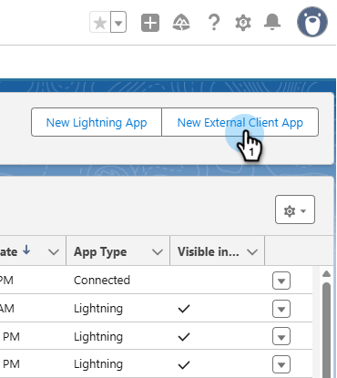
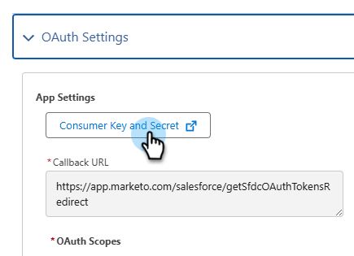

# Se connecter à l’aide d’OAuth 2.0 {#log-in-using-oauth-2-0}

Salesforce utilise le protocole OAuth pour permettre aux utilisateurs des applications d’accéder en toute sécurité aux données (d’authentifier l’application à l’aide d’OAuth 2.0) sans avoir à révéler leurs informations de connexion. Vous trouverez ci-dessous les étapes à effectuer pour connecter et synchroniser Marketo Engage avec Salesforce en toute sécurité.

>[!IMPORTANT]
>
>Pour connecter Marketo et [!DNL Salesforce] à l’aide d’OAuth, connectez-vous à Marketo via un navigateur privé (incognito) afin d’éviter de vous connecter à [!DNL Salesforce] avec un nom d’utilisateur incorrect.

## Configurer l’application cliente externe {#set-up-external-client-app}

>[!NOTE]
>
>Depuis septembre 2025, Salesforce limite l’utilisation des [applications connectées](https://help.salesforce.com/s/articleView?id=005132365&type=1){target="_blank"}. Pour les utilisateurs existants qui ont configuré une application connectée en fonction de notre documentation, vous pouvez ajouter l’autorisation « Approuver les applications connectées désinstallées » au profil de l’utilisateur de la synchronisation Marketo ou créer une application cliente externe à l’aide des instructions ci-dessous.

1. Dans Salesforce, cliquez sur l’icône d’engrenage et sélectionnez **Configuration**.

   

1. Dans la zone Recherche rapide, saisissez `App Manager`, puis sélectionnez **App Manager**.

   

1. Cliquez sur **Nouvelle application cliente externe**.

   

1. Renseignez les détails sous _Informations de base_. Définissez _État de distribution_ sur **Local**.

   

1. Développez la section **API (activer les paramètres OAuth)** et cochez la case **[!UICONTROL activer OAuth]**. Pour _URL de rappel_, saisissez `https://app.marketo.com/salesforce/getSfdcOAuthTokensRedirect`. Sélectionnez toutes les portées OAuth disponibles et cliquez sur la flèche de droite pour les ajouter.

   

1. Sous _Activation du flux_, assurez-vous qu’aucune case n’est sélectionnée.

   

1. Sous _Sécurité_, assurez-vous que seules les options **Exiger un secret pour le flux du serveur web** et **Exiger un secret pour le flux du jeton d’actualisation** sont sélectionnées.

   

1. Ignorez les quatre dernières sections et cliquez sur **Créer**.

   

1. Une fois la nouvelle application client externe créée, cliquez sur l’onglet **Paramètres** et développez la section **Paramètres OAuth**.

   

1. Cliquez sur le bouton **Clé du client et secret du client** pour ouvrir un nouvel onglet. Copiez et enregistrez les deux nombres (vous en aurez besoin ultérieurement pour les utiliser dans Marketo Engage).

   

## Configuration de Marketo {#set-up-marketo}

>[!PREREQUISITES]
>
>* L’accès à l’API doit être activé pour l’utilisateur de la synchronisation Salesforce (si vous êtes un utilisateur de Salesforce Professional Edition, cet accès n’est pas disponible par défaut ; contactez votre chargé de compte Salesforce).
>* L’utilisateur de la synchronisation Marketo doit être créé dans Salesforce.
>* Pour les clients existants, la fonction « Activer OAuth pour la synchronisation SFDC » est activée sur l’abonnement du client.
>* Les bloqueurs de fenêtres contextuelles sont désactivés.
>* L’application connectée est créée et nous disposons des clés [!UICONTROL Consumer Key] et [!UICONTROL Consumer Secret] disponibles.

>[!CAUTION]
>
>Veillez à masquer tous les champs dont vous n’avez pas besoin dans Marketo à l’utilisateur de la synchronisation avant de cliquer sur **[!UICONTROL Synchroniser les champs]**. Une fois que vous avez cliqué sur Synchroniser les champs , tous les champs que l’utilisateur peut voir dans SFDC sont créés de manière permanente dans Marketo et ne peuvent pas être supprimés.

1. Dans la section Marketo Admin , cliquez sur **[!UICONTROL CRM]**, puis **[!UICONTROL Synchroniser avec Salesforce]**.

   

1. Ajoutez les informations Clé du client et Secret du client que vous avez précédemment enregistrées et cliquez sur et **[!UICONTROL Enregistrer]**.

   

1. Sur la page de synchronisation de Marketo Salesforce, cliquez sur le bouton **[!UICONTROL Se connecter avec Salesforce]**.

   

   >[!CAUTION]
   >
   >Si les champs Nom d’utilisateur/Mot de passe/Jeton s’affichent et non un bouton « Se connecter avec Salesforce », votre abonnement Marketo est activé pour l’authentification de base. Reportez-vous à la section [Configuration de Marketo avec une authentification de base](/help/marketo/product-docs/crm-sync/salesforce-sync/setup/enterprise-unlimited-edition/step-3-of-3-connect-marketo-and-salesforce-enterprise-unlimited.md){target="_blank"}. Une fois que la synchronisation commence à utiliser un ensemble d’informations d’identification, il n’est plus possible de basculer sur les informations d’identification ou l’abonnement Salesforce. Pour qu’Oauth 2.0 soit configuré pour votre authentification Salesforce, contactez l’assistance Marketo {target="_blank"}.

1. Un pop-up s’affiche avec la page de connexion à Salesforce. Saisissez vos informations d’identification « Utilisateur de synchronisation Marketo » et connectez-vous.

   

1. Saisissez le code de vérification que vous avez reçu par e-mail (envoyé par Salesforce) et cliquez sur **[!UICONTROL Vérifier]**.

   

1. Une fois la vérification effectuée, la page d’accès s’affiche pour demander l’accès. Cliquez sur **[!UICONTROL Autoriser]**.

   

1. Dans quelques minutes, un pop-up apparaîtra dans Marketo. Cliquez sur **[!UICONTROL Confirmer les informations d’identification]**.

   

1. Une fois la synchronisation des champs terminée, cliquez sur **[!UICONTROL Démarrer la synchronisation Salesforce]**.

   

1. Cliquez sur **[!UICONTROL Démarrer la synchronisation]**.

   

Votre synchronisation entre Marketo et [!DNL Salesforce] est en cours.

>[!MORELIKETHIS]
>
>* [Étape 1 sur 3 : Ajouter des champs Marketo à Salesforce (Entreprise/Illimité)](/help/marketo/product-docs/crm-sync/salesforce-sync/setup/enterprise-unlimited-edition/step-1-of-3-add-marketo-fields-to-salesforce-enterprise-unlimited.md){target="_blank"}
>* [Étape 2 sur 3 : création d’un utilisateur Salesforce pour Marketo (Entreprise/Illimité)](/help/marketo/product-docs/crm-sync/salesforce-sync/setup/enterprise-unlimited-edition/step-2-of-3-create-a-salesforce-user-for-marketo-enterprise-unlimited.md){target="_blank"}
>* [Installer le package Marketo Sales Insight dans Salesforce AppExchange](/help/marketo/product-docs/marketo-sales-insight/msi-for-salesforce/installation/install-marketo-sales-insight-package-in-salesforce-appexchange.md){target="_blank"}
>* [Configuration de Marketo Sales Insight dans Salesforce Enterprise/Unlimited](/help/marketo/product-docs/marketo-sales-insight/msi-for-salesforce/configuration/configure-marketo-sales-insight-in-salesforce-enterprise-unlimited.md){target="_blank"}
