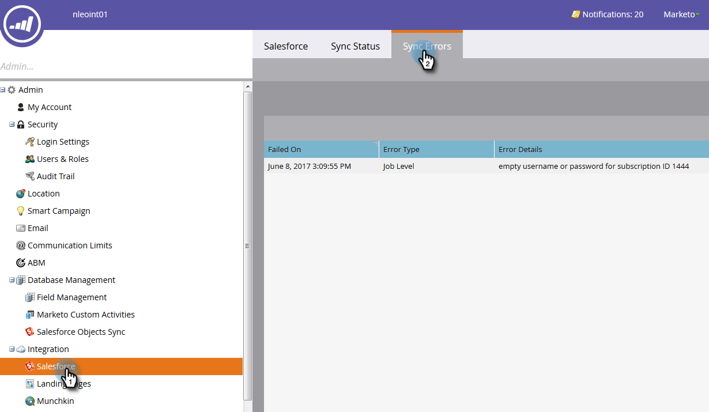

# Erreurs de synchronisation [!DNL Salesforce] {#salesforce-sync-errors}

Affichez un résumé des erreurs survenues pendant le processus de synchronisation. Cela inclut les erreurs dues à des échecs de synchronisation de données incompatibles.

>[!NOTE]
>
>**Autorisations d’administrateur requises**

## Afficher les erreurs de synchronisation {#view-sync-errors}

1. Cliquez sur **[!UICONTROL Admin]**.

   

1. Sous Intégration, cliquez sur **Salesforce**, puis sur l’onglet **[!UICONTROL Erreurs de synchronisation]**.

   

>[!NOTE]
>
>Les erreurs répertoriées vont de l’heure actuelle à cinq jours avant la synchronisation actuelle.

| Champ | Description |
|---|---|
| Échec de | Niveau d’enregistrement _ou_ niveau de tâche |
| Date/Heure de l’échec | Détails de l’erreur |
| Type d&#39;erreur | SFDC Message de retour |

>[!TIP]
>
>Cliquez sur l’enregistrement au niveau de l’enregistrement pour afficher les identifiants Marketo et [!DNL Salesforce] de l’objet associé. Dans certains cas, le message sur l’enregistrement et les erreurs au niveau de la tâche proviennent directement de [!DNL Salesforce]. Les rechercher en ligne peut fournir des détails supplémentaires.

## Erreurs de synchronisation des filtres {#filter-sync-errors}

1. Pour filtrer les données, cliquez sur l’icône de filtrage située à l’extrémité droite de la page.

   

1. Sélectionnez votre période et votre heure, puis filtrez par type d’erreur (niveau de tâche ou niveau d’enregistrement). Cliquez sur **[!UICONTROL Appliquer]** lorsque vous avez terminé.

   

**ÉTAPE FACULTATIVE** : Pour exporter les erreurs de synchronisation, cliquez sur **[!UICONTROL Exporter]**. Les données seront exportées au format CSV.

