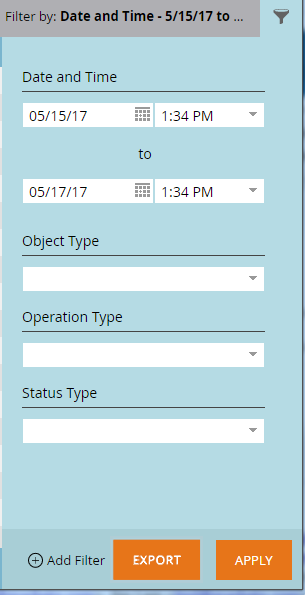

# Statut de synchronisation Salesforce {#salesforce-sync-status}

Utilisez le tableau de bord État de synchronisation pour afficher les statistiques de synchronisation dans le cadre des étapes de synchronisation et de son état de réussite.

Les étapes de synchronisation reflètent les opérations push ou pull de chaque type d’objet pour le schéma d’objet et les données elles-mêmes. Les statistiques couvrent les nouveaux enregistrements, les mises à jour, les suppressions et les échecs de comptage pendant la synchronisation. Les utilisateurs peuvent filtrer par date, type d’opération ou type d’objet. Le tableau de bord État de synchronisation affiche l’état des cycles de synchronisation pour les cinq derniers jours.

>[!NOTE]
>
>Autorisations d’administrateur requises

## Afficher l’état de synchronisation {#view-sync-status}

1. Cliquez sur **[!UICONTROL Admin]**.

   

1. Sous [!UICONTROL Intégration], cliquez sur **Salesforce**, puis sur l’onglet **[!UICONTROL État de synchronisation]**.

   

Par défaut, les statistiques sont triées selon le tout dernier démarrage. Vous pouvez trier par Démarré à ou Terminé à (de la plus récente à la plus ancienne) en cliquant sur l’icône de tri.

## État de synchronisation du filtre {#filter-sync-status}

1. Pour filtrer les données, cliquez sur l’icône de filtrage située à l’extrémité droite de la page.

   

1. Sélectionnez votre période et votre période, puis cliquez sur la ou les listes déroulantes pour filtrer par [!UICONTROL Type d’objet], [!UICONTROL Type d’opération] et/ou [!UICONTROL Type d’état].

   

1. Cliquez sur **[!UICONTROL Apply]**.

   

**ÉTAPE FACULTATIVE** : pour exporter des erreurs de synchronisation, cliquez sur **[!UICONTROL Exporter]**. Les données seront exportées au format CSV.

## Champs d’état de synchronisation {#sync-status-fields}

<table> 
 <colgroup> 
  <col> 
  <col> 
  <col> 
 </colgroup> 
 <tbody> 
  <tr> 
   <th>Champ</th> 
   <th>Description</th> 
   <th>Valeurs d’énumération</th> 
  </tr> 
  <tr> 
   <td colspan="1">Début</td> 
   <td colspan="1">Date/heure de début du cycle de synchronisation (fuseau horaire de l’utilisateur)</td> 
   <td colspan="1"></td> 
  </tr>  
  <tr> 
   <td colspan="1">Fin</td> 
   <td colspan="1">Date/heure de fin du cycle de synchronisation (fuseau horaire de l’utilisateur)</td> 
   <td colspan="1"></td> 
  </tr> 
  <tr> 
   <td colspan="1">Objet</td> 
   <td colspan="1">Type d'objet</td> 
   <td colspan="1">Contact, Personne, tâche, opportunité, prospect, Autres comme ci-dessous</td> 
  </tr>  
  <tr> 
   <td colspan="1">Opération</td> 
   <td colspan="1">Type d’opération</td> 
   <td colspan="1">Types d’opérations ci-dessous</td> 
  </tr>  
  <tr> 
   <td colspan="1">Statut</td> 
   <td colspan="1">État du lot</td> 
   <td colspan="1">Succès, Échec, Incomplet, En cours de traitement, Nettoyé*</td> 
  </tr>
  <tr> 
   <td colspan="1">Nouveau</td> 
   <td colspan="1">Nombre de nouveaux enregistrements</td> 
   <td colspan="1"></td> 
  </tr>  
  <tr> 
   <td colspan="1">Mis à jour</td> 
   <td colspan="1">Nombre d'enregistrements mis à jour</td> 
   <td colspan="1"></td> 
  </tr>  
  <tr> 
   <td colspan="1">Supprimé</td> 
   <td colspan="1">Nombre d'enregistrements supprimés</td> 
   <td colspan="1"></td> 
  </tr> 
  <tr> 
   <td colspan="1">Élément présentant un échec</td> 
   <td colspan="1">Nombre d’enregistrements dont la synchronisation a échoué</td> 
   <td colspan="1"> </td> 
  </tr>  
  <tr> 
   <td colspan="1">Ignoré</td> 
   <td colspan="1">Nombre d’enregistrements ignorés, car aucun changement n’a été apporté aux champs ciblés pour la synchronisation.</td> 
   <td colspan="1"></td> 
  </tr>  
 </tbody> 
</table>

&#42; Les données sont restaurées à l’état d’intégrité précédent après l’échec de l’étape de synchronisation.

## Type d&#39;objet {#object-type}

<table> 
 <colgroup> 
  <col> 
 </colgroup> 
 <tbody> 
  <tr> 
   <td colspan="1">Compte</td> 
  </tr>  
  <tr> 
   <td colspan="1">Type de compte</td> 
  </tr> 
  <tr> 
   <td colspan="1">Objets personnalisés</td> 
  </tr>  
  <tr> 
   <td colspan="1">Campagne</td> 
  </tr>  
  <tr> 
   <td colspan="1">Statut du membre de la campagne</td> 
  </tr>
  <tr> 
   <td colspan="1">Contact</td> 
  </tr>  
  <tr> 
   <td colspan="1">Modèle d'e-mail</td> 
  </tr>  
  <tr> 
   <td colspan="1">Événement</td> 
  </tr> 
  <tr> 
   <td colspan="1">Personne (prospect)</td> 
  </tr>  
  <tr> 
   <td colspan="1">Opportunité</td> 
  </tr>  
  <tr> 
   <td colspan="1">Rôle du contact d’opportunité</td> 
  </tr>  
  <tr> 
   <td colspan="1">Tâche</td> 
  </tr>  
  <tr> 
   <td colspan="1">Utilisateur</td> 
  </tr>  
 </tbody> 
</table>

## Type d’opération {#operation-type}

<table> 
 <colgroup> 
  <col> 
  <col> 
  <col>
  <col> 
 </colgroup> 
 <tbody> 
  <tr> 
   <th>Type d’opération</th> 
   <th>Trouvé par rapport à ces objets</th> 
   <th>Remarques</th> 
   <th>Type d'opération</th>
  </tr> 
  <tr> 
   <td colspan="1">Lien Init avec le programme</td> 
   <td colspan="1">Campagne</td> 
   <td colspan="1">Liaison de campagnes à des programmes</td> 
   <td colspan="1">Mise à jour</td>
  </tr>  
  <tr> 
   <td colspan="1">Extraire les conversions</td> 
   <td colspan="1">Personne (prospect)*</td> 
   <td colspan="1">Extrayez les actions de conversion de SFDC vers Marketo. Les unités (nombres) sont des pistes convertissant en contacts</td> 
   <td colspan="1">Mise à jour, élément en échec ou saut</td>
  </tr> 
  <tr> 
   <td colspan="1">Extraire les suppressions</td> 
   <td colspan="1">Contact, Personne (prospect), Opportunité, Campagne, Membres de la campagne, Contact d’opportunité, Objets personnalisés, Campagnes, État du membre de la campagne, Rôle Contact d’opportunité</td> 
   <td colspan="1">Suppression des enregistrements de SFDC synchronisés avec Marketo</td> 
   <td colspan="1">Suppression, échec d’un élément ou saut</td>
  </tr>  
  <tr> 
   <td colspan="1">Extraire les mises à jour</td> 
   <td colspan="1">Tâche, Personne (piste), Queue de personne (piste), Contact, Événement, Opportunité, Compte, Type de compte, Membres de la campagne, Objets personnalisés, Campagnes, État du membre de la campagne, Événements, État de la personne, Opportunité, Rôle Contact de l’opportunité</td> 
   <td colspan="1">Mises à jour ou nouveaux enregistrements dans SFDC synchronisés avec Marketo, Extraction des événements en tant qu’activités</td> 
   <td colspan="1">Nouvel élément, mis à jour, échoué ou ignoré</td>
  </tr>  
  <tr> 
   <td colspan="1">Intégrer les nouveaux</td> 
   <td colspan="1">Tâches, modèles de courrier électronique</td> 
   <td colspan="1">Tâches push (activités)</td> 
   <td colspan="1"></td>
  </tr>
  <tr> 
   <td colspan="1">Intégrer les mises à jour</td> 
   <td colspan="1">Tâches, modèles de courrier électronique, Personne, Contact, Campagnes</td> 
   <td colspan="1">Envoyer les mises à jour à SFDC et supprimer également</td> 
   <td colspan="1">Mise à jour, élément en échec ou saut</td>
  </tr>  
  <tr> 
   <td colspan="1">Synchroniser le schéma</td> 
   <td colspan="1">Membres de campagne, Objets personnalisés, Campagnes, État du membre de campagne, Tâches, Personne, Opportunité, Rôle Contact d’opportunité, Utilisateurs</td> 
   <td colspan="1">Synchronise les métadonnées des différents objets, afin de déterminer les nouveaux champs à synchroniser lors du cycle suivant</td> 
   <td colspan="1"></td>
  </tr>  
  <tr> 
   <td colspan="1">Synchroniser avec le programme</td> 
   <td colspan="1">Campagnes</td> 
   <td colspan="1">Synchronisation du programme Marketo avec les campagnes SFDC</td> 
   <td colspan="1">Nouveau, mises à jour, échec ou abandon</td>
  </tr> 
  <tr> 
   <td colspan="1">Mettre à jour les activités</td> 
   <td colspan="1">Tâches</td> 
   <td colspan="1">Extraction des activités de Salesforce</td> 
   <td colspan="1"></td>
  </tr>  
  <tr> 
   <td colspan="1">Mettre à jour le FKS</td> 
   <td colspan="1">Tous</td> 
   <td colspan="1">Mise à jour de la clé étrangère de tous les objets</td> 
   <td colspan="1">S/O</td>
  </tr>  
 </tbody> 
</table>

&#42;Le paramétrage de la marque au niveau de l&#39;abonnement décide du libellé - &quot;Lead&quot; ou &quot;Person&quot; dans le rapport.
