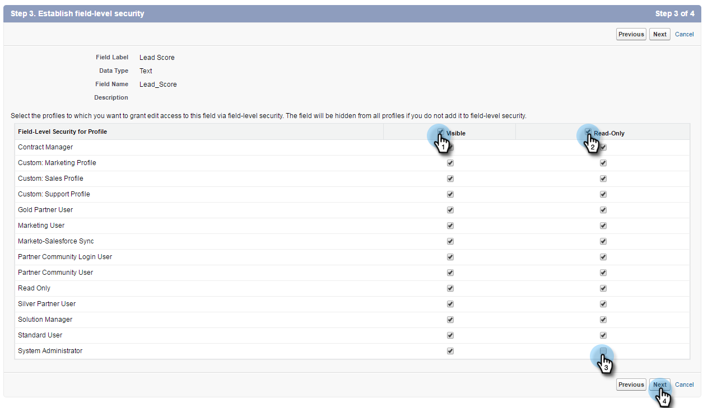

# Étape 1 sur 3 : Ajouter des champs Marketo à [!DNL Salesforce] (Entreprise/Illimité) {#step-of-add-marketo-fields-to-salesforce-enterprise-unlimited}

>[!PREREQUISITES]
>
>Vous devez avoir accès aux API [!DNL Salesforce] pour effectuer une synchronisation entre Marketo et [!DNL Salesforce].

Marketo utilise un ensemble de champs pour capturer certains types d’informations liées au marketing. Si vous souhaitez obtenir ces données en [!DNL Salesforce], veuillez suivre les instructions ci-dessous.

1. Créez trois champs personnalisés dans [!DNL Salesforce] sur les objets de prospect et de contact : Score, Programme d’acquisition et Date d’acquisition.
1. Mappez ces champs personnalisés entre les prospects et les contacts afin que les valeurs soient transférées lors de la conversion dans [!DNL Salesforce].
1. Vous pouvez créer d’autres champs supplémentaires, si nécessaire (voir le tableau ci-dessous).

Tous ces champs personnalisés sont facultatifs et ne sont pas obligatoires pour synchroniser Marketo et [!DNL Salesforce]. Il est recommandé de créer des champs pour le score, le programme d’acquisition et la date d’acquisition.

## Ajouter des champs Marketo aux [!DNL Salesforce] {#add-marketo-fields-to-salesforce}

Ajoutez trois champs personnalisés sur les objets de prospect et de contact dans les [!DNL Salesforce] répertoriés ci-dessus. Si vous souhaitez en ajouter d&#39;autres, consultez le tableau des champs disponibles à la fin de cette section.

Effectuez les étapes suivantes pour chacun des trois champs personnalisés pour les ajouter. Commencez par le score.

1. Connectez-vous à [!DNL Salesforce] et cliquez sur **[!UICONTROL Configuration]**.

   

1. Dans le menu Générer sur la gauche, cliquez sur **[!UICONTROL Personnaliser]** et sélectionnez **[!UICONTROL Prospects]**. Cliquez sur **[!UICONTROL Champs]**.

   

1. Cliquez sur **[!UICONTROL Nouveau]** dans la section Champs personnalisés et relations au bas de la page.

   

1. Sélectionnez le type de champ approprié (pour Score - Nombre ; Programme d&#39;acquisition - Texte ; Date d&#39;acquisition - Date/Heure).

   

1. Cliquez sur **[!UICONTROL Suivant]**.

   

1. Saisissez les [!UICONTROL Libellé du champ], [!UICONTROL Longueur] et [!UICONTROL Nom du champ] pour le champ, comme illustré dans le tableau ci-dessous.

<table> 
 <thead> 
  <tr> 
   <th> 
    

      Intitulé de champ 
    
</th> 
   <th> 
    

      Nom du champ 
    
</th> 
   <th> 
    

      Type de données 
    
</th> 
   <th> 
    

      Attributs de champ 
    
</th> 
  </tr> 
 </thead> 
 <tbody> 
  <tr> 
   <td>Score</td> 
   <td>mkto71_Lead_Score</td> 
   <td>Nombre</td> 
   <td>Longueur 10 Décimales 0 </td> 
  </tr> 
  <tr> 
   <td>Date d'acquisition</td> 
   <td>mkto71_Acquisition_Date</td> 
   <td>Date/heure</td> 
   <td> </td> 
  </tr> 
  <tr> 
   <td>Programme d'acquisition</td> 
   <td>mkto71_Acquisition_Program</td> 
   <td>Texte</td> 
   <td>Longueur 255</td> 
  </tr> 
 </tbody> 
</table>

>[!NOTE]
>
>[!DNL Salesforce] ajoute __c aux noms de champ lorsqu’il les utilise pour créer des noms d’API.

>[!NOTE]
>
>Les champs de texte et de nombre nécessitent une longueur, mais pas les champs Date/Heure. Une description est facultative.

1. Cliquez sur **[!UICONTROL Suivant]**.

   

1. Spécifiez les paramètres d&#39;accès et cliquez sur **[!UICONTROL Suivant]** :

   * Définissez tous les rôles sur **[!UICONTROL Visible]** et **[!UICONTROL Lecture seule]**

   * Désélectionnez la case **[!UICONTROL Lecture seule]** pour le profil de l’utilisateur de synchronisation :

      * Si vous avez un utilisateur avec le profil d’un _Administrateur système_ en tant qu’utilisateur de synchronisation, désélectionnez la case **[!UICONTROL Lecture seule]** pour le profil Administrateur système (comme illustré ci-dessous)
      * Si vous avez créé un _profil personnalisé_ pour l’utilisateur de synchronisation, décochez la case **[!UICONTROL Lecture seule]** pour ce profil personnalisé

   

1. Choisissez les mises en page qui doivent afficher le champ.

   

1. Cliquez sur **[!UICONTROL Enregistrer et nouveau]** pour revenir en arrière et créer chacun des deux autres champs personnalisés. Cliquez sur **[!UICONTROL Enregistrer]**. Vous avez terminé avec les trois.

   

1. Dans le menu Générer sur la gauche, cliquez sur **[!UICONTROL Personnaliser]** et sélectionnez Contacts. Cliquez sur [!UICONTROL  Champs ].
1. Exécutez les étapes 3 à 10 pour les champs Score, Date d&#39;acquisition et Programme d&#39;acquisition sur l&#39;objet de contact, comme vous l&#39;avez fait pour l&#39;objet de prospect.
1. Vous pouvez éventuellement utiliser la procédure ci-dessus pour tout champ personnalisé supplémentaire de ce tableau.

<table> 
 <thead> 
  <tr> 
   <th> 
    

      Intitulé de champ 
    
</th> 
   <th> 
    

      Nom du champ 
    
</th> 
   <th> 
    

      Type de données 
    
</th> 
   <th> 
    

      Attributs de champ 
    
</th> 
  </tr> 
 </thead> 
 <tbody> 
  <tr> 
   <td>ID du programme d’acquisition</td> 
   <td>mkto71_Acquisition_Program_Id</td> 
   <td>Nombre</td> 
   <td>Longueur 18 Nombre De Décimales 0 </td> 
  </tr> 
  <tr> 
   <td>Référent d'origine</td> 
   <td>mkto71_Original_Referrer</td> 
   <td>Texte</td> 
   <td>Longueur 255</td> 
  </tr> 
  <tr> 
   <td>Moteur de recherche d'origine</td> 
   <td>mkto71_Original_Search_Engine</td> 
   <td>Texte</td> 
   <td>Longueur 255</td> 
  </tr> 
  <tr> 
   <td>Phrase de recherche d'origine</td> 
   <td>mkto71_Original_Search_Phrase</td> 
   <td>Texte</td> 
   <td>Longueur 255</td> 
  </tr> 
  <tr> 
   <td>Informations sur la source d'origine</td> 
   <td>mkto71_Original_Source_Info</td> 
   <td>Texte</td> 
   <td>Longueur 255</td> 
  </tr> 
  <tr> 
   <td>Type de source d'origine</td> 
   <td>mkto71_Original_Source_Type</td> 
   <td>Texte</td> 
   <td>Longueur 255</td> 
  </tr> 
  <tr> 
   <td>Ville déduite</td> 
   <td>mkto71_Inferred_City</td> 
   <td>Texte</td> 
   <td>Longueur 255</td> 
  </tr> 
  <tr> 
   <td>Société déduite</td> 
   <td>mkto71_Inferred_Company</td> 
   <td>Texte</td> 
   <td>Longueur 255</td> 
  </tr> 
  <tr> 
   <td>Pays déduit</td> 
   <td>mkto71_Inferred_Country</td> 
   <td>Texte</td> 
   <td>Longueur 255</td> 
  </tr> 
  <tr> 
   <td>Aire métropolitaine déduite</td> 
   <td>mkto71_Inferred_Metropolitan_Area</td> 
   <td>Texte</td> 
   <td>Longueur 255</td> 
  </tr> 
  <tr> 
   <td>Indicatif téléphonique local déduit</td> 
   <td>mkto71_Inferred_Phone_Area_Code</td> 
   <td>Texte</td> 
   <td>Longueur 255</td> 
  </tr> 
  <tr> 
   <td>Code postal déduit</td> 
   <td>mkto71_Inferred_Postal_Code</td> 
   <td>Texte</td> 
   <td>Longueur 255</td> 
  </tr> 
  <tr> 
   <td>Région déduite</td> 
   <td>mkto71_Inferred_State_Region</td> 
   <td>Texte</td> 
   <td>Longueur 255</td> 
  </tr> 
 </tbody> 
</table>

>[!NOTE]
>
>Les valeurs des champs affectés automatiquement par Marketo ne seront pas immédiatement disponibles dans [!DNL Salesforce] une fois le nouveau champ créé. Marketo synchronise les données à [!DNL Salesforce] lors de la prochaine mise à jour de l’enregistrement sur l’un des systèmes (c’est-à-dire une mise à jour de l’un des champs synchronisés entre Marketo et [!DNL Salesforce]).

## Mapper des champs personnalisés pour les conversions {#map-custom-fields-for-conversions}

Un champ personnalisé sur l’objet de prospect dans [!DNL Salesforce] doit être mappé à un champ de contact sur l’objet de contact afin que les données soient transférées lorsqu’une conversion se produit.

1. Dans le coin supérieur droit, cliquez sur **[!UICONTROL Configuration]**.

   

1. Saisissez « Fields » dans la recherche de navigation sans appuyer sur Entrée. Champs apparaît sous différents objets ; cliquez sur **[!UICONTROL Champs]** sous [!UICONTROL Leads].

   

1. Accédez à la section [!UICONTROL Champs personnalisés et relations du lead] et cliquez sur **[!UICONTROL Mapper les champs de lead]**.

   

1. Cliquez sur la liste déroulante en regard du champ à mapper.

   

1. Sélectionnez le champ personnalisé de contact correspondant.

   

1. Répétez les étapes ci-dessus pour tout autre champ que vous avez créé.

1. Cliquez sur **[!UICONTROL Enregistrer]** lorsque vous avez terminé.

   Assez facile, non ?

>[!MORELIKETHIS]
>
>[Étape 2 sur 3 : création d’un utilisateur  [!DNL Salesforce]  Marketo (Entreprise/Illimité)](/help/marketo/product-docs/crm-sync/salesforce-sync/setup/enterprise-unlimited-edition/step-2-of-3-create-a-salesforce-user-for-marketo-enterprise-unlimited.md)
