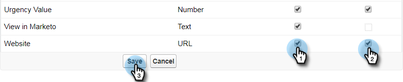

# Étape 2 sur 3 : Créer un utilisateur Salesforce pour Marketo (Enterprise/Unlimited) {#step-of-create-a-salesforce-user-for-marketo-enterprise-unlimited}

>[!NOTE]
>
>Ces étapes doivent être effectuées par un administrateur Salesforce.

>[!NOTE]
>
>**Conditions préalables**
>
>* [Étape 1 sur 3 : Ajouter les champs du marketing à Salesforce (Enterprise/Unlimited)](step-1-of-3-add-marketo-fields-to-salesforce-enterprise-unlimited.md)

>

Dans cet article, vous allez configurer des autorisations d&#39;utilisateur dans le profil Salesforce et créer un compte d&#39;intégration Marketo-Salesforce.

## Création d’un Profil {#create-a-profile}

1. Cliquez sur **Configuration**.

   

1. Tapez &quot;profils&quot; dans la barre de recherche Nav et cliquez sur le lien **Profils** .

   

1. Cliquez sur **Nouveau**.

   

1. Sélectionnez Utilisateur **** standard, nommez le profil &quot;Synchronisation Marketo-Salesforce&quot;, puis cliquez sur **Enregistrer**.

   

## Définir les autorisations de Profil {#set-profile-permissions}

1. Cliquez sur **Modifier** pour définir les autorisations de sécurité.

   

1. Sous la section Permissions **** administratives, vérifiez que les cases suivantes sont cochées :

   * API activée
   * Modifier les modèles HTML
   * Gérer les Documents publics
   * Gérer les modèles publics

   

   >[!TIP]
   >
   >Assurez-vous de cocher la case **Mot de passe n’expirant jamais** .

1. Sous la section Autorisations générales de l’utilisateur, vérifiez que les cases suivantes sont cochées :

   * Convertir les pistes
   * Modifier les Événements
   * Modifier les Tâches

   

1. Sous la section Autorisations d’objet standard, vérifiez que les autorisations de lecture, de création, de modification et de suppression sont recherchées :

   * Comptes
   * Campagnes
   * Contacts
   * Pistes
   * Opportunités

   >[!NOTE]
   >
   >Octroyez des autorisations aux campagnes si vous prévoyez d’utiliser Campaign Sync.

   

1. Lorsque vous avez terminé, cliquez sur **Enregistrer** en bas de la page.

   

## Définir les autorisations de champ {#set-field-permissions}

1. Discutez avec vos spécialistes du marketing pour déterminer les champs personnalisés à synchroniser.

   >[!NOTE]
   >
   >Cette étape permet d’éviter que les champs dont vous n’avez pas besoin ne s’affichent dans Marketo, ce qui réduit l’encombrement et accélère la synchronisation.

1. Dans la page des détails du profil, accédez à la section Sécurité **** au niveau du champ. Cliquez sur **Vue** pour modifier l’accessibilité des objets :

   * `Lead`
   * `Contact`
   * `Account`
   * `Opportunity`

   >[!TIP]
   >
   >Vous pouvez configurer d’autres objets en fonction des besoins de votre entreprise.

   

1. Pour chaque objet, cliquez sur **Modifier**.

   

1. Localisez les champs inutiles, assurez-vous que **Accès en lecture **et** Accès en modification **sont désactivés. Cliquez sur **Enregistrer** lorsque vous avez terminé.

   >[!NOTE]
   >
   >**Rappel**
   >
   >
   >Modifiez uniquement l’accessibilité des champs personnalisés.

   

1. Une fois tous les champs inutiles désactivés, vous devez cocher **Accès en lecture et Accès en modification **pour les champs d&#39;objet suivants. Cliquez sur **Enregistrer** lorsque vous avez terminé.

<table> 
 <tbody> 
  <tr> 
   <th colspan="1" rowspan="1">
Objet
</th> 
   <th colspan="1" rowspan="1">
Champs
</th> 
  </tr> 
  <tr> 
   <td colspan="1" rowspan="1">
Compte
</td> 
   <td colspan="1" rowspan="1">
Champ Type
</td> 
  </tr> 
  <tr> 
   <td colspan="1" rowspan="1">
Événement
</td> 
   <td colspan="1" rowspan="1">
Tous les champs
</td> 
  </tr> 
  <tr> 
   <td colspan="1" rowspan="1">
Tâche
</td> 
   <td colspan="1" rowspan="1">
Tous les champs
</td> 
  </tr> 
 </tbody> 
</table>

## Créer un compte de synchronisation Marketo-Salesforce {#create-marketo-salesforce-sync-account}

>[!TIP]
>
>Créez un compte Salesforce dédié (ex. [`[email protected]`](http://docs.marketo.com/cdn-cgi/l/email-protection#89e4e8fbe2ecfde6c9f0e6fcfbeae6e4f9e8e7f0a7eae6e4)) pour distinguer les modifications effectuées par Marketo des autres utilisateurs de Salesforce.

1. Tapez &quot;Gérer les utilisateurs&quot; dans la barre de recherche de Nav, puis cliquez sur **Utilisateurs**. Cliquez sur **Nouvel utilisateur**.

   

1. Renseignez les champs obligatoires. Sélectionnez ensuite la licence **utilisateur : Salesforce** et le Profil que vous avez créé précédemment. Cliquez sur **Enregistrer** lorsque vous avez terminé.

   

L&#39;étape 2 sur 2 est terminée.

>[!NOTE]
>
>**Articles connexes**
>
>* [Étape 3 sur 3 : Connecter Marketing et Salesforce (Enterprise/Unlimited)](step-3-of-3-connect-marketo-and-salesforce-enterprise-unlimited.md)

>

