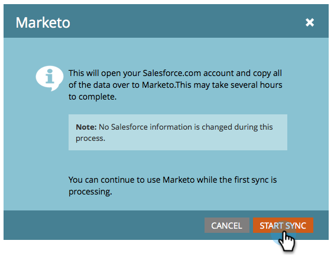

# Étape 3 sur 3 : connecter Marketo et [!DNL Salesforce] (Entreprise/Illimité) {#step-of-connect-marketo-and-salesforce-enterprise-unlimited}

Dans cet article, vous allez configurer Marketo pour qu’il se synchronise avec l’instance [!DNL Salesforce] configurée.

>[!PREREQUISITES]
>
>* [Étape 1 de 3 : ajouter des champs Marketo à  [!DNL Salesforce] (Entreprise/Illimité)](/help/marketo/product-docs/crm-sync/salesforce-sync/setup/enterprise-unlimited-edition/step-1-of-3-add-marketo-fields-to-salesforce-enterprise-unlimited.md)
>* [Étape 2 sur 3 : création d’un utilisateur  [!DNL Salesforce]  Marketo (Entreprise/Illimité)](/help/marketo/product-docs/crm-sync/salesforce-sync/setup/enterprise-unlimited-edition/step-2-of-3-create-a-salesforce-user-for-marketo-enterprise-unlimited.md)

## Récupérer le jeton de sécurité de l’utilisateur de synchronisation {#retrieve-sync-user-security-token}

>[!TIP]
>
>Si vous disposez déjà du jeton de sécurité, passez directement à Définition des informations d’identification de l’utilisateur de synchronisation et félicitations pour la préparation !

1. Connectez-vous à [!DNL Salesforce] avec l’utilisateur de synchronisation Marketo, cliquez sur le nom de l’utilisateur de synchronisation, puis sur **[!UICONTROL Mes paramètres]**.

   

1. Dans la recherche rapide, saisissez « reset » et cliquez sur **[!UICONTROL Réinitialiser mon jeton de sécurité]**.

   

1. Cliquez sur **[!UICONTROL Réinitialiser le jeton de sécurité]**.

   

   Le jeton de sécurité vous sera envoyé par e-mail.

## Définir les informations d’identification de l’utilisateur de synchronisation {#set-sync-user-credentials}

1. Dans Marketo, accédez à **[!UICONTROL Admin]**, sélectionnez **CRM**, puis cliquez sur **[!UICONTROL Synchroniser avec Salesforce.com]**

   

   >[!NOTE]
   >
   >Veillez à [masquer tous les champs dont vous n’avez pas besoin](/help/marketo/product-docs/crm-sync/salesforce-sync/sfdc-sync-details/hide-a-salesforce-field-from-the-marketo-sync.md) dans Marketo à l’utilisateur de synchronisation avant de cliquer sur **[!UICONTROL Synchroniser les champs]**. Une fois que vous avez cliqué sur [!UICONTROL Synchroniser les champs] tous les champs visibles par l’utilisateur sont créés en permanence dans Marketo et ne peuvent pas être supprimés.

1. Saisissez les informations d’identification de l’utilisateur de synchronisation [!DNL Salesforce] créées dans la partie 2 de la configuration [!DNL Salesforce] ([Professionnel](/help/marketo/product-docs/crm-sync/salesforce-sync/setup/professional-edition/step-2-of-3-create-a-salesforce-user-for-marketo-professional.md) ou [Entreprise](/help/marketo/product-docs/crm-sync/salesforce-sync/setup/enterprise-unlimited-edition/step-2-of-3-create-a-salesforce-user-for-marketo-enterprise-unlimited.md)) et cliquez sur **[!UICONTROL Champs de synchronisation]** (cochez la case **[!UICONTROL Sandbox]** [!DNL Salesforce] uniquement si vous synchronisez un sandbox Marketo avec un autre sandbox).

   

   >[!CAUTION]
   >
   >Si un bouton « Se connecter à [!DNL Salesforce] » s’affiche à la place des champs Nom d’utilisateur/Mot de passe/Jeton, votre abonnement Marketo est activé pour OAuth. Reportez-vous [&#x200B; cet article](/help/marketo/product-docs/crm-sync/salesforce-sync/log-in-using-oauth-2-0.md). Dès que la synchronisation commence à utiliser un ensemble d’informations d’identification, **les informations d’identification [!DNL Salesforce] ou l’abonnement ne changent pas**. Si vous souhaitez utiliser l’authentification de base, contactez votre gestionnaire de compte.

1. Lisez l’avertissement, puis cliquez sur **[!UICONTROL Confirmer les informations d’identification]**.

   

   >[!CAUTION]
   >
   >Si vous souhaitez parcourir les [mappages et les personnaliser](/help/marketo/product-docs/crm-sync/salesforce-sync/setup/optional-steps/edit-initial-field-mappings.md), c’est votre seule chance de le faire ! Une fois que vous avez cliqué sur [!UICONTROL Démarrer la synchronisation de Salesforce], tout est terminé.

## Démarrer [!DNL Salesforce] synchronisation {#start-salesforce-sync}

1. Cliquez sur **[!UICONTROL Démarrer la synchronisation Salesforce]** pour lancer la synchronisation persistante Marketo-[!DNL Salesforce].

   

   >[!CAUTION]
   >
   >Marketo ne déduplique pas automatiquement les données par rapport à une synchronisation [!DNL Salesforce] ou lorsque vous saisissez manuellement des prospects.

1. Cliquez sur **[!UICONTROL Démarrer la synchronisation]**.

   

   >[!NOTE]
   >
   >Le temps nécessaire pour terminer la synchronisation initiale varie en fonction de la taille et de la complexité de votre base de données.

## Vérifier la synchronisation {#verify-sync}

Marketo fournit des messages de statut pour la synchronisation [!DNL Salesforce] dans la zone Admin. Pour vérifier que la synchronisation fonctionne correctement, procédez comme suit.

1. Dans Marketo, cliquez sur **[!UICONTROL Admin]**, puis sur **[!UICONTROL Salesforce]**.

   

1. Le statut de synchronisation est visible dans le coin supérieur droit. L’un des trois messages suivants s’affiche : **[!UICONTROL Dernière synchronisation]**, **[!UICONTROL Synchronisation en cours]** ou **[!UICONTROL Échec]**.

   

   

   

Vous venez de terminer la configuration de l’une des fonctionnalités les plus puissantes de Marketo, allez-y !

>[!MORELIKETHIS]
>
>* [Étape 1 de 3 : ajouter des champs Marketo à  [!DNL Salesforce] (Entreprise/Illimité)](/help/marketo/product-docs/crm-sync/salesforce-sync/setup/enterprise-unlimited-edition/step-1-of-3-add-marketo-fields-to-salesforce-enterprise-unlimited.md)
>* [Étape 2 sur 3 : création d’un utilisateur  [!DNL Salesforce]  Marketo (Entreprise/Illimité)](/help/marketo/product-docs/crm-sync/salesforce-sync/setup/enterprise-unlimited-edition/step-2-of-3-create-a-salesforce-user-for-marketo-enterprise-unlimited.md)
>* [Installer le package Marketo Sales Insight dans [!DNL Salesforce] AppExchange](/help/marketo/product-docs/marketo-sales-insight/msi-for-salesforce/installation/install-marketo-sales-insight-package-in-salesforce-appexchange.md)
>* [Configuration de Marketo Sales Insight in [!DNL Salesforce] Enterprise/Unlimited](/help/marketo/product-docs/marketo-sales-insight/msi-for-salesforce/configuration/configure-marketo-sales-insight-in-salesforce-enterprise-unlimited.md)
