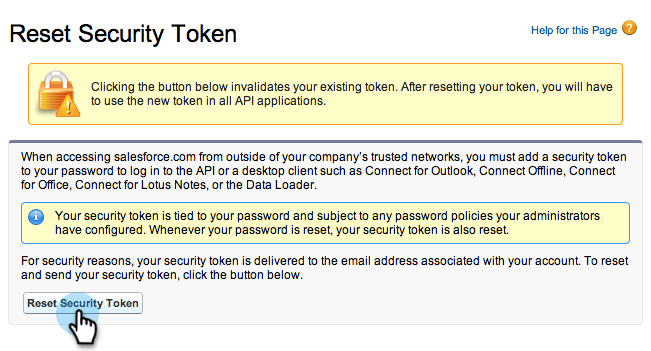

# Étape 3 sur 3 : Connexion de Marketo et de Salesforce (Enterprise/Unlimited) {#step-of-connect-marketo-and-salesforce-enterprise-unlimited}

Dans cet article, vous allez configurer Marketo pour qu’il se synchronise avec votre instance Salesforce configurée.

>[!PREREQUISITES]
>
>* [Étape 1 sur 3 : Ajout de champs Marketo à Salesforce (Enterprise/Unlimited)](/help/marketo/product-docs/crm-sync/salesforce-sync/setup/enterprise-unlimited-edition/step-1-of-3-add-marketo-fields-to-salesforce-enterprise-unlimited.md)
>* [Étape 2 sur 3 : Création d’un utilisateur Salesforce pour Marketo (Enterprise/Unlimited)](/help/marketo/product-docs/crm-sync/salesforce-sync/setup/enterprise-unlimited-edition/step-2-of-3-create-a-salesforce-user-for-marketo-enterprise-unlimited.md)

## Récupération du jeton de sécurité utilisateur de synchronisation {#retrieve-sync-user-security-token}

>[!TIP]
>
>Si vous disposez déjà du jeton de sécurité, passez directement à la section Définir les informations d’identification de l’utilisateur de synchronisation et à la section Notions de connexion pour la préparation !

1. Connectez-vous à Salesforce avec l’utilisateur de synchronisation Marketo, cliquez sur le nom de l’utilisateur de synchronisation, puis **Mes paramètres**.

   

1. Dans la recherche rapide, saisissez &quot;reset&quot; (réinitialiser), puis cliquez sur **Réinitialiser mon jeton de sécurité**.

   

1. Cliquez sur **Réinitialiser le jeton de sécurité**.

   

   Le jeton de sécurité vous sera envoyé par email.

## Définition des informations d’identification d’utilisateur de synchronisation {#set-sync-user-credentials}

1. Dans Marketo, accédez à **Administration**, sélectionnez **CRM**, puis cliquez sur **Synchroniser avec [Salesforce.com](https://Salesforce.com)**

   

   >[!NOTE]
   >
   >Veillez à [masquer tous les champs dont vous n’avez pas besoin ;](/help/marketo/product-docs/crm-sync/salesforce-sync/sfdc-sync-details/hide-a-salesforce-field-from-the-marketo-sync.md) dans Marketo à partir de l’utilisateur de synchronisation avant de cliquer sur **Champs de synchronisation**. Une fois que vous avez cliqué sur Synchroniser les champs, tous les champs visibles par l’utilisateur sont créés dans Marketo de manière permanente et ne peuvent pas être supprimés.

1. Saisissez les informations d’identification de l’utilisateur de synchronisation Salesforce créées dans la partie 2 de la configuration Salesforce ([Professionnel](/help/marketo/product-docs/crm-sync/salesforce-sync/setup/professional-edition/step-2-of-3-create-a-salesforce-user-for-marketo-professional.md) ou [Entreprise](/help/marketo/product-docs/crm-sync/salesforce-sync/setup/enterprise-unlimited-edition/step-2-of-3-create-a-salesforce-user-for-marketo-enterprise-unlimited.md)) et cliquez sur **Champs de synchronisation** (check) **Sandbox** uniquement si vous synchronisez un environnement de test Marketo avec un environnement de test Salesforce).

   

   >[!CAUTION]
   >
   >Si vous voyez un bouton &quot;Se connecter à Salesforce&quot; au lieu des champs Nom d’utilisateur/Mot de passe/Jeton, votre abonnement Marketo est activé pour OAuth. Veuillez [voir cet article](/help/marketo/product-docs/crm-sync/salesforce-sync/log-in-using-oauth-2-0.md). Dès que la synchronisation commence à utiliser un ensemble d’informations d’identification, **il n’y a pas de changement d’informations d’identification ou d’abonnement Salesforce**. Si vous souhaitez utiliser l’authentification de base, contactez l’équipe du compte Adobe (votre gestionnaire de compte).

1. Lisez l’avertissement, puis cliquez sur **Confirmation des informations d’identification**.

   

   >[!CAUTION]
   >
   >Si vous souhaitez consulter la variable [mappages et personnalisez-les](/help/marketo/product-docs/crm-sync/salesforce-sync/setup/optional-steps/edit-initial-field-mappings.md), c&#39;est votre seule chance de le faire ! Une fois que vous avez cliqué sur Démarrer la synchronisation Salesforce, c’est terminé.

## Démarrer la synchronisation Salesforce {#start-salesforce-sync}

1. Cliquez sur **Démarrer la synchronisation Salesforce** pour lancer la synchronisation persistante Marketo-Salesforce.

   

   >[!CAUTION]
   >
   >Marketo ne déduplique pas automatiquement d’une synchronisation Salesforce ou lorsque vous saisissez manuellement des pistes.

1. Cliquez sur **Démarrer la synchronisation**.

   

   >[!NOTE]
   >
   >Le temps d’exécution de la synchronisation initiale varie en fonction de la taille et de la complexité de votre base de données.

## Vérifier la synchronisation {#verify-sync}

Marketo fournit des messages d’état pour la synchronisation Salesforce dans la zone Admin. Vous pouvez vérifier que la synchronisation fonctionne correctement en procédant comme suit.

1. Dans Marketo, cliquez sur **Administration**, puis **Salesforce**.

   

1. L’état de synchronisation est visible dans le coin supérieur droit. Il affiche l’un des trois messages suivants : **Dernière synchronisation**, **Synchronisation en cours** ou **En échec**.

   

   

   

Ouah, vous venez de terminer la configuration de l&#39;une des fonctionnalités les plus puissantes de Marketo, allez-y !

>[!MORELIKETHIS]
>
>* [Étape 1 sur 3 : Ajout de champs Marketo à Salesforce (Enterprise/Unlimited)](/help/marketo/product-docs/crm-sync/salesforce-sync/setup/enterprise-unlimited-edition/step-1-of-3-add-marketo-fields-to-salesforce-enterprise-unlimited.md)
>* [Étape 2 sur 3 : Création d’un utilisateur Salesforce pour Marketo (Enterprise/Unlimited)](/help/marketo/product-docs/crm-sync/salesforce-sync/setup/enterprise-unlimited-edition/step-2-of-3-create-a-salesforce-user-for-marketo-enterprise-unlimited.md)
>* [Installation du package Marketo Sales Insight dans l’AppExchange Salesforce](/help/marketo/product-docs/marketo-sales-insight/msi-for-salesforce/installation/install-marketo-sales-insight-package-in-salesforce-appexchange.md)
>* [Configuration de Marketo Sales Insight dans Salesforce Enterprise/Unlimited](/help/marketo/product-docs/marketo-sales-insight/msi-for-salesforce/configuration/configure-marketo-sales-insight-in-salesforce-enterprise-unlimited.md)

