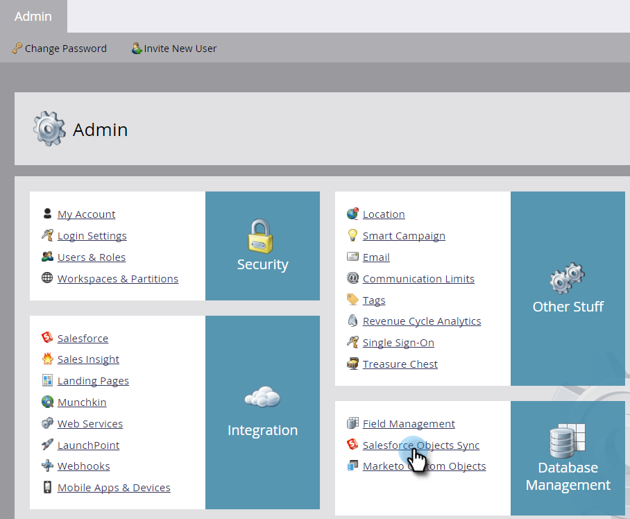
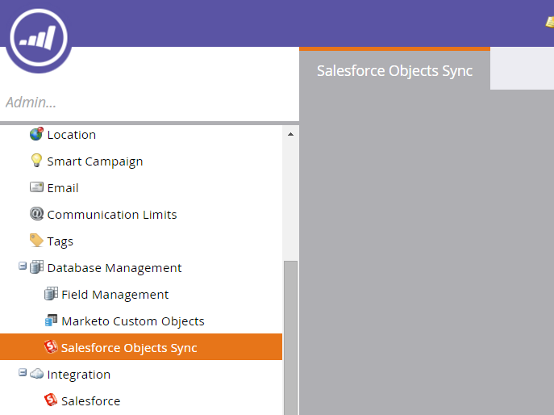
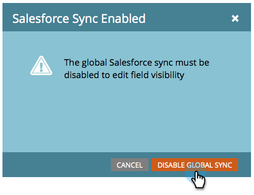

# Ajouter/Supprimer un champ d&#39;objet personnalisé en tant que contraintes de Liste/déclenchement dynamiques {#add-remove-custom-object-field-as-smart-list-trigger-constraints}

Marketo offre un contrôle de grain fin sur la synchronisation d’objets personnalisés Salesforce. Cela vous permet de sélectionner les champs disponibles en tant que contraintes dans les filtres d’objets personnalisés et de les utiliser comme déclencheurs dans les campagnes dynamiques.

>[!NOTE]
>
>**Autorisations d’administrateur requises**

1. Cliquez sur **Admin.**

   

1. Cliquez sur **Admin**, puis sur **Synchronisation des objets Salesforce.**

   

1. **Les objets Salesforce** Syncappears dans la colonne de gauche.

   

1. Sélectionnez l’objet à modifier.

   

1. Cliquez sur **Modifier les champs visibles**.

   >[!TIP]
   >
   >Si le bouton **Modifier les champs visibles** est grisé, l’objet est actuellement utilisé dans une liste dynamique ou une campagne dynamique. Supprimez toutes les associations pour continuer.

   

1. Si votre synchronisation globale est activée, cliquez sur **Désactiver la synchronisation globale**.

   

1. Cochez les cases en regard des contraintes de filtre/déclencheur nécessaires et cliquez sur **Enregistrer**.

   

   >[!NOTE]
   >
   >Tous les champs sont sélectionnés par défaut pour être des contraintes sur les filtres.

1. Cliquez sur l&#39;onglet **Champs** pour confirmer vos modifications.

   

   >[!NOTE]
   >
   >**Rappel**
   >
   >
   >N&#39;oubliez pas de réactiver votre synchronisation globale !

Waouh ! Désormais, vos listes intelligentes et vos campagnes intelligentes ont encore plus de puissance.

>[!MORELIKETHIS]
>
>* [Activer/désactiver la synchronisation d’objets personnalisés](enable-disable-custom-object-sync.md)

>

