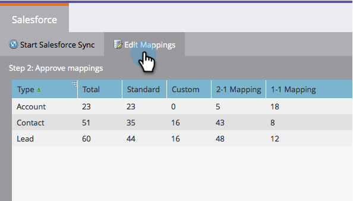

# Modifier les mappages de champs initiaux {#edit-initial-field-mappings}

>[!NOTE]
>
>**Rappel**
>
>Cette fonction est accessible uniquement avant la synchronisation initiale avec Salesforce ! Une fois le bouton **Synchroniser maintenant** enfoncé, cela ne peut plus être fait.

Lors de la synchronisation initiale avec Salesforce, Marketo combine automatiquement des champs personnalisés portant le même nom dans un seul champ du côté Marketo afin de garantir que les données peuvent être échangées avec les objets Lead et Contact dans la gestion de la relation client. Cet article explique comment personnaliser ces mappages.

## Faire correspondre les champs non mappés {#map-unmapped-fields}

Lorsque vous voyez un champ dans le dossier Champs non mappés, cela signifie qu&#39;il n&#39;est pas mappé à un champ similaire sur le prospect ou le contact dans Salesforce. Tu peux réparer ça.

1. Cliquez sur Modifier les mappages.

1. Ouvrez le dossier **Champs personnalisés non mappés**.

   

1. Faites glisser un champ personnalisé non mappé sur un autre pour les mapper ensemble.

   >[!NOTE]
   >
   >Vous pouvez uniquement modifier les mappages de champs personnalisés. Les mappages de champs standard ne peuvent pas être modifiés.

   

1. Cliquez sur **Terminer les mappages** lorsque vous avez terminé.

   

## Rompre le mappage existant {#break-existing-mapping}

Si vous avez des champs portant le même nom sur le prospect et l&#39;objet de contact Marketo les mappera automatiquement. Vous pouvez les considérer comme différents et détenir des données différentes. Ventilez le mappage comme cela.

1. Cliquez sur **Modifier les mappages**.

   

1. Mettez en surbrillance un champ mappé et cliquez sur **Rompre le mappage** pour séparer les champs.

   

1. Cliquez sur **Terminer les mappages** lorsque vous avez terminé.

   

   Sympa ! La synchronisation initiale est presque terminée.

## Réinitialiser le Schéma {#reset-schema}

1. Si vous apportez des modifications au schéma dans Salesforce lorsque vous travaillez sur les mappages, vous pouvez extraire les modifications en cliquant sur **Réinitialiser le Schéma**.

   * Toutes les modifications de mappage seront réinitialisées !
   * La réinitialisation du schéma ne fera qu&#39;ajouter des champs, et non les supprimer (même si vous les masquez de l&#39;utilisateur de synchronisation).

   

