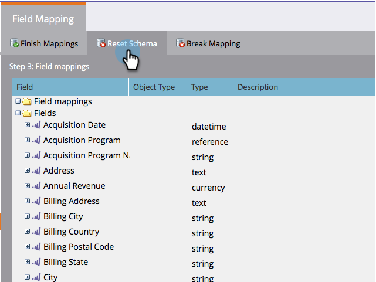

# Modifier les mappages de champs initiaux {#edit-initial-field-mappings}

>[!NOTE]
>
>Cette fonctionnalité est accessible uniquement avant la synchronisation initiale avec Salesforce. Une fois le bouton **[!UICONTROL Synchroniser maintenant]** enfoncé, cela ne peut plus être effectué.

Lors de la synchronisation initiale avec Salesforce, Marketo Engage combine automatiquement les champs personnalisés portant le même nom dans un seul champ du côté Marketo afin de garantir que les données peuvent être échangées avec les objets Lead et Contact dans le CRM. Cet article explique comment personnaliser ces mappages.

## Mapper les champs non mappés {#map-unmapped-fields}

Lorsque vous voyez un champ dans le dossier [!UICONTROL Champs non mappés], cela signifie qu’il n’est pas mappé à un champ similaire sur le prospect ou le contact dans Salesforce. Vous pouvez réparer ça.

1. Cliquez sur **[!UICONTROL Modifier les mappages]**.

1. Ouvrez le dossier **[!UICONTROL Unmapped Custom Fields]** .

   

1. Faites glisser un champ personnalisé non mappé sur un autre pour les mapper ensemble.

   >[!NOTE]
   >
   >Vous pouvez uniquement modifier les mappages de champs personnalisés. Les mappages de champs standard ne peuvent pas être modifiés.

   

1. Cliquez sur **[!UICONTROL Terminer les mappages]** lorsque vous avez terminé.

   

## Rompre le mappage existant {#break-existing-mapping}

Si vous disposez de champs portant le même nom sur l’objet de piste et de contact, Marketo les mappe automatiquement. Vous pouvez les considérer comme différents et contenir des données différentes. Brisez le mappage comme cela.

1. Cliquez sur **[!UICONTROL Modifier les mappages]**.

   

1. Sélectionnez un champ mappé et cliquez sur **[!UICONTROL Rompre le mappage]** pour séparer les champs.

   

1. Cliquez sur **[!UICONTROL Terminer les mappages]** lorsque vous avez terminé.

   

   Beau ! La synchronisation initiale est presque terminée.

## Réinitialiser le schéma {#reset-schema}

1. Si vous apportez des modifications au schéma dans Salesforce lorsque vous travaillez sur les mappages, vous pouvez extraire les modifications en cliquant sur **[!UICONTROL Réinitialiser le schéma]**.

   * Toutes les modifications de mappage seront réinitialisées !
   * La réinitialisation du schéma ajoute uniquement les champs, et non les supprime (même si vous les masquez de l’utilisateur de synchronisation).

   
