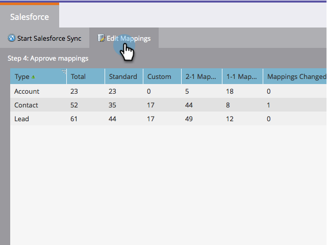

# Modifier les mappages d’origine des champs {#edit-initial-field-mappings}

>[!NOTE]
>
>Cette fonctionnalité n’est accessible qu’avant la synchronisation initiale avec Salesforce. Une fois que vous avez appuyé sur le bouton **[!UICONTROL Synchroniser maintenant]**, cela ne peut plus être fait.

Lors de la synchronisation initiale avec Salesforce, Marketo Engage combine automatiquement les champs personnalisés dotés de noms similaires en un seul champ côté Marketo afin de s’assurer que les données peuvent être échangées avec les objets Lead et Contact dans le CRM. Cet article explique comment personnaliser ces mappages.

## Mapper les champs non mappés {#map-unmapped-fields}

Lorsqu’un champ s’affiche dans le dossier [!UICONTROL Champs non mappés], cela signifie qu’il n’est pas mappé à un champ similaire sur le prospect ou le contact dans Salesforce. Tu peux arranger ça.

1. Cliquez sur **[!UICONTROL Modifier les mappages]**.

1. Ouvrez le dossier **[!UICONTROL Champs personnalisés non mappés]**.

   

1. Faites glisser un champ personnalisé non mappé vers un autre pour les mapper ensemble.

   >[!NOTE]
   >
   >Vous pouvez uniquement modifier les mappages de champs personnalisés. Les mappages de champs standard ne peuvent pas être modifiés.

   

1. Cliquez sur **[!UICONTROL Terminer les mappages]** lorsque vous avez terminé.

   

## Rompre le mappage existant {#break-existing-mapping}

Si vous avez des champs aux noms similaires sur le prospect et l’objet de contact, Marketo les associera automatiquement. Vous pouvez les considérer comme différents et conserver des données différentes. Interrompez le mappage comme suit.

1. Cliquez sur **[!UICONTROL Modifier les mappages]**.

   

1. Mettez en surbrillance un champ mappé et cliquez sur **[!UICONTROL Rompre le mappage]** pour séparer les champs.

   

1. Cliquez sur **[!UICONTROL Terminer les mappages]** lorsque vous avez terminé.

   

   Joli ! La synchronisation initiale est presque terminée.

## Réinitialiser le schéma {#reset-schema}

1. Si vous apportez des modifications au schéma dans Salesforce lors de l’utilisation des mappages, vous pouvez extraire les modifications en cliquant sur **[!UICONTROL Réinitialiser le schéma]**.

   * Toutes les modifications apportées au mappage seront réinitialisées.
   * La réinitialisation du schéma ajoutera uniquement des champs, et non les supprimera (même si vous les masquez à l’utilisateur de synchronisation).

   
