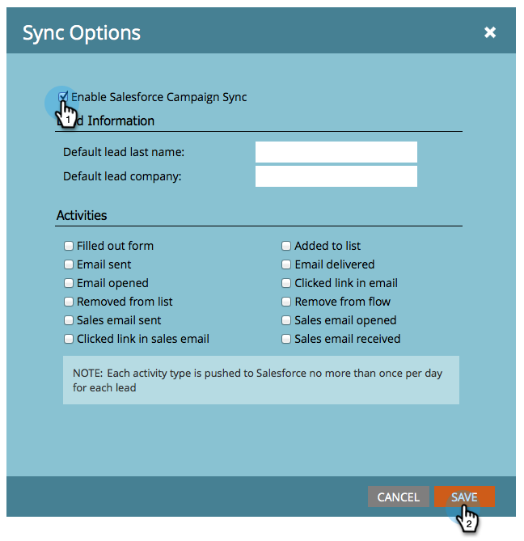

# Activer/désactiver la synchronisation Campaign {#enable-disable-campaign-sync}

>[!NOTE]
>
>Droits d’administration requis.

Cette option permet à Marketing Cloud de synchroniser son adhésion et ses états programmes avec les campagnes Salesforce et vice versa.

1. Accédez à **Admin, **cliquez sur **Salesforce.**

   ** 

   **

1. Cliquez sur **Modifier les paramètres** de synchronisation.

   

1. Cochez **Activer la synchronisation** Campaign Salesforce et cliquez sur **ENREGISTRER**.

   

Voilà. Il vous suffit de donner un peu de temps à la synchronisation pour extraire les données de Salesforce et vous pouvez partir.

>[!NOTE]
>
>**Articles connexes**
>
>* [Synchronisation SFDC : Campaign Sync](../../../../../product-docs/crm-sync/salesforce-sync/sfdc-sync-details/sfdc-sync-campaign-sync.md)
>* [Définir le nom de piste et les valeurs de Société par défaut](set-default-person-last-name-and-company-name.md)
>* [Personnaliser la synchronisation des Activités](customize-activities-sync.md)

>

