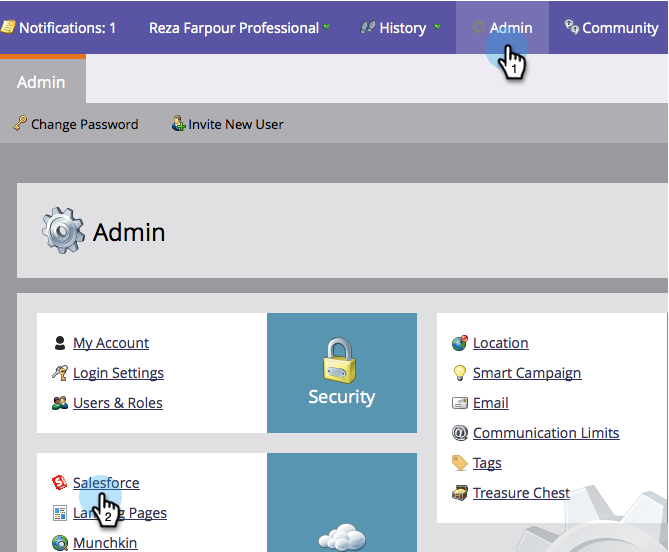

# Activer/Désactiver la synchronisation des campagnes {#enable-disable-campaign-sync}

>[!NOTE]
>
>**Autorisations d’administrateur requises**

Cette option permet à Marketo de synchroniser son appartenance au programme et ses états avec les campagnes Salesforce et vice versa.

1. Accédez à **Administration**, cliquez sur **Salesforce**.

   

1. Cliquez sur **Modifier les paramètres de synchronisation**.

   

1. Vérifier **Activation de la synchronisation des campagnes Salesforce** et cliquez sur **ENREGISTRER**.

   

Voilà. Donnez juste du temps à la synchronisation pour extraire les données de Salesforce et vous pouvez y aller.

>[!MORELIKETHIS]
>
>* [Synchronisation SFDC : Synchronisation des campagnes](/help/marketo/product-docs/crm-sync/salesforce-sync/sfdc-sync-details/sfdc-sync-campaign-sync.md)
>* [Définition du nom de piste et des valeurs d’entreprise par défaut](/help/marketo/product-docs/crm-sync/salesforce-sync/setup/optional-steps/set-default-person-last-name-and-company-name.md)
>* [Personnalisation de la synchronisation des activités](/help/marketo/product-docs/crm-sync/salesforce-sync/setup/optional-steps/customize-activities-sync.md)

