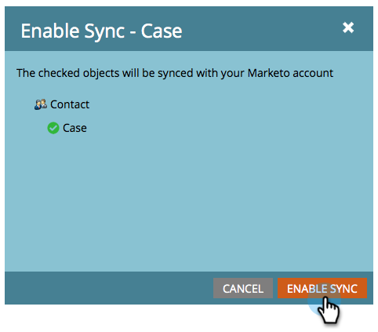

# Activer/désactiver la synchronisation d’objets personnalisés {#enable-disable-custom-object-sync}

Les objets personnalisés créés dans votre instance Salesforce peuvent également faire partie de Marketing Cloud. Voici comment le configurer.

## Activer/désactiver la synchronisation d’objets personnalisés {#enable-disable-custom-object-sync-1}

>[!NOTE]
>
>Droits d’administration requis.

1. Cliquez sur **Admin**.

   ** 

   **

1. Dans le menu Gestion de la base de données, cliquez sur **Salesforce** **Objets synchronisés**.

   

1. S’il s’agit de votre premier objet personnalisé, cliquez sur **Synchroniser le schéma.** Sinon, cliquez sur **Actualiser le Schéma** pour vous assurer que vous disposez de la dernière version.

   

1. Si votre synchronisation globale est en cours d’exécution, vous devrez la désactiver en cliquant sur **Désactiver la synchronisation globale.**

   

   >[!NOTE]
   >
   >Une synchronisation du schéma d&#39;objets personnalisés Salesforce peut prendre quelques minutes.

1. Cliquez sur **Actualiser le Schéma**.

   

1. Sélectionnez l’objet à synchroniser, puis cliquez sur **Activer la synchronisation**.

   >[!TIP]
   >
   >Marketo ne peut synchroniser un objet personnalisé que s&#39;il a une relation directe avec l&#39;objet prospect, contact ou compte dans Salesforce.

   

1. Cliquez à nouveau sur **Activer la synchronisation** .

   ** 

   **

1. Revenez à l’onglet **Salesforce** et cliquez sur **Activer la synchronisation**.

   

## Utilisation des objets personnalisés {#using-your-custom-objects}

>[!NOTE]
>
>Vous ne pouvez pas utiliser d’objets personnalisés dans des campagnes dynamiques avec des déclencheurs.

1. Dans votre liste intelligente, faites glisser le pointeur de la souris sur le **filtre** Avec opportunité et définissez cette option sur **true**.

   

1. Utilisez ensuite les contraintes de filtre pour restreindre la cible d’action.

   

   Excellent ! Vous pouvez désormais utiliser les données de cet objet personnalisé dans des campagnes et des listes intelligentes.

>[!MORELIKETHIS]
>
>* [Ajouter/supprimer un champ d&#39;objet personnalisé en tant que contraintes de Liste/déclenchement intelligent](add-remove-custom-object-field-as-smart-list-trigger-constraints.md)

>

