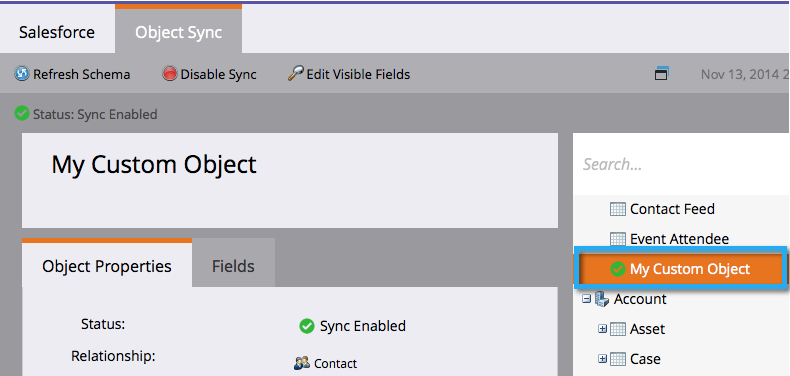

# Activer la synchronisation d&#39;objets personnalisés non anglais {#enable-non-english-custom-object-sync}

Si votre utilisateur de synchronisation Marketo utilise une autre langue que l’anglais, vous pouvez rencontrer une erreur lors de l’activation d’une synchronisation d’objets personnalisée.

## Erreur {#the-error}

## Obtenir le résultat {#getting-around-it}

1. Connectez-vous à Salesforce à l’aide de l’utilisateur de synchronisation marketing.

   

1. Sous le nom d’utilisateur, accédez à **Configuration**.

   

1. Sous **Informations personnelles**, cliquez sur **Mes informations personnelles**.

   

1. Cliquez sur **Modifier**.

   

1. Remplacez **Language** par **English**.

   

1. Cliquez sur **Enregistrer**.

   

1. De retour dans Marketo, sous **Admin > Salesforce > Objets** cliquez sur **Actualiser le Schéma**.

   

1. Cela va extraire les objets liste en anglais. Sélectionnez maintenant l’objet de votre choix et cliquez sur **Activer la synchronisation**.

   

1. Notez que votre objet personnalisé est désormais activé et synchronisé.

   

1. Revenez maintenant à Salesforce et suivez les étapes ci-dessus pour rétablir la langue de votre choix pour l’utilisateur de synchronisation.

>[!NOTE]
>
>**Rappel**
>
>N&#39;oubliez pas d&#39;actualiser le Schéma une dernière fois pour retirer les objets dans votre langue.

