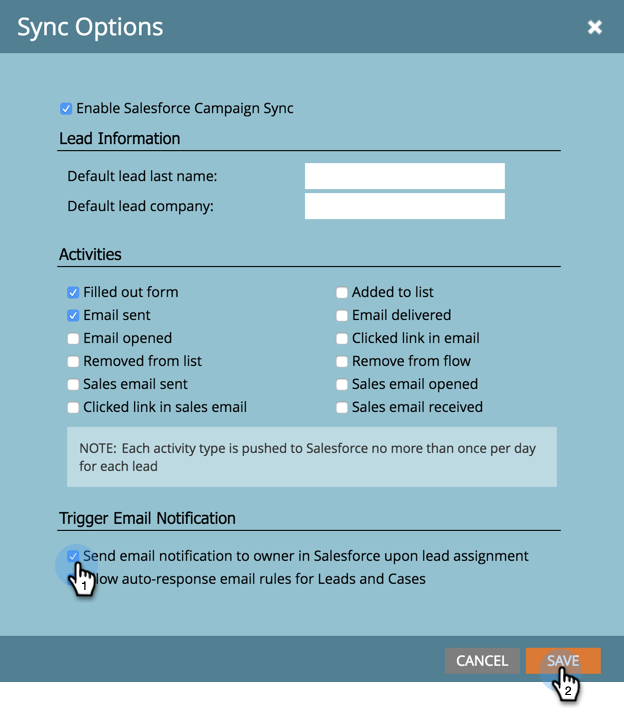

# Désactiver les notifications par e-mail pour la personne propriétaire du lead {#turn-off-email-notifications-to-lead-owner}

Vous pouvez désactiver les notifications électroniques automatiques envoyées aux propriétaires de leads dans [!DNL Salesforce] lors de l’affectation de leads. Voici comment faire.

1. Accédez à **[!UICONTROL Admin]**.

   

1. Cliquez sur **[!DNL Salesforce]**.

   

1. Sous **[!UICONTROL Options de synchronisation]**, cliquez sur **[!UICONTROL Modifier]**.

   

1. Décochez la case **[!UICONTROL Envoyer une notification par e-mail au propriétaire dans Salesforce lors de l’affectation du prospect]**. Cliquez sur **[!UICONTROL Enregistrer]**

   
