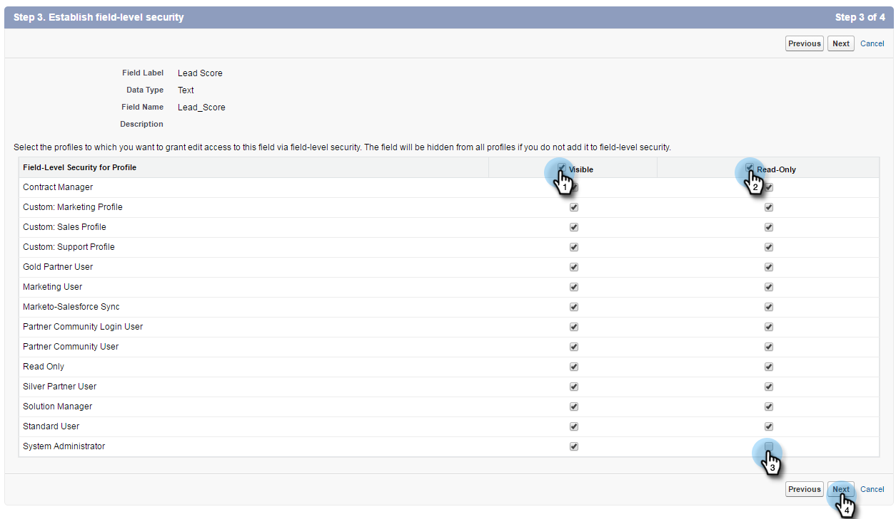

# Étape 1 sur 3 : Ajout de champs Marketo à Salesforce (professionnel) {#step-of-add-marketo-fields-to-salesforce-professional}

>[!PREREQUISITES]
>
>Votre instance Salesforce doit avoir accès aux API Salesforce pour synchroniser les données entre Marketo Engage et Salesforce.

Marketo utilise un ensemble de champs pour capturer certains types d’informations marketing. Si vous souhaitez ces données dans Salesforce, veuillez suivre les instructions ci-dessous.

1. Créez trois champs personnalisés dans Salesforce sur les objets de piste et de contact : Score, Programme d’acquisition et Date d’acquisition.
1. Mappez ces champs personnalisés entre les prospects et les contacts afin qu’au moment de la conversion dans Salesforce, les valeurs soient transférées.
1. Vous pouvez créer d’autres champs supplémentaires, si nécessaire (voir le tableau ci-dessous).

Tous ces champs personnalisés sont facultatifs et ne sont pas nécessaires pour synchroniser Marketo et Salesforce. Il est recommandé de créer des champs pour Score, Programme d’acquisition et Date d’acquisition.

## Ajout de champs Marketo à Salesforce {#add-marketo-fields-to-salesforce}

Ajoutez trois champs personnalisés aux objets de piste et de contact dans Salesforce répertoriés ci-dessus. Si vous souhaitez en ajouter d’autres, reportez-vous au tableau des champs disponibles à la fin de cette section.

Effectuez les étapes suivantes pour chacun des trois champs personnalisés à ajouter. Commencez par **[!UICONTROL Score]**.

1. Connectez-vous à Salesforce et cliquez sur **[!UICONTROL Configuration]**.

   

1. Dans le menu Créer à gauche, cliquez sur **[!UICONTROL Personnaliser]** et sélectionnez **[!UICONTROL Pistes]**. Cliquez sur **[!UICONTROL Fields]**.

   

1. Cliquez sur **[!UICONTROL New]** dans la section Champs personnalisés et relations au bas de la page.

   

1. Choisissez le type de champ approprié (pour Score - **[!UICONTROL nombre]** ; Programme d’acquisition - **[!UICONTROL texte]** ; Date d’acquisition - **Date/Heure**).

   

1. Cliquez sur **[!UICONTROL Suivant]**.

   

1. Saisissez le libellé du champ, sa longueur et son nom, comme illustré dans le tableau ci-dessous.

<table> 
 <thead> 
  <tr> 
   <th> 
    

      Intitulé de champ 
    
</th> 
   <th> 
    

      Nom de champ 
    
</th> 
   <th> 
    

      Type de données 
    
</th> 
   <th> 
    

      Attributs de champ 
    
</th> 
  </tr> 
 </thead> 
 <tbody> 
  <tr> 
   <td>Évaluation</td> 
   <td>mkto71_Lead_Score</td> 
   <td>Nombre</td> 
   <td>Longueur 10 Nombre de décimales 0 </td> 
  </tr> 
  <tr> 
   <td>Date d'acquisition</td> 
   <td>mkto71_Acquisition_Date</td> 
   <td>Date/heure</td> 
   <td> </td> 
  </tr> 
  <tr> 
   <td>Programme d'acquisition</td> 
   <td>mkto71_Acquisition_Program</td> 
   <td>Texte</td> 
   <td>Longueur 255</td> 
  </tr> 
 </tbody> 
</table>

>[!NOTE]
>
>Salesforce ajoute __c aux noms de champ lorsqu’il les utilise pour créer des noms d’API.

>[!NOTE]
>
>Les champs Texte et Nombre nécessitent une longueur, mais pas Date/Heure. Une description est facultative.

1. Cliquez sur **[!UICONTROL Suivant]**.

   

1. Spécifiez les paramètres d’accès et cliquez sur **[!UICONTROL Suivant]** :

   * Définissez tous les rôles sur **[!UICONTROL Visible]** et **[!UICONTROL Lecture seule]**

   * Décochez la case **[!UICONTROL Lecture seule]** pour le profil de votre utilisateur de synchronisation :

      * Si vous avez un utilisateur avec le profil d’un _administrateur système_ comme utilisateur de synchronisation, décochez la case **[!UICONTROL Lecture seule]** pour le profil administrateur système (comme illustré ci-dessous).

      * Si vous avez créé un _profil personnalisé_ pour l’utilisateur de synchronisation, décochez la case **[!UICONTROL Lecture seule]** pour ce profil personnalisé.

   

1. Sélectionnez les mises en page qui doivent afficher le champ.

   

1. Cliquez sur **[!UICONTROL Enregistrer et nouveau]** pour revenir en arrière et créer chacun des deux autres champs personnalisés. Cliquez sur **[!UICONTROL Enregistrer]** avec les trois.

   

1. Dans le menu Créer à gauche, cliquez sur **[!UICONTROL Personnaliser]** et sélectionnez **[!UICONTROL Contacts]**. Cliquez sur **[!UICONTROL Fields]**.
1. Exécutez les étapes 3 à 10 pour les champs Score, Date d’acquisition et Programme d’acquisition sur l’objet de contact, comme vous l’avez fait pour l’objet de piste.
1. Vous pouvez éventuellement appliquer la procédure ci-dessus pour tout champ personnalisé supplémentaire provenant de ce tableau.

<table> 
 <tbody> 
  <tr> 
   <th>Intitulé de champ</th> 
   <th>Nom de champ</th> 
   <th>Type de données</th> 
   <th>Attributs de champ</th> 
  </tr> 
  <tr> 
   <td>Identifiant du programme d’acquisition</td> 
   <td>mkto71_Acquisition_Program_Id</td> 
   <td>Nombre</td> 
   <td>Longueur 18 Nombre de décimales 0 </td> 
  </tr> 
  <tr> 
   <td>Référent d'origine</td> 
   <td>mkto71_Original_Referrer</td> 
   <td>Texte</td> 
   <td>Longueur 255</td> 
  </tr> 
  <tr> 
   <td>Moteur de recherche d'origine</td> 
   <td>mkto71_Original_Search_Engine</td> 
   <td>Texte</td> 
   <td>Longueur 255</td> 
  </tr> 
  <tr> 
   <td>Phrase de recherche d'origine</td> 
   <td>mkto71_Original_Search_Expression</td> 
   <td>Texte</td> 
   <td>Longueur 255</td> 
  </tr> 
  <tr> 
   <td>Informations sur la source d'origine</td> 
   <td>mkto71_Original_Source_Info</td> 
   <td>Texte</td> 
   <td>Longueur 255</td> 
  </tr> 
  <tr> 
   <td>Type de source d'origine</td> 
   <td>mkto71_Original_Source_Type</td> 
   <td>Texte</td> 
   <td>Longueur 255</td> 
  </tr> 
  <tr> 
   <td>Ville déduite</td> 
   <td>mkto71_Inferred_City</td> 
   <td>Texte</td> 
   <td>Longueur 255</td> 
  </tr> 
  <tr> 
   <td>Société déduite</td> 
   <td>mkto71_Inferred_Company</td> 
   <td>Texte</td> 
   <td>Longueur 255</td> 
  </tr> 
  <tr> 
   <td>Pays déduit</td> 
   <td>mkto71_Inferred_Country</td> 
   <td>Texte</td> 
   <td>Longueur 255</td> 
  </tr> 
  <tr> 
   <td>Aire métropolitaine déduite</td> 
   <td>mkto71_Inferred_Metropolitan_Area</td> 
   <td>Texte</td> 
   <td>Longueur 255</td> 
  </tr> 
  <tr> 
   <td>Indicatif téléphonique local déduit</td> 
   <td>mkto71_Inferred_Phone_Area_Code</td> 
   <td>Texte</td> 
   <td>Longueur 255</td> 
  </tr> 
  <tr> 
   <td>Code postal déduit</td> 
   <td>mkto71_Inferred_Postal_Code</td> 
   <td>Texte</td> 
   <td>Longueur 255</td> 
  </tr> 
  <tr> 
   <td>Région déduite</td> 
   <td>mkto71_Inferred_State_Region</td> 
   <td>Texte</td> 
   <td>Longueur 255</td> 
  </tr> 
 </tbody> 
</table>

>[!NOTE]
>
>Les valeurs des champs automatiquement attribués par Marketo ne seront pas immédiatement disponibles dans Salesforce une fois le nouveau champ créé. Marketo synchronise les données avec Salesforce lors de la prochaine mise à jour de l’enregistrement sur l’un ou l’autre système (c’est-à-dire une mise à jour de l’un des champs synchronisés entre Marketo et Salesforce).

## Mappage des champs personnalisés pour les conversions  {#map-custom-fields-for-conversions}

Un champ personnalisé sur l’objet prospect dans Salesforce doit être mappé à un champ de contact sur l’objet contact afin que les données soient reportées lors d’une conversion.

1. Dans le coin supérieur droit, cliquez sur **[!UICONTROL Configuration]**.

   

1. Saisissez &quot;[!UICONTROL fields]&quot; dans la recherche de navigation sans appuyer sur la touche Entrée. Les champs s’affichent sous différents objets. Cliquez sur **[!UICONTROL Champs]** sous Pistes.

   

1. Accédez à la section Champs personnalisés des pistes et relations et cliquez sur **[!UICONTROL Mapper les champs de piste]**.

   

1. Cliquez sur la liste déroulante en regard du champ à mapper.

   

1. Sélectionnez le champ personnalisé de contact correspondant.

   

1. Répétez les étapes ci-dessus pour tous les autres champs que vous avez créés.

1. Cliquez sur **[!UICONTROL Enregistrer]** lorsque vous avez terminé.

Assez facile, n&#39;est-ce pas ?

>[!MORELIKETHIS]
>
>[Étape 2 sur 3 : création d’un utilisateur Salesforce pour Marketo (professionnel)](/help/marketo/product-docs/crm-sync/salesforce-sync/setup/professional-edition/step-2-of-3-create-a-salesforce-user-for-marketo-professional.md){target="_blank"}
