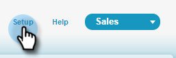

# Étape 1 sur 3 : Ajouter les champs du marketing à Salesforce (Professional) {#step-of-add-marketo-fields-to-salesforce-professional}

>[!PREREQUISITES]
>
>Votre instance Salesforce doit avoir accès aux API Salesforce pour synchroniser les données entre Marketo et Salesforce.

Marketo utilise un ensemble de champs pour capturer certains types d’informations liées au marketing. Si vous souhaitez obtenir ces données dans Salesforce, veuillez suivre les instructions ci-dessous.

1. Créez trois champs personnalisés dans Salesforce sur les objets prospect et contact : Score, Programme d’acquisition et date d’acquisition.
1. Faites correspondre ces champs personnalisés entre les pistes et les contacts afin qu’au moment de la conversion dans Salesforce, les valeurs soient reportées.
1. Si nécessaire, vous pouvez créer d’autres champs (voir le tableau ci-dessous).

Tous ces champs personnalisés sont facultatifs et ne sont pas nécessaires pour synchroniser Marketing Cloud et Salesforce. Il est recommandé de créer des champs pour Note, Programme d’acquisition et Date d’acquisition.

## Ajouter les champs du marketing à Salesforce {#add-marketo-fields-to-salesforce}

Ajoutez trois champs personnalisés sur les objets prospect et contact dans Salesforce répertoriés ci-dessus. Si vous souhaitez en ajouter d’autres, reportez-vous au tableau des champs disponibles à la fin de cette section.

Effectuez les étapes suivantes pour chacun des trois champs personnalisés à ajouter. Début avec **Score**.

1. Connectez-vous à Salesforce et cliquez sur **Configuration.**

   

1. Dans le menu Créer à gauche, cliquez sur **Personnaliser** et sélectionnez **Pistes**. Cliquez sur **Champs**.

   

1. Cliquez sur **Nouveau** dans la section Champs personnalisés et relations au bas de la page.

   

1. Choisissez le type de champ approprié (pour Score — **nombre**; Programme d&#39;acquisition — **texte**; Date d&#39;acquisition — **Date/Heure**).

   

1. Cliquez sur **Suivant**.

   

1. Entrez le libellé du champ, la longueur et le nom du champ, comme indiqué dans le tableau ci-dessous.

<table> 
 <thead> 
  <tr> 
   <th> 
    

      Libellé du champ 
    
</th> 
   <th> 
    

      Nom du champ 
    
</th> 
   <th> 
    

      Type de données 
    
</th> 
   <th> 
    

      Attributs de champ 
    
</th> 
  </tr> 
 </thead> 
 <tbody> 
  <tr> 
   <td>Score</td> 
   <td>mkto71_Lead_Score</td> 
   <td>Nombre</td> 
   <td>Longueur 10 Nombre de décimales 0 </td> 
  </tr> 
  <tr> 
   <td>Date d’acquisition</td> 
   <td>mkto71_Acquisition_Date</td> 
   <td>Date/Heure</td> 
   <td> </td> 
  </tr> 
  <tr> 
   <td>Programme d’acquisition</td> 
   <td>mkto71_Acquisition_Programme</td> 
   <td>Texte</td> 
   <td>Longueur 255</td> 
  </tr> 
 </tbody> 
</table>

>[!NOTE]
>
>Salesforce ajoute __c aux noms de champ lorsqu&#39;il les utilise pour créer des noms d&#39;API.

>[!NOTE]
>
>Les champs de texte et de nombre nécessitent une longueur, mais pas les champs Date/Heure. Une description est facultative.

1. Cliquez sur **Suivant**.

   

1. Spécifiez les paramètres d’accès et cliquez sur **Suivant** :

   * Définissez tous les rôles sur **Visible** et **Lecture seule**.

   * Désactivez la case à cocher **Lecture seule** pour le profil de votre utilisateur de synchronisation :

      * Si vous avez un utilisateur avec le profil d&#39;un _administrateur système_ en tant qu&#39;utilisateur synchronisé, désélectionnez la case **Lecture seule** pour le profil Administrateur système (comme illustré ci-dessous).

      * Si vous avez créé un _profil personnalisé_ pour l’utilisateur de synchronisation, désactivez la case **Lecture seule** pour ce profil personnalisé.

   

1. Choisissez les dispositions de page qui doivent afficher le champ.

   

1. Cliquez sur **Enregistrer et nouveau** pour revenir en arrière et créer chacun des deux autres champs personnalisés. Cliquez sur **Enregistrer** après avoir terminé les trois.

   

1. Dans le menu Créer à gauche, cliquez sur **Personnaliser** et sélectionnez **Contacts**. Cliquez sur **Champs**.
1. Exécutez les étapes 3 à 10 pour les champs Note, Date d’acquisition et Programme d’acquisition sur l’objet contact, comme pour l’objet prospect.
1. Vous pouvez éventuellement utiliser la procédure ci-dessus pour tout autre champ personnalisé de ce tableau.

<table> 
 <tbody> 
  <tr> 
   <th>Libellé du champ</th> 
   <th>Nom du champ</th> 
   <th>Type de données</th> 
   <th>Attributs de champ</th> 
  </tr> 
  <tr> 
   <td>ID de Programme d’acquisition</td> 
   <td>mkto71_Acquisition_Programme_Id</td> 
   <td>Nombre</td> 
   <td>Longueur 18 Nombre de décimales 0 </td> 
  </tr> 
  <tr> 
   <td>Parrain original</td> 
   <td>mkto71_Original_Parrain</td> 
   <td>Texte</td> 
   <td>Longueur 255</td> 
  </tr> 
  <tr> 
   <td>Moteur de recherche original</td> 
   <td>mkto71_Original_Search_Engine</td> 
   <td>Texte</td> 
   <td>Longueur 255</td> 
  </tr> 
  <tr> 
   <td>Expression de recherche d’origine</td> 
   <td>mkto71_Original_Search_Expression</td> 
   <td>Texte</td> 
   <td>Longueur 255</td> 
  </tr> 
  <tr> 
   <td>Infos source d'origine</td> 
   <td>mkto71_Original_Source_Info</td> 
   <td>Texte</td> 
   <td>Longueur 255</td> 
  </tr> 
  <tr> 
   <td>Type de source original</td> 
   <td>mkto71_Original_Source_Type</td> 
   <td>Texte</td> 
   <td>Longueur 255</td> 
  </tr> 
  <tr> 
   <td>Ville d'origine</td> 
   <td>mkto71_Inferred_City</td> 
   <td>Texte</td> 
   <td>Longueur 255</td> 
  </tr> 
  <tr> 
   <td>Société déduite</td> 
   <td>mkto71_Inferred_Société</td> 
   <td>Texte</td> 
   <td>Longueur 255</td> 
  </tr> 
  <tr> 
   <td>Pays d'origine</td> 
   <td>mkto71_Inferred_Country</td> 
   <td>Texte</td> 
   <td>Longueur 255</td> 
  </tr> 
  <tr> 
   <td>Zone métropolitaine désignée</td> 
   <td>mkto71_Inferred_Metropolitan_Area</td> 
   <td>Texte</td> 
   <td>Longueur 255</td> 
  </tr> 
  <tr> 
   <td>Code de zone de téléphone indiqué</td> 
   <td>mkto71_Inferred_Phone_Area_Code</td> 
   <td>Texte</td> 
   <td>Longueur 255</td> 
  </tr> 
  <tr> 
   <td>Code postal déduit</td> 
   <td>mkto71_Inferred_Postal_Code</td> 
   <td>Texte</td> 
   <td>Longueur 255</td> 
  </tr> 
  <tr> 
   <td>Région d'État désignée</td> 
   <td>mkto71_Inferred_State_Region</td> 
   <td>Texte</td> 
   <td>Longueur 255</td> 
  </tr> 
 </tbody> 
</table>

## Mettre en correspondance les champs personnalisés pour les conversions {#map-custom-fields-for-conversions}

Un champ personnalisé sur l&#39;objet prospect dans Salesforce doit être mappé à un champ de contact sur l&#39;objet contact afin que les données soient reportées lors d&#39;une conversion.

1. Dans le coin supérieur droit, cliquez sur Configuration.

   

1. Tapez &quot;champs&quot; dans la Recherche de navigation sans appuyer sur Entrée. Les champs s’affichent sous différents objets ; Cliquez sur Champs sous Pistes.

   

1. Accédez à la section Champs personnalisés de piste et relations, puis cliquez sur Mapper les champs de piste.

   

1. Cliquez sur la liste déroulante en regard du champ à mapper.

   

1. Sélectionnez le champ personnalisé de contact correspondant.

   

1. Répétez les étapes ci-dessus pour tous les autres champs que vous avez créés.
1. Cliquez sur Enregistrer lorsque vous avez terminé.

Assez facile, n&#39;est-ce pas ?

>[!NOTE]
>
>Voici une [vidéo de l&#39;ensemble du processus](https://nation.marketo.com/videos/1475) qui devrait le rendre parfaitement clair !

>[!MORELIKETHIS]
>
>[Étape 2 sur 3 : Créer un utilisateur Salesforce pour Marketo (Professional)](/help/marketo/product-docs/crm-sync/salesforce-sync/setup/professional-edition/step-2-of-3-create-a-salesforce-user-for-marketo-professional.md)
