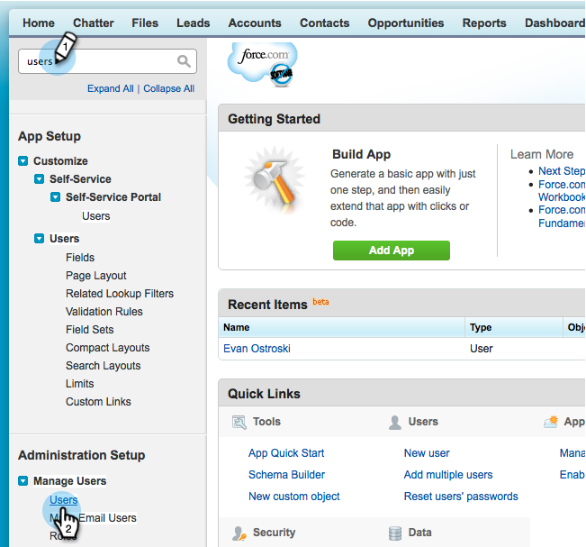

# Étape 2 sur 3 : Créer un utilisateur Salesforce pour Marketo (Professional) {#step-of-create-a-salesforce-user-for-marketo-professional}

>[!NOTE]
>
>Ces étapes doivent être effectuées par un administrateur Salesforce.

>[!PREREQUISITES]
>
>* [Étape 1 sur 3 : Ajouter les champs du marketing à Salesforce (Professional)](step-1-of-3-add-marketo-fields-to-salesforce-professional.md)

>

Dans cet article, vous allez personnaliser les autorisations de champ avec une mise en page Salesforce et créer un utilisateur de synchronisation Marketo-Salesforce.

## Définir les mises en page {#set-page-layouts}

Salesforce Professional définit l&#39;accessibilité au niveau des champs avec les mises en page, contrairement aux Profils de Salesforce Enterprise/Unlimited. Suivez ces étapes pour permettre à l’utilisateur de synchronisation de Marketing de mettre à jour les champs personnalisés.

1. Tapez **dispositions de page** dans la barre de recherche Nav sans appuyer sur **Entrée**, puis cliquez sur **Mise en page** sous **Pistes**.

   

1. Cliquez sur **Modifier** en regard de Disposition de piste.

   

1. Cliquez et faites glisser une nouvelle **section** dans la mise en page.

   

1. Saisissez &quot;Marketo&quot; pour **Nom de la section** et cliquez sur **OK**.

   

1. Cliquez et faites glisser le champ **Date d’acquisition** dans la section **Marketo**.

   

1. Répétez l’étape ci-dessus pour les champs suivants :

   * Programme d’acquisition
   * ID de Programme d’acquisition
   * Opt-out par courriel
   * Ville d&#39;origine
   * Société déduite
   * Pays d&#39;origine
   * Zone métropolitaine désignée
   * Code de zone de téléphone indiqué
   * Code postal déduit
   * Région d&#39;État désignée
   * Note de piste
   * Parrain original
   * Moteur de recherche original
   * Expression de recherche d’origine
   * Infos source d&#39;origine
   * Type de source original

   >[!NOTE]
   >
   >Ces champs doivent figurer sur la mise en page pour que Marketing Cloud puisse les lire/écrire.

   >[!TIP]
   >
   >Créez deux colonnes pour les champs en faisant glisser le curseur vers le côté droit de la page. Vous pouvez déplacer les champs d’un côté à l’autre pour équilibrer les longueurs de colonne.

1. Cliquez sur **Enregistrer** une fois l’ajout de champs terminé.

   

1. Répétez toutes les étapes ci-dessus pour le Salesforce **Mise en page de la page de contact**.

   

1. Pensez à cliquer sur **Enregistrer** lorsque vous avez terminé avec la **Mise en page de la page de contact**.

   

   >[!NOTE]
   >
   >**Rappel**
   >
   >
   >Assurez-vous que le champ **Événement de toute la journée** a été ajouté à la **Mise en page du Événement**.

## Créer un utilisateur de synchronisation {#create-sync-user}

Marketo requiert des informations d’identification pour accéder à Salesforce. Pour ce faire, il est préférable d’utiliser un utilisateur dédié créé en suivant les étapes ci-dessous.

>[!NOTE]
>
>Si votre entreprise ne dispose pas de licences Salesforce supplémentaires, vous pouvez utiliser un **utilisateur marketing** existant avec le profil **Administrateur système**.

1. Saisissez &quot;users&quot; dans la barre de recherche Nav, puis cliquez sur **Utilisateurs** sous **Gérer les utilisateurs**.

   

1. Cliquez sur **Nouvel utilisateur**.

   

1. Renseignez les champs obligatoires, sélectionnez la **Licence utilisateur : Salesforce**, définissez le **Profil : Administrateur système**, cochez **Utilisateur marketing** et cliquez sur **Enregistrer**.

   

   >[!TIP]
   >
   >Assurez-vous que l’adresse électronique saisie est valide. Vous devez vous connecter en tant qu’utilisateur de synchronisation pour réinitialiser le mot de passe.

Excellent ! Vous disposez maintenant d’un compte que Marketo peut utiliser pour se connecter à Salesforce. Faisons-le.

>[!NOTE]
>
>**Articles connexes**
>
>* [Étape 3 sur 3 : Connect Marketo and Salesforce (Professional)](step-3-of-3-connect-marketo-and-salesforce-professional.md)

>

