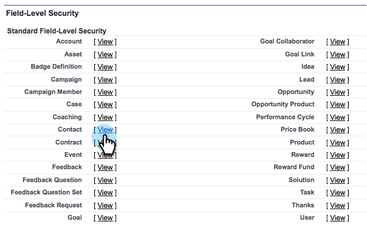

# Ajout d’un champ de [!DNL Salesforce] existant à la synchronisation Marketo {#add-an-existing-salesforce-field-to-the-marketo-sync}

>[!NOTE]
>
>**Autorisations d’administration requises**

En règle générale, les nouveaux champs personnalisés de Salesforce se synchronisent automatiquement avec Marketo Engage. Si ce n’est pas le cas, les champs peuvent ne pas être visibles pour l’utilisateur de la synchronisation Marketo. Voici comment résoudre ce problème.

1. Cliquez sur votre nom, puis sélectionnez **[!UICONTROL Configuration]**.

   

1. Saisissez « profile » dans la barre de recherche de gauche, puis cliquez sur **[!UICONTROL Profils]** sous **[!UICONTROL Gérer les utilisateurs]**.

   

1. Cliquez sur le profil de l’utilisateur de synchronisation.

   

1. Sous la section **[!UICONTROL Sécurité au niveau du champ]**, cliquez sur **[!UICONTROL Afficher]** en regard de l’objet qui contient le champ.

   

1. Cliquez sur **[!UICONTROL Modifier]**.

   

1. Cochez la case **[!UICONTROL Visible]** du champ à ajouter à la synchronisation, puis cliquez sur **[!UICONTROL Enregistrer]**.

   

   Lors du prochain cycle de synchronisation, Marketo verra le champ et commencera la magie.

   >[!NOTE]
   >
   > Si le champ contient déjà des valeurs dans [!DNL Salesforce], celles-ci ne sont pas synchronisées avec Marketo avant la prochaine mise à jour de l’enregistrement.
