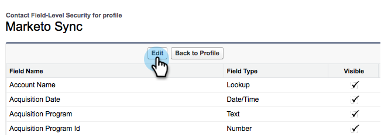
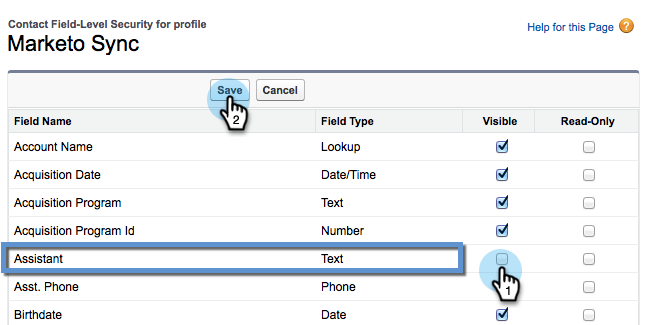

# Masquer un champ [!DNL Salesforce] de la synchronisation Marketo {#hide-a-salesforce-field-from-the-marketo-sync}

>[!NOTE]
>
>**Autorisations d’administration requises**

Tous les champs de Salesforce ne sont pas utiles pour le marketing. Vous pouvez optimiser les performances de synchronisation en incluant uniquement les champs dont vous avez besoin. Voici comment masquer un champ de Marketo Engage.

1. Cliquez sur le menu Nom et sélectionnez **[!UICONTROL Configuration]**.

   

1. Saisissez « profiles » dans la barre de recherche et cliquez sur **[!UICONTROL Profils]** sous **[!UICONTROL Gérer les utilisateurs]**.

   

1. Cliquez sur le profil de l’utilisateur de synchronisation.

   

1. Sous la section **[!UICONTROL Sécurité au niveau du champ]**, cliquez sur **[!UICONTROL Afficher]** en regard de l’objet qui contient le champ cible.

   

1. Cliquez sur **[!UICONTROL Modifier]**.

   

1. Décochez la case **[!UICONTROL Visible]** en regard du champ que vous souhaitez masquer. Cliquez sur **[!UICONTROL Enregistrer]**

   

   >[!NOTE]
   >
   >Si le champ que vous masquez dans [!DNL Salesforce] a déjà été synchronisé avec Marketo, vous devrez également le masquer dans Marketo si vous ne souhaitez pas l’utiliser.

   Vous avez terminé. Ce champ n’apparaît plus dans Marketo une fois la synchronisation suivante terminée.

   >[!MORELIKETHIS]
   >
   >[Masquer et afficher un champ](/help/marketo/product-docs/administration/field-management/hide-and-unhide-a-field.md){target="_blank"}
