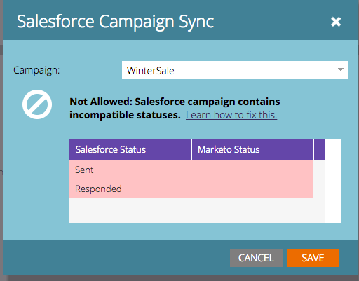

# Comment faire correspondre les statuts de programme et les statuts de campagne [!DNL Salesforce] avant la synchronisation {#how-to-match-program-statuses-and-salesforce-campaign-statuses-prior-to-sync}

Cet article décrit comment corriger une erreur de statut incompatible et mapper les statuts avant la synchronisation du programme Marketo et d’[!DNL Salesforce] Campaign.

## Que faire si vous avez reçu un message d’erreur {#what-do-you-do-if-you-received-an-error-message}

Si vous essayez de synchroniser une campagne [!DNL Salesforce] existante contenant des prospects et que la campagne contient un ou plusieurs statuts incompatibles, un message d’erreur s’affiche. Un programme Marketo et une [!DNL Salesforce] Campaign *ne se synchronisent pas* si les statuts ne correspondent pas exactement.

À partir de ce message d’erreur, vous pouvez choisir :

1. Sélectionnez une autre campagne à synchroniser dans le menu déroulant, OU
1. Vous pouvez annuler, corriger les erreurs de statut et essayer de synchroniser une fois les erreurs réparées. Pour corriger les erreurs de statut, effectuez l’une des opérations suivantes :

   * Connectez-vous à Salesforce et supprimez ou renommez les statuts des membres de campagne incompatibles afin de les mapper aux statuts du programme Marketo utilisés pour le type de canal associé à votre programme Marketo.
   * Modifiez les statuts du programme dans Marketo pour mapper les statuts des membres de Salesforce Campaign que vous avez mis en place. Il s’agit d’une fonction d’administration Marketo. Pour plus d’informations, consultez [Création d’un canal de programme](/help/marketo/product-docs/administration/tags/create-a-program-channel.md){target="_blank"}.
