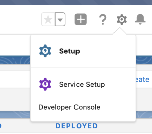

# Étape 1 sur 3 : Ajout de champs Marketo à la gestion de la relation client Veeva {#step-1-of-3-add-marketo-fields-to-veeva-crm}

>[!PREREQUISITES]
>
>Votre instance de CRM Veeva doit avoir accès aux API Salesforce pour synchroniser les données entre Marketo Engage et Veeva CRM.

Marketo Engage utilise un ensemble de champs pour capturer certains types d’informations liées au marketing. Si vous souhaitez ces données dans le CRM Veeva, veuillez suivre les instructions ci-dessous.

`1.` Créez un champ personnalisé dans le CRM Veeva sur les objets contact : Score

`2.` Vous pouvez créer des champs supplémentaires, si vous le souhaitez (voir le tableau ci-dessous).

Tous ces champs personnalisés sont facultatifs et ne sont pas nécessaires pour synchroniser Marketo Engage et Veeva CRM.

## Ajout de champs Marketo à la gestion de la relation client Veeva {#add-marketo-fields-to-veeva-crm}

Ajoutez un champ personnalisé sur les objets de piste et de contact dans le CRM Veeva répertorié ci-dessus. Si vous souhaitez en ajouter d’autres, reportez-vous au tableau des champs disponibles à la fin de cette section.

Pour ajouter le champ Score , procédez comme suit.

1. Connectez-vous au CRM Veeva et cliquez sur **[!UICONTROL Setup]**.

   

1. Cliquez sur **[!UICONTROL Objets et champs]** et sélectionnez **[!UICONTROL Gestionnaire d’objets]**.

   

1. Dans la barre de recherche, recherchez &quot;Contact&quot;.

   

1. Cliquez sur l’objet **[!UICONTROL Contact]** .

1. Sélectionnez **[!UICONTROL Champs et relations]**.

1. Cliquez sur **[!UICONTROL New]**.

   

1. Choisissez le type de champ approprié (pour Score - nombre).

   

1. Cliquez sur **[!UICONTROL Suivant]**.

   

1. Saisissez le **[!UICONTROL libellé du champ]**, la **[!UICONTROL longueur]** et le **[!UICONTROL nom du champ]** pour le champ, comme illustré dans le tableau ci-dessous.

<table>
 <tbody>
  <tr>
   <th>Intitulé de champ
   <th>Nom de champ
   <th>Type de données
   <th>Attributs de champ
  </tr>
  <tr>
   <td>Évaluation</td>
   <td>mkto71_Lead_Score</td>
   <td>Nombre</td>
   <td>Longueur 10 
Nombre de décimales 0</td>
  </tr>
 </tbody>
</table>

>[!NOTE]
>
>Veeva CRM ajoute __c aux noms de champ lorsqu’elle les utilise pour créer des noms d’API.

>[!NOTE]
>
>Les champs Texte et Nombre nécessitent une longueur, mais pas Date/Heure. Une description est facultative.

1. Cliquez sur **[!UICONTROL Suivant]**.

   

1. Spécifiez les paramètres d&#39;accès et cliquez sur **[!UICONTROL Suivant]**.

1. Définissez tous les rôles sur Visible et Lecture seule.

1. Décochez la case Lecture seule pour le profil de votre utilisateur de synchronisation :

* Si vous disposez d’un utilisateur disposant du profil d’un administrateur système comme utilisateur de synchronisation, décochez la case Lecture seule pour le profil administrateur système (comme illustré ci-dessous).
* Si vous avez créé un profil personnalisé pour l’utilisateur de synchronisation, décochez la case Lecture seule pour ce profil personnalisé.

  

1. Sélectionnez les mises en page qui doivent afficher le champ.

1. Cliquez sur **[!UICONTROL Enregistrer et nouveau]** pour revenir en arrière et créer chacun des deux autres champs personnalisés.

1. Cliquez sur **[!UICONTROL Enregistrer]** lorsque vous avez terminé avec les trois.

   

>[!NOTE]
>
>En ajoutant le champ à l’objet Contact, ils sont également ajoutés à l’objet Compte de personne.

FACULTATIF : utilisez la procédure ci-dessus pour tout champ personnalisé supplémentaire du tableau ci-dessous.

<table>
 <tbody>
  <tr>
   <th>Intitulé de champ
   <th>Nom de champ
   <th>Type de données
   <th>Attributs de champ
  </tr>
  <tr>
   <td>Ville déduite</td>
   <td>mkto71_Inferred_City</td>
   <td>Texte</td>
   <td>Longueur 255</td>
  </tr>
  <tr>
   <td>Société déduite</td>
   <td>mkto71_Inferred_Company</td>
   <td>Texte</td>
   <td>Longueur 255</td>
  </tr>
  <tr>
   <td>Pays déduit</td>
   <td>mkto71_Inferred_Country</td>
   <td>Texte</td>
   <td>Longueur 255</td>
  </tr>
  <tr>
   <td>Aire métropolitaine déduite</td>
   <td>mkto71_Inferred_Metropolitan_Area</td>
   <td>Texte</td>
   <td>Longueur 255</td>
  </tr>
  <tr>
   <td>Indicatif téléphonique local déduit</td>
   <td>mkto71_Inferred_Phone_Area_Code</td>
   <td>Texte</td>
   <td>Longueur 255</td>
  </tr>
  <tr>
   <td>Code postal déduit</td>
   <td>mkto71_Inferred_Postal_Code</td>
   <td>Texte</td>
   <td>Longueur 255</td>
  </tr>
  <tr>
   <td>Région déduite</td>
   <td>mkto71_Inferred_State_Region</td>
   <td>Texte</td>
   <td>Longueur 255</td>
  </tr>
 </tbody>
</table>

>[!NOTE]
>
>Les valeurs des champs automatiquement attribués par Marketo ne seront pas immédiatement disponibles dans le CRM Veeva lorsque le nouveau champ aura été créé. Marketo synchronisera les données avec le CRM Veeva lors de la prochaine mise à jour de l’enregistrement sur l’un ou l’autre système (c’est-à-dire une mise à jour de l’un des champs synchronisés entre Marketo et le CRM Veeva).
