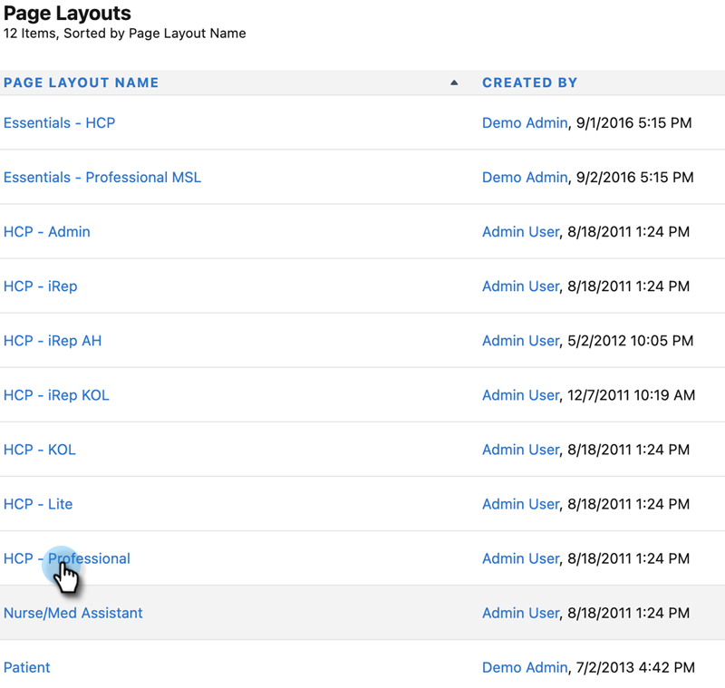
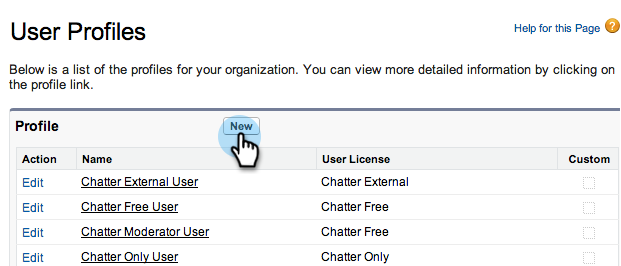
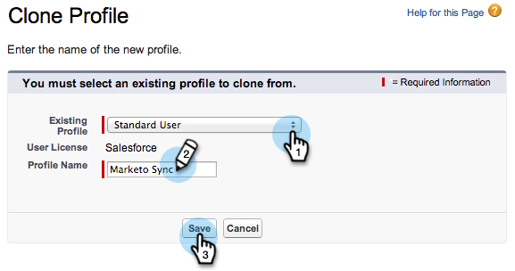
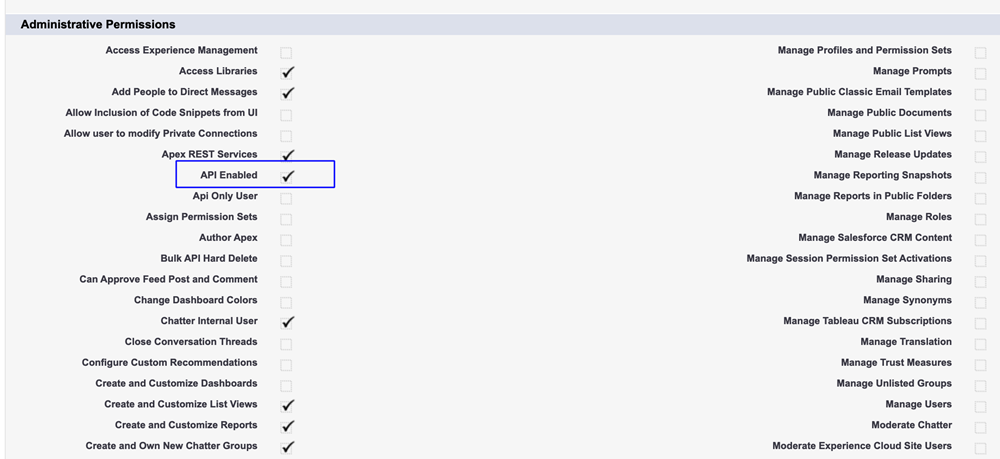

# Étape 2 sur 3 : création d’un utilisateur CRM [!DNL Veeva] pour Marketo Engage {#step-2-of-3-create-a-veeva-crm-user-for-marketo-engage}

>[!NOTE]
>
>Les étapes de cet article doivent être effectuées par un administrateur CRM [!DNL Veeva].

>[!PREREQUISITES]
>
>[Étape 1 de 3 : ajouter des champs Marketo à [!DNL Salesforce] (Professionnel)](/help/marketo/product-docs/crm-sync/veeva-crm-sync/setup/step-1-of-3-add-marketo-fields-to-veeva-crm.md){target="_blank"}

Dans cet article, vous allez personnaliser les autorisations de champ avec une mise en page CRM [!DNL Veeva] et créer un utilisateur de synchronisation CRM [!DNL Marketo-Veeva].

## Définir les mises en page {#set-page-layouts}

La procédure suivante permet à l’utilisateur de la synchronisation Marketo de mettre à jour les champs personnalisés.

1. Cliquez sur les mises en page **[!UICONTROL Compte]** (Compte de personne) dans la barre de recherche de navigation sans appuyer sur Entrée, puis cliquez sur **[!UICONTROL Mise en page]** sous [!UICONTROL Contacts].

   

1. Cliquez sur **[!UICONTROL Dispositions de page]**.

   

1. Cliquez sur **[!UICONTROL Professionnel]**.

   

1. Cliquez sur une nouvelle **[!UICONTROL Section]** et faites-la glisser dans la mise en page.

1. Saisissez « Marketo » pour **[!UICONTROL Nom de la section]** et cliquez sur **[!UICONTROL OK]**.

   

1. Cliquez sur le champ **[!UICONTROL Score]** et faites-le glisser dans la section Marketo.

   

1. Répétez l&#39;étape ci-dessus pour les champs suivants :

   * Ville déduite
   * Société déduite
   * Pays déduit
   * Aire métropolitaine déduite
   * Indicatif téléphonique local déduit
   * Code postal déduit
   * Région déduite

   >[!NOTE]
   >
   >Ces champs doivent être dans la mise en page pour que Marketo puisse les lire/écrire.

   >[!TIP]
   >
   >Créez deux colonnes pour les champs en faisant glisser vers le bas à droite de la page. Vous pouvez déplacer des champs d’un côté à l’autre pour équilibrer la longueur des colonnes.

1. Une fois la mise en page [!UICONTROL Professionnel-Professionnel] terminée, cliquez sur **[!UICONTROL Enregistrer]**.

   

>[!NOTE]
>
>Répétez cette opération pour d’autres mises en page de [!UICONTROL Compte].

## Création d’un profil {#create-a-profile}

1. Cliquez sur **[!UICONTROL Configurer]**.

   

1. Saisissez « profiles » dans la barre de recherche de navigation et cliquez sur le lien **[!UICONTROL Profils]**.

   

1. Cliquez sur **[!UICONTROL Nouveau]**.

   

1. Sélectionnez **[!UICONTROL Utilisateur standard]**, nommez le profil « [!UICONTROL Marketo-Salesforce Sync] » et cliquez sur **[!UICONTROL Enregistrer]**.

   

## Définir les autorisations de profil {#set-profile-permissions}

1. Cliquez sur **[!UICONTROL Modifier]** pour définir les autorisations de sécurité.

   

1. Dans la section [!UICONTROL Autorisations d’administration], assurez-vous que [!UICONTROL API activée] est sélectionné.

   

   >[!TIP]
   >
   >Veillez à cocher la case [!UICONTROL  Le mot de passe n’expire jamais ].

1. Dans la section [!UICONTROL  Autorisations générales des utilisateurs ], assurez-vous que les options [!UICONTROL Modifier les événements] et [!UICONTROL Modifier les tâches] sont sélectionnées.

   

1. Dans la section [!UICONTROL  Autorisations d’objet standard ], assurez-vous que les autorisations [!UICONTROL Lecture], [!UICONTROL Créer], [!UICONTROL Modifier] et [!UICONTROL Supprimer] sont cochées pour [!UICONTROL Comptes] et [!UICONTROL Contacts].

   

1. Sous la section [!UICONTROL  Autorisations d’objet personnalisé ], assurez-vous que les autorisations [!UICONTROL Lecture] sont vérifiées pour [!UICONTROL Appel], [!UICONTROL Message de clé d’appel] et tout autre objet personnalisé souhaité.

   

1. Lorsque vous avez terminé, cliquez sur **[!UICONTROL Enregistrer]** au bas de la page.

   

## Définir les autorisations de champ {#set-field-permissions}

1. Discutez avec vos spécialistes du marketing pour savoir quels champs personnalisés sont nécessaires à la synchronisation.

   >[!NOTE]
   >
   >Cette étape permet d’éviter l’affichage des champs dont vous n’avez pas besoin dans Marketo, ce qui réduit l’encombrement et accélère la synchronisation.

1. Dans la page [!UICONTROL détails du profil], accédez à la section **[!UICONTROL Sécurité au niveau du champ]**. Cliquez sur **[!UICONTROL Affichage]** pour modifier l’accessibilité des objets [!UICONTROL Contact] et [!UICONTROL Compte].

   

   >[!TIP]
   >
   >Vous pouvez configurer d’autres objets en fonction des besoins de votre entreprise.

1. Pour chaque objet, cliquez sur **[!UICONTROL Modifier]**.

   

Recherchez les champs inutiles et assurez-vous que les options [!UICONTROL Accès en lecture] et [!UICONTROL Accès en modification] sont **décochées** cochées. Cliquez sur **[!UICONTROL Enregistrer]** lorsque vous avez terminé.

>[!NOTE]
>
>Ne modifiez que l’accessibilité des champs personnalisés.

1. Une fois que vous avez désactivé tous les champs inutiles, cochez [!UICONTROL Accès en lecture] et [!UICONTROL Accès en modification] pour les champs d’objet suivants. Cliquez sur **[!UICONTROL Enregistrer]** lorsque vous avez terminé.

<table>
 <tbody>
  <tr>
   <th>Objet
   <th>Champs
  </tr>
  <tr>
   <td>Compte</td>
   <td>Champ de type</td>
  </tr>
  <tr>
   <td>Événement</td>
   <td>Tous les champs</td>
  </tr>
  <tr>
   <td>Tâche</td>
   <td>Tous les champs</td>
  </tr>
 </tbody>
</table>

## Créer un utilisateur de synchronisation {#create-sync-user}

Marketo nécessite des informations d’identification pour accéder à [!DNL Veeva] CRM. Il est préférable de le faire avec un utilisateur dédié créé avec les étapes ci-dessous.

>[!NOTE]
>
>Si votre entreprise ne dispose pas de licences CRM [!DNL Veeva] supplémentaires, vous pouvez utiliser un utilisateur ou une utilisatrice marketing existant(e) avec le profil d’administration système.

1. Saisissez « users » (utilisateurs) dans la barre de recherche de navigation, puis cliquez sur **[!UICONTROL Utilisateurs]** sous [!UICONTROL Gérer les utilisateurs].

   

1. Cliquez sur **[!UICONTROL Nouvel utilisateur]**.

   

1. Renseignez les champs obligatoires, sélectionnez l’utilisateur **[!UICONTROL Licence utilisateur]** : **[!UICONTROL Salesforce]**, définissez le **[!UICONTROL Profil]** : **[!UICONTROL Synchronisation Marketo]** Utilisateur et cliquez sur **[!UICONTROL Enregistrer]**.

   

>[!TIP]
>
>Vérifiez que l’adresse e-mail saisie est valide. Vous devrez vous connecter en tant qu’utilisateur de synchronisation pour réinitialiser le mot de passe.

Excellent ! Vous disposez désormais d’un compte que Marketo Engage peut utiliser pour se connecter à [!DNL Veeva] CRM. Faisons-le.

>[!MORELIKETHIS]
>
>[Étape 3 sur 3 : connecter Marketo et [!DNL Veeva] CRM](/help/marketo/product-docs/crm-sync/veeva-crm-sync/setup/step-3-of-3-connect-marketo-engage-and-veeva-crm.md){target="_blank"}
