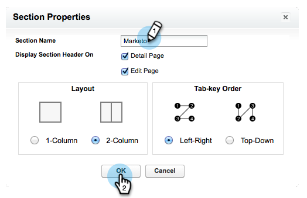

# Étape 2 sur 3 : création d’un utilisateur CRM Veeva pour Marketo Engage {#step-2-of-3-create-a-veeva-crm-user-for-marketo-engage}

>[!NOTE]
>
>Les étapes de cet article doivent être réalisées par un administrateur CRM Veeva.

>[!PREREQUISITES]
>
>[Étape 1 sur 3 : Ajout de champs Marketo à Salesforce (professionnel)](/help/marketo/product-docs/crm-sync/veeva-crm-sync/setup/step-1-of-3-add-marketo-fields-to-veeva-crm.md){target="_blank"}

Dans cet article, vous allez personnaliser les autorisations de champ avec une mise en page de page CRM Veeva et créer un utilisateur de synchronisation CRM Marketo-Veeva.

## Définition des mises en page {#set-page-layouts}

Suivez ces étapes pour permettre à l’utilisateur de synchronisation Marketo de mettre à jour les champs personnalisés.

1. Cliquez sur les dispositions de la page Compte (compte de personne) dans la barre de recherche de navigation sans appuyer sur Entrée, puis cliquez sur **[!UICONTROL Disposition de page]** sous Contacts.

   

1. Cliquez sur **[!UICONTROL Disposition de page]**.

   

1. Cliquez sur **[!UICONTROL HP - Professionnel]**.

   

1. Cliquez et faites glisser un nouveau **[!UICONTROL Section]** dans la mise en page.

1. Saisissez &quot;Marketo&quot; pour le nom de la section, puis cliquez sur **[!UICONTROL OK]**.

   

1. Cliquez sur le champ Score et faites-le glisser dans la section Marketo .

   

1. Répétez l’étape ci-dessus pour les champs suivants :

   * Ville déduite
   * Société déduite
   * Pays déduit
   * Aire métropolitaine déduite
   * Indicatif téléphonique local déduit
   * Code postal déduit
   * Région déduite

   >[!NOTE]
   >
   >Ces champs doivent être mis en page afin que Marketo puisse y lire/écrire.

   >[!TIP]
   >
   >Créez deux colonnes pour les champs en faisant glisser vers le bas à droite de la page. Vous pouvez déplacer les champs d&#39;un côté à l&#39;autre pour équilibrer la longueur des colonnes.

1. Lorsque vous avez terminé avec la mise en page professionnelle du réseau de gestion de la confidentialité, cliquez sur **[!UICONTROL Enregistrer]**.

   

   >[!NOTE]
   >
   >Répétez cette opération pour les autres mises en page de page de compte.

## Création d’un profil {#create-a-profile}

1. Cliquez sur **[!UICONTROL Configuration]**.

   

1. Saisissez &quot;profils&quot; dans la barre de recherche de navigation, puis cliquez sur le bouton **[!UICONTROL Profils]** lien.

   

1. Cliquez sur **[!UICONTROL Nouveau]**.

   

1. Sélectionnez Utilisateur standard, nommez le profil &quot;Synchronisation Marketo-Salesforce&quot; et cliquez sur **[!UICONTROL Enregistrer]**.

   

## Définition des autorisations de profil {#set-profile-permissions}

1. Cliquez sur **[!UICONTROL Modifier]** pour définir les autorisations de sécurité.

   

1. Dans la section Autorisations d’administration , assurez-vous que **[!UICONTROL API activée]** est sélectionnée.

   

   >[!TIP]
   >
   >Veillez à cocher la case Mot de passe n’expire jamais .

1. Dans la section Autorisations utilisateur générales, assurez-vous que **[!UICONTROL Modifier des événements]** et **[!UICONTROL Modifier les tâches]** sont sélectionnées.

   

1. Dans la section Autorisations d’objet standard , assurez-vous que la variable **[!UICONTROL Lecture]**, **[!UICONTROL Créer]**, **[!UICONTROL Modifier]**, et **[!UICONTROL Supprimer]** les autorisations sont vérifiées pour les comptes et les contacts.

   

1. Dans la section Autorisations d’objet personnalisé , assurez-vous que les autorisations de lecture sont vérifiées pour **[!UICONTROL Appeler]**, **[!UICONTROL Message de clé d’appel]**, ainsi que tout autre objet personnalisé de votre choix.

   

1. Lorsque vous avez terminé, cliquez sur **[!UICONTROL Enregistrer]** au bas de la page.

   

## Définition des autorisations de champ {#set-field-permissions}

1. Discutez avec vos spécialistes du marketing pour déterminer les champs personnalisés à synchroniser.

   >[!NOTE]
   >
   >Cette étape permet d’éviter que les champs dont vous n’avez pas besoin ne s’affichent dans Marketo, ce qui réduit l’encombrement et accélère la synchronisation.

1. Dans la page des détails du profil, accédez à [!UICONTROL Sécurité au niveau du champ] . Cliquez sur **[!UICONTROL Affichage]** pour modifier l’accessibilité des objets Contact et Compte .

   

   >[!TIP]
   >
   >Vous pouvez configurer d’autres objets en fonction des besoins de votre entreprise.

1. Pour chaque objet, cliquez sur **[!UICONTROL Modifier]**.

   

1. Recherchez les champs inutiles, assurez-vous que les options Lecture d’accès et Modifier l’accès sont _unchecked_. Cliquez sur **[!UICONTROL Enregistrer]** une fois terminé.

   

   >[!NOTE]
   >
   >Modifiez uniquement l’accessibilité pour les champs personnalisés.

1. Une fois tous les champs inutiles désactivés, cochez les cases Lecture de l’accès et Modification de l’accès pour les champs d’objet suivants. Cliquez sur **[!UICONTROL Enregistrer]** une fois terminé.

<table>
 <tbody>
  <tr>
   <th>Objet
   <th>Champs
  </tr>
  <tr>
   <td>Compte</td>
   <td>Champ de type</td>
  </tr>
  <tr>
   <td>Événement</td>
   <td>Tous les champs</td>
  </tr>
  <tr>
   <td>Tâche</td>
   <td>Tous les champs</td>
  </tr>
 </tbody>
</table>

## Créer un utilisateur de synchronisation {#create-sync-user}

Marketo nécessite des informations d’identification pour accéder à la gestion de la relation client de Veeva. Pour ce faire, il est préférable de créer un utilisateur dédié en suivant les étapes ci-dessous.

>[!NOTE]
>
>Si votre entreprise ne dispose d’aucune licence CRM Veeva supplémentaire, vous pouvez utiliser un utilisateur marketing existant avec le profil Administrateur système.

1. Saisissez &quot;Utilisateurs&quot; dans la barre de recherche de navigation, puis cliquez sur **[!UICONTROL Utilisateurs]** sous Gérer les utilisateurs.

   

1. Cliquez sur **[!UICONTROL Nouvel utilisateur]**.

   

1. Renseignez les champs obligatoires, sélectionnez Licence utilisateur : Salesforce, définissez Profil : utilisateur de synchronisation Marketo et cliquez sur **[!UICONTROL Enregistrer]**.

   

>[!TIP]
>
>Assurez-vous que l’adresse électronique saisie est valide. Vous devez vous connecter en tant qu’utilisateur de synchronisation pour réinitialiser le mot de passe.

Excellent ! Vous disposez à présent d’un compte que Marketo Engage peut utiliser pour se connecter à Veeva CRM. Faisons-le.

>[!MORELIKETHIS]
>
>[Étape 3 sur 3 : connexion Marketo et Veeva CRM](/help/marketo/product-docs/crm-sync/veeva-crm-sync/setup/step-3-of-3-connect-marketo-engage-and-veeva-crm.md){target="_blank"}
