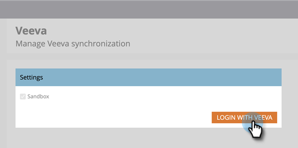

# Étape 3 sur 3 : Connexion à Marketo Engage et Veeva CRM {#step-3-of-3-connect-marketo-engage-and-veeva-crm}

Dans cet article, vous allez configurer Marketo Engage pour qu’il se synchronise avec votre instance CRM Veeva configurée. **Salesforce apparaît dans certaines fenêtres contextuelles.** car Veeva CRM est basé sur la plateforme Salesforce.

>[!PREREQUISITES]
>
>* [Étape 1 sur 3 : Ajout de champs Marketo à Veeva](/help/marketo/product-docs/crm-sync/veeva-crm-sync/setup/step-1-of-3-add-marketo-fields-to-veeva-crm.md){target="_blank"}
>* [Étape 2 sur 3 : Création d’un utilisateur Veeva pour Marketo](/help/marketo/product-docs/crm-sync/veeva-crm-sync/setup/step-2-of-3-create-a-veeva-crm-user-for-marketo-engage.md){target="_blank"}

>[!IMPORTANT]
>
>Une seule instance Marketo peut être connectée à une instance CRM Veeva à la fois.

## Connexion à Veeva CRM à l’aide d’OAuth {#connect-to-veeva-crm-using-oauth}

1. Dans Marketo, cliquez sur **Administration**. Sélectionner **CRM** et cliquez sur **Synchronisation avec Veeva**.

   

   >[!NOTE]
   >
   >Veillez à [masquer tous les champs dont vous n’avez pas besoin ;](/help/marketo/product-docs/crm-sync/salesforce-sync/sfdc-sync-details/hide-a-salesforce-field-from-the-marketo-sync.md){target="_blank"} dans Marketo à partir de l’utilisateur de synchronisation avant de cliquer sur Champs de synchronisation. Une fois que vous avez cliqué sur Synchroniser les champs, tous les champs visibles par l’utilisateur sont créés dans Marketo de manière permanente et ne peuvent pas être supprimés.

1. Cliquez sur **Connexion avec Veeva**.

   

   >[!NOTE]
   >
   >Cochez Sandbox si vous synchronisez un sandbox Marketo avec un sandbox CRM Veeva.

1. Cliquez sur **Confirmation des informations d’identification**.

   

1. Une fenêtre contextuelle contenant la page de connexion Salesforce s’affiche. Saisissez vos informations d’identification &quot;Utilisateur de synchronisation Marketo&quot;, puis cliquez sur **Connexion**.

   

1. Saisissez le code de vérification que vous avez reçu par courrier électronique (envoyé par Salesforce) et cliquez sur **Vérifier**.

   

1. Une fois la vérification effectuée, la page d’accès s’affiche pour demander l’accès. Cliquez sur **Autoriser**.

   

1. Dans quelques minutes, une fenêtre contextuelle s’affiche dans la page Marketo. Cliquez sur **Confirmation des informations d’identification**.

   

## Démarrer la synchronisation des veeva {#start-veeva-sync}

1. Cliquez sur **Démarrer la synchronisation des veeva** pour commencer la synchronisation CRM Marketo-Veeva persistante.

   

   >[!CAUTION]
   >
   >Marketo ne procède pas automatiquement à la déduplication par rapport à une synchronisation CRM Veeva, ni lorsque vous saisissez manuellement des pistes.

1. Cliquez sur **Démarrer la synchronisation**.

   

>[!NOTE]
>
>Le temps d’exécution de la synchronisation initiale varie en fonction de la taille et de la complexité de votre base de données.

## Vérifier la synchronisation {#verify-sync}

Marketo fournit des messages d’état pour la synchronisation CRM Veeva dans la zone Admin. Vous pouvez vérifier que la synchronisation fonctionne correctement en procédant comme suit.

1. Dans Marketo, cliquez sur **Administration**, puis **Veeva**.

   

1. L’état de synchronisation est visible dans le coin supérieur droit. Il affiche l’un des trois messages suivants : Dernière synchronisation, synchronisation en cours ou échec.

>[!MORELIKETHIS]
>
>[Configuration d’objets personnalisés](/help/marketo/product-docs/crm-sync/veeva-crm-sync/sync-details/custom-object-sync.md){target="_blank"}
