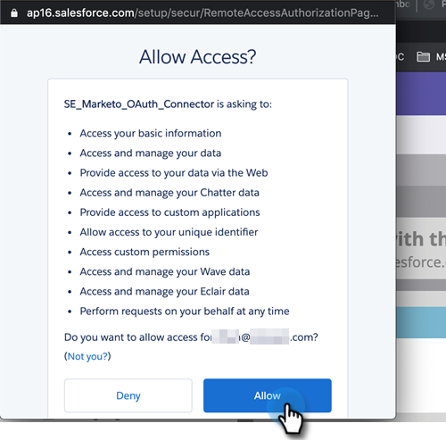

# Étape 3 sur 3 : connecter Marketo Engage et [!DNL Veeva] CRM {#step-3-of-3-connect-marketo-engage-and-veeva-crm}

Dans cet article, vous allez configurer Marketo Engage pour qu’il se synchronise avec l’instance CRM [!DNL Veeva] configurée. **Vous verrez des [!DNL Salesforce] dans certaines fenêtres pop-up** car [!DNL Veeva] CRM est créé sur la plateforme [!DNL Salesforce].

>[!PREREQUISITES]
>
>* [Étape 1 de 3 : ajouter des champs Marketo à  [!DNL Veeva]](/help/marketo/product-docs/crm-sync/veeva-crm-sync/setup/step-1-of-3-add-marketo-fields-to-veeva-crm.md){target="_blank"}
>* [Étape 2 sur 3 : création d’un  [!DNL Veeva]  utilisateur pour Marketo](/help/marketo/product-docs/crm-sync/veeva-crm-sync/setup/step-2-of-3-create-a-veeva-crm-user-for-marketo-engage.md){target="_blank"}

>[!IMPORTANT]
>
>Une seule instance Marketo peut être connectée à la fois à une instance CRM [!DNL Veeva].

## Connexion à [!DNL Veeva] CRM à l’aide d’OAuth {#connect-to-veeva-crm-using-oauth}

1. Dans Marketo, Cliquez Sur **[!UICONTROL Admin]**. Sélectionnez **[!UICONTROL CRM]** et cliquez sur **[!UICONTROL Synchroniser avec Veeva]**.

   

   >[!NOTE]
   >
   >Veillez à [masquer tous les champs dont vous n’avez pas besoin](/help/marketo/product-docs/crm-sync/salesforce-sync/sfdc-sync-details/hide-a-salesforce-field-from-the-marketo-sync.md){target="_blank"} dans Marketo pour l’utilisateur de synchronisation avant de cliquer sur Synchroniser les champs. Une fois que vous avez cliqué sur Synchroniser les champs, tous les champs que l’utilisateur peut voir seront créés définitivement dans Marketo et ne peuvent pas être supprimés.

1. Cliquez sur **[!UICONTROL Connexion avec Veeva]**.

   

   >[!NOTE]
   >
   >Cochez la case [!UICONTROL Sandbox] si vous synchronisez un sandbox Marketo avec un sandbox CRM [!DNL Veeva].

1. Cliquez sur **[!UICONTROL Confirmer les informations d’identification]**.

   

1. Un pop-up s’affiche avec la page de connexion [!DNL Salesforce]. Saisissez vos informations d’identification d’utilisateur de synchronisation Marketo, puis cliquez sur **[!UICONTROL Connexion]**.

   

1. Saisissez le code de vérification que vous avez reçu par e-mail (envoyé par [!DNL Salesforce]) et cliquez sur **[!UICONTROL Vérifier]**.

   

1. Une fois la vérification effectuée, la page d’accès s’affiche pour demander l’accès. Cliquez sur **[!UICONTROL Autoriser]**.

   

1. Dans quelques minutes, un pop-up apparaîtra dans Marketo Engae. Cliquez sur **[!UICONTROL Confirmer les informations d’identification]**.

   

## Démarrer [!DNL Veeva] synchronisation {#start-veeva-sync}

1. Cliquez sur **[!UICONTROL Démarrer la synchronisation Veeva]** pour lancer la synchronisation persistante de [!DNL Marketo-Veeva] CRM.

   

   >[!CAUTION]
   >
   >Marketo ne déduplique pas automatiquement les données par rapport à une synchronisation CRM [!DNL Veeva] ou lorsque vous saisissez manuellement des prospects.

1. Cliquez sur **[!UICONTROL Démarrer la synchronisation]**.

   

>[!NOTE]
>
>Le temps nécessaire pour terminer la synchronisation initiale varie en fonction de la taille et de la complexité de votre base de données.

## Vérifier la synchronisation {#verify-sync}

Marketo fournit des messages de statut pour la synchronisation CRM [!DNL Veeva] dans la zone Admin. Pour vérifier que la synchronisation fonctionne correctement, procédez comme suit.

1. Dans Marketo, cliquez sur **[!UICONTROL Admin]**, puis **[!UICONTROL Veeva]**.

   

1. Le statut de synchronisation est visible dans le coin supérieur droit. L’un des trois messages s’affiche : Dernière synchronisation, Synchronisation en cours ou Échec.

>[!MORELIKETHIS]
>
>[Configurer des objets personnalisés](/help/marketo/product-docs/crm-sync/veeva-crm-sync/sync-details/custom-object-sync.md){target="_blank"}
