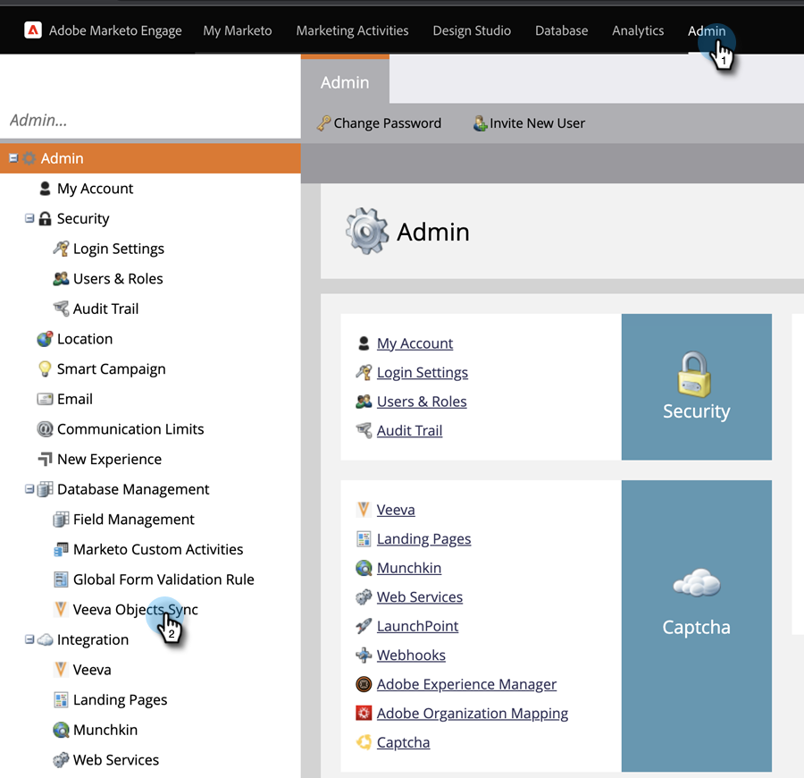

# Synchronisation d’un objet personnalisé {#custom-object-sync}

Les objets personnalisés créés dans votre instance CRM [!DNL Veeva] peuvent également faire partie de Marketo Engage. Voici comment le configurer.

>[!NOTE]
>
>**Autorisations d’administrateur requises**

>[!PREREQUISITES]
>
>Pour utiliser un objet personnalisé, il doit être associé à un objet contact ou compte dans [!DNL Veeva] CRM.

## Activer l’objet personnalisé {#enable-custom-object}

1. Dans Marketo, cliquez sur **[!UICONTROL Admin]**, puis **[!UICONTROL Synchronisation des objets Veeva]**.

   

1. S&#39;il s&#39;agit de votre premier objet personnalisé, cliquez sur **[!UICONTROL Schéma de synchronisation]**.

   

1. Cliquez sur **[!UICONTROL Désactiver la synchronisation globale]**.

   

   >[!NOTE]
   >
   >La synchronisation initiale du schéma d’objet personnalisé [!DNL Veeva] peut prendre quelques minutes.

1. Faites glisser l’objet personnalisé que vous souhaitez synchroniser dans la zone de travail.

   

   >[!NOTE]
   >
   >Les objets personnalisés doivent avoir des noms uniques. Marketo ne prend pas en charge deux objets personnalisés différents portant le même nom.

1. Cliquez sur **[!UICONTROL Activer la synchronisation]**.

   

1. Cliquez de nouveau sur **[!UICONTROL Activer la synchronisation]**.

   

1. Revenez à l’onglet **[!UICONTROL Veeva]**.

   

1. Cliquez sur **[!UICONTROL Activer la synchronisation]**.

   

1. Pour afficher tous vos [!DNL Veeva] objets personnalisés, cliquez sur **[!UICONTROL Admin]** et **[!UICONTROL Synchronisation des objets Veeva]**.

   

   >[!NOTE]
   >
   >Marketo ne prend en charge que les entités personnalisées qui sont liées à des entités standard à un ou deux niveaux de profondeur.

Excellent ! Vous pouvez désormais utiliser les données de cet objet personnalisé dans les campagnes et listes dynamiques.

>[!MORELIKETHIS]
>
>* [Synchronisation des messages d’appel et de clé d’appel](/help/marketo/product-docs/crm-sync/veeva-crm-sync/sync-details/syncing-call-and-call-key-messages.md){target="_blank"}
>* [Ajouter/supprimer un champ d’objet personnalisé en tant que liste dynamique/contraintes de déclencheur](/help/marketo/product-docs/crm-sync/veeva-crm-sync/sync-details/add-remove-custom-object-field-as-smart-list-trigger-constraints.md){target="_blank"}
