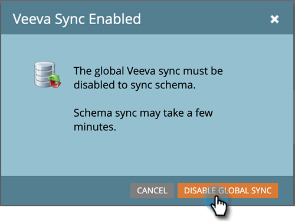
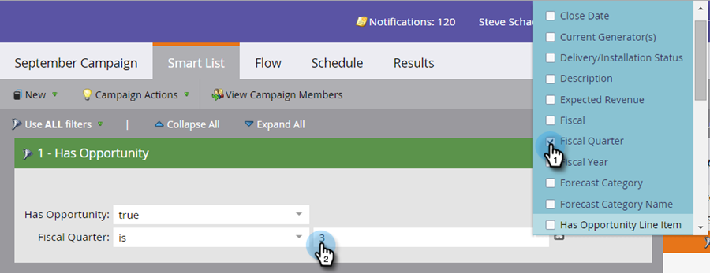

# Activer/Désactiver la synchronisation d’objets personnalisés {#enable-disable-custom-object-sync}

Les objets personnalisés créés dans votre instance CRM Veeva peuvent également faire partie de Marketo Engage. Voici comment le mettre en place.

## Activation ou désactivation de la synchronisation d’objet personnalisé {#enable-or-disable-the-custom-object-sync}

>[!NOTE]
>
>**Autorisations d’administrateur requises**

1. Dans Marketo, cliquez sur **[!UICONTROL Administration]**, puis **[!UICONTROL Synchronisation des objets Veeva]**.

   

1. S’il s’agit de votre premier objet personnalisé, cliquez sur Schéma de synchronisation. Sinon, cliquez sur **[!UICONTROL Actualiser le schéma]** pour vous assurer que vous disposez de la dernière version.

   

1. Si votre synchronisation globale est en cours d’exécution, désactivez-la en cliquant sur **[!UICONTROL Désactiver la synchronisation globale]**.

   

   >[!NOTE]
   >
   >Une synchronisation du schéma d’objet personnalisé de Veeva peut prendre quelques minutes.

1. Cliquez sur **[!UICONTROL Actualiser le schéma]**.

   

Sélectionnez l’objet que vous souhaitez synchroniser, puis cliquez sur Activer la synchronisation.

>[!TIP]
>
>Marketo ne peut synchroniser un objet personnalisé que s’il a une relation directe avec l’objet Contact ou Compte dans le CRM Veeva.

1. Cliquez sur **[!UICONTROL Activer la synchronisation]** encore une fois.

   

1. Revenez à l’onglet Veeva et cliquez sur **[!UICONTROL Activer la synchronisation]**.

   

## Utilisation des objets personnalisés {#using-your-custom-objects}

>[!NOTE]
>
>Vous ne pouvez pas utiliser d’objets personnalisés dans des campagnes intelligentes avec des déclencheurs.

1. Dans votre liste dynamique, faites glisser le pointeur de la souris sur le filtre &quot;Avec opportunité&quot; et définissez sur **[!UICONTROL True]**.

   

1. Vous pouvez éventuellement utiliser des contraintes de filtre pour limiter la cible d’action.

   

Excellent ! Vous pouvez désormais utiliser les données de cet objet personnalisé dans les campagnes dynamiques et les listes dynamiques.

>[!MORELIKETHIS]
>
>[Ajouter/Supprimer un champ d’objet personnalisé en tant que contraintes de liste/déclenchement intelligent](/help/marketo/product-docs/crm-sync/veeva-crm-sync/sync-details/add-remove-custom-object-field-as-smart-list-trigger-constraints.md){target="_blank"}
