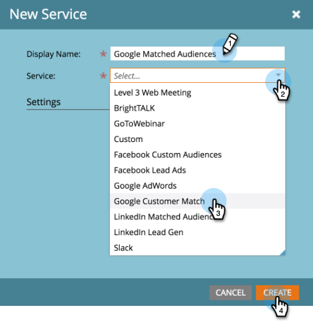

# Ajout de la correspondance client Google as a [!DNL LaunchPoint] Service {#add-google-customer-match-as-a-launchpoint-service}

Grâce à cette intégration, vous pouvez envoyer une audience Marketo à Google pour qu’elle soit ciblée à l’aide de [!DNL Google AdWords], mais aussi cibler à nouveau des audiences dans YouTube, Search et [!DNL Gmail].

>[!NOTE]
>
>**Autorisations d’administrateur requises**

1. Accédez à **[!UICONTROL Admin]**.

   

1. Cliquez sur **[!UICONTROL LaunchPoint]**.

   

1. Sélectionnez **[!UICONTROL Nouveau]** puis **[!UICONTROL Nouveau service]**.

   

1. Saisissez un **[!UICONTROL Nom d’affichage]** et sélectionnez **[!UICONTROL Correspondance client Google]** dans le menu déroulant **[!UICONTROL Service]**. Cliquez sur **[!UICONTROL Créer]**.

   

1. Pour connecter un compte [!DNL Google AdWords], cliquez sur **[!UICONTROL Autoriser]**.

   

1. Google s’ouvre dans un nouvel onglet. Connectez-vous à votre compte [!DNL Google AdWords].

   >[!CAUTION]
   >
   >Pour que Marketo envoie des audiences sur plusieurs comptes [!DNL AdWords], l’utilisateur Google autorisé dans les étapes suivantes doit avoir accès à _tous_ ces comptes.

   

1. Vérifiez les autorisations demandées, puis cliquez sur **[!UICONTROL Autoriser]**.

   

1. Votre compte [!DNL Google AdWords] est maintenant connecté à Marketo. Cliquez sur **[!UICONTROL Créer]**.

   

   Génial ! Les audiences Google Matched sont désormais répertoriées en tant que service [!DNL LaunchPoint] dans l’onglet Services installés .

>[!NOTE]
>
>L’intégration de Google Customer Match ne peut prendre en charge qu’un seul compte de responsable et tous les sous-comptes de ce compte de responsable. Plusieurs comptes de responsable ne sont pas pris en charge.
