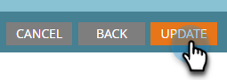

# Envoyer une liste à Google {#send-a-list-to-google}

Pour ceux qui utilisent le ciblage par correspondance des clients Google, suivez les étapes ci-dessous pour envoyer une liste statique Marketo Engage à votre compte Google.

1. Dans Marketo Engage, recherchez et sélectionnez la liste souhaitée.

   

1. Cliquez sur le menu déroulant **Liste d’actions** et sélectionnez **Envoyer au réseau publicitaire**.

   

1. Choisissez Google et cliquez sur **Suivant**.

   

1. Choisissez le compte publicitaire de votre choix. Vous pouvez choisir une audience existante ou en créer une nouvelle. Dans cet exemple, nous en créons un nouveau. Donnez un nom à votre nouvelle audience.

   

1. Effectuez vos sélections facultatives.

   

   >[!NOTE]
   >
   >* Si vous sélectionnez **Garder l’appartenance à l’audience synchronisée** la liste est actualisée au fur et à mesure qu’elle change dans votre instance. Nous ajoutons ou supprimons des personnes de l’audience lorsqu’elles sont ajoutées ou supprimées de la liste statique.
   >
   >* Si vous cochez la case en bas, le statut de consentement est ACCORDÉ pour les données utilisateur envoyées à Google Ads à des fins publicitaires et de personnalisation des annonces. Si vous ne cochez pas cette option, le statut de consentement est Non spécifié. Pour ceux qui envisagent de télécharger des données pour les utilisateurs de l’Espace économique européen (EEE), Google a établi une liste de [FAQ](https://support.google.com/google-ads/answer/14310715){target="_blank"}, ainsi que des détails supplémentaires décrivant la [politique de l’UE en matière de consentement des utilisateurs](https://www.google.com/about/company/user-consent-policy/){target="_blank"}.

1. Cliquez sur **Mettre à jour**.

   

1. Cliquez sur **OK** pour quitter.

   
