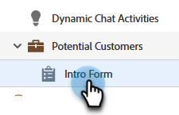
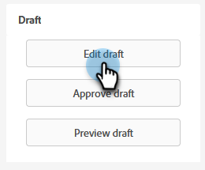

# Paramètres De Flux De Conversion Pour Marketo Engage Forms{#conversational-flow-settings-for-marketo-engage-forms}

Rendez Marketo Engage Forms conversationnel en l’intégrant aux flux de conversation des Dynamic Chat. qualifier instantanément des pistes à l’aide des données de formulaire ou de l’adhésion à une liste dynamique pour répondre aux réservations, aux liens de livres blancs ou aux objectifs personnalisés.

>[!PREREQUISITES]
>
>AJOUTER LE PRÉREQ ICI

>[!AVAILABILITY]
>
>Un membre de la liste dynamique ou un membre de la liste nécessite Dynamic Chat.

1. Recherchez et sélectionnez votre formulaire (ou créez-en un).

   

1. Cliquez sur **Modifier le brouillon**.

   

1. Sur la page de modification du formulaire, cliquez sur **Paramètres de formulaire**, puis **Paramètres**.

   

1. Cliquez sur le bouton **Paramètres de flux de conversation** curseur à activer.

   

1. Un modal Choix par défaut s’affiche. Sélectionnez vos préférences. Dans cet exemple, nous choisissons **Utiliser le flux de conversation**.

   

1. Sélectionnez le flux de conversation et le type de diffusion de votre choix.

   

   >[!NOTE]
   >
   >[En savoir plus sur les flux de conversation](/help/marketo/product-docs/demand-generation/dynamic-chat-two/automated-chat/conversational-flows-overview.md){target="_blank"}

   **ÉTAPE FACULTATIVE**: vous pouvez cliquer sur Ajouter un choix pour cibler les visiteurs du chat qui répondent à un critère spécifique.

   

   >[!IMPORTANT]
   >
   >Le navigateur du visiteur doit être une personne connue en tant que cookie avant l’envoi du formulaire pour être admissible comme membre de la liste statique/dynamique.

1. Cliquez sur **Terminer** une fois terminé.

   
