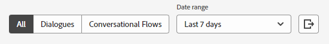

# Analytics {#analytics}

Bien que la création de rapports soit disponible au niveau de la boîte de dialogue, vérifiez l’engagement global à l’aide des trois tableaux de bord ci-dessous.

Accéder à chaque tableau de bord sous **Analytics** dans le volet de navigation de gauche.

## Tableau de bord des performances globales {#global-performance-dashboard}

Découvrez les performances de vos boîtes de dialogue, notamment les mesures d’engagement et de performance (total et sur une période), les pages les plus performantes et les boîtes de dialogue les plus performantes.

Afficher les boîtes de dialogue, les flux de conversation, etc. Tri par visiteurs connus, visiteurs inconnus ou les deux. Sélectionnez un paramètre prédéfini ou une période personnalisée. Exportez vos résultats en cliquant sur un bouton.

## Tableau de bord des performances des réunions {#meeting-performance-dashboard}

Voyez combien de réunions sont réservées et avec qui elles sont réservées.

Afficher les boîtes de dialogue, les flux de conversation, etc. Sélectionnez un paramètre prédéfini ou une période personnalisée. Exportez vos résultats en cliquant sur un bouton.

## Tableau de bord des performances de la messagerie instantanée {#live-chat-performance-dashboard}

Vérifiez combien de conversations ont eu vos agents de vente en direct et quelles équipes ont obtenu les meilleurs résultats.

Afficher les boîtes de dialogue, les flux de conversation, etc. Sélectionnez un paramètre prédéfini ou une période personnalisée. Exportez vos résultats en cliquant sur un bouton.

## Définitions {#definitions}

<table>
<thead>
<tbody>
  <tr>
    <td style="width:25%"><b>Terminé</b></td>
    <td>Un événement terminé se produit lorsqu’un visiteur atteint la dernière invite d’une conversation. <i>ou</i> lorsqu’un visiteur épuise tout le contenu d’une conversation.
     Un événement terminé par visiteur, par session.</td>
  </tr>
  <tr>
    <td style="width:25%"><b>Personnes acquises</b></td>
    <td>Se produit lorsqu’un visiteur envoie son adresse électronique.
     Une acquisition par visiteur, par session.</td>
  </tr>
</tbody>
</table>
