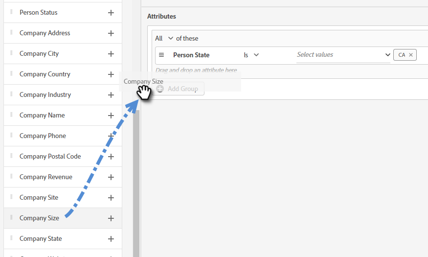
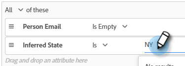
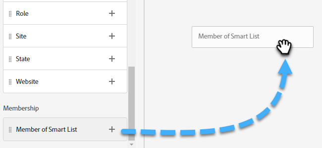

# Critère d’audience {#audience-criteria}

Tout comme les listes dynamiques Marketo Engage, les attributs des critères d’audience vous permettent de définir votre audience cible. Vous pouvez cibler des personnes connues ou inconnues à l’aide d’attributs déduits, de personne ou d’entreprise (ou d’une combinaison de ces attributs).

## Priorité {#priority}

La priorité détermine la boîte de dialogue qu’un prospect reçoit s’il répond aux critères de plusieurs d’entre elles. Il est établi lorsque vous [créez votre boîte de dialogue](/help/marketo/product-docs/demand-generation/dynamic-chat/automated-chat/create-a-dialogue.md){target="_blank"} pour la première fois. Vous pouvez modifier la priorité d’une boîte de dialogue existante en l’ouvrant et en accédant à **[!UICONTROL Détails de la boîte de dialogue]** dans l’onglet Critères d’audience.

## Événements {#events}

Les événements vous permettent de cibler les visiteurs et visiteuses en fonction de leur niveau de défilement ou de leur durée de présence sur votre page ou site. Dans l’exemple ci-dessous, nous ciblons les visiteurs et visiteuses qui se trouvent sur une page spécifique depuis plus de 20 secondes.

1. Saisissez l’événement **[!UICONTROL Temps passé sur la page]** et faites-le glisser vers la droite.

   

1. Définissez l’heure « [!UICONTROL  supérieure à ] » sur 20 secondes.

   

1. Ajoutez l’URL de la page souhaitée dans la section [[!UICONTROL Target]](#target).

   

## Attributs {#attributes}

**Personnes connues**

Vous pouvez choisir parmi de _nombreuses_ combinaisons d’attributs. Dans l&#39;exemple ci-dessous, nous ciblons toutes les personnes connues en Californie qui travaillent dans une entreprise de plus de 50 employés.

1. Saisissez l’attribut **[!UICONTROL État de la personne]** et faites-le glisser vers la droite.

   

1. _[!UICONTROL Est]_ est défini par défaut. Dans le champ Sélectionner des valeurs , saisissez dans l’autorité de certification (vous pouvez également cliquer sur la liste déroulante et effectuer une sélection dans la liste).

   

1. Saisissez l’attribut **[!UICONTROL Taille de l’entreprise]** et faites-le glisser à l’emplacement indiqué _faites glisser un attribut ici_.

   

   >[!NOTE]
   >
   >Vous pouvez également choisir un attribut en cliquant sur son icône **+**.

1. Cliquez sur la liste déroulante des opérateurs et sélectionnez **[!UICONTROL Supérieur à]**.

   

1. Tapez 50 et cliquez ailleurs sur l&#39;écran pour enregistrer.

   

Et c&#39;est tout !

**Personnes anonymes**

Il existe un moyen facile de cibler spécifiquement les personnes qui ne figurent pas encore dans votre base de données. Dans cet exemple, nous ciblons toutes les personnes anonymes situées dans la région de New York.

1. Saisissez l’attribut **[!UICONTROL E-mail de la personne]** et faites-le glisser vers la droite.

   

1. Cliquez sur la liste déroulante des opérateurs et sélectionnez **[!UICONTROL Est vide]**.

   

1. Saisissez l’attribut **[!UICONTROL État déduit]** et faites-le glisser à l’emplacement indiqué _faites glisser un attribut ici_.

   

   >[!NOTE]
   >
   >Lorsqu&#39;une personne visite votre site web, [Munchkin](/help/marketo/product-docs/administration/additional-integrations/add-munchkin-tracking-code-to-your-website.md){target="_blank"} crée un cookie et le place dans le système. Nous recherchons leur IP dans une base de données spéciale et déduisons toutes sortes de bonnes informations.

1. _[!UICONTROL Est]_ est défini par défaut. Dans le champ Sélectionner des valeurs , saisissez NY (vous pouvez également cliquer sur la liste déroulante et effectuer une sélection dans la liste).

   

## Adhésion {#membership}

Utilisez les listes dynamiques Marketo Engage pour l’audience cible de votre boîte de dialogue.

>[!AVAILABILITY]
>
>Le membre de la liste dynamique ou le membre des critères de liste nécessite Dynamic Chat Prime. Pour plus d’informations, contactez l’équipe du compte Adobe (votre gestionnaire de compte).

1. Sous Abonnement, accédez à **[!UICONTROL Membre de la liste dynamique]** et déposez-la sur la zone de travail.

   

1. Sélectionnez la liste dynamique de votre choix.

   

## Ajouter des groupes {#add-groups}

Vous avez également la possibilité de regrouper les attributs si vous souhaitez que certains attributs soient associés à « tout ou partie » d’un autre. Vous pouvez ajouter plusieurs groupes.

## Cible {#target}

C’est là que vous saisissez la ou les URL pour lesquelles vous souhaitez afficher une boîte de dialogue spécifique. Vous pouvez également ajouter des exclusions.

Formats acceptables :

* `http://website.com`
* `https://*.website.com`
* `http://website.com/folder/*`
* `https://*.website.com/folder/*`

>[!NOTE]
>
>* L’utilisation d’un astérisque agit comme un caractère générique fourre-tout. Ainsi, `https://*.website.com` placez la boîte de dialogue sur chaque page du site, y compris les sous-domaines (par exemple : `support.website.com`). De plus, `https://website.com/folder/*` placerait la boîte de dialogue sur chaque page HTML dans le dossier suivant (par exemple, dans ce cas, disons que le dossier est « sports », donc : website.com/sports/baseball.html, website.com/sports/football.html, etc.).
>
>* Les paramètres d’URL ne sont pas pris en charge pour le moment.

**Exclusions**

Utilisez des exclusions pour vous assurer que votre boîte de dialogue n’apparaît _pas_ sur une page ou une zone spécifique de votre site. Les exclusions suivent le même format que les inclusions.

>[!MORELIKETHIS]
>
>* [Créer une boîte de dialogue](/help/marketo/product-docs/demand-generation/dynamic-chat/automated-chat/create-a-dialogue.md){target="_blank"}
>* [Stream Designer](/help/marketo/product-docs/demand-generation/dynamic-chat/automated-chat/stream-designer.md){target="_blank"}
