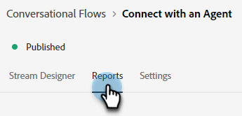
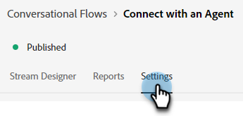

# Aperçu du flux de conversation {#conversational-flow-overview}

Concevez un flux de conversation et déclenchez-le pour n’importe quel visiteur en fonction d’une action spécifique (par exemple, en cliquant sur un bouton d’appel à l’action, au chargement de la page, au temps passé sur la page, etc.).

## Dialogues et flux de conversation {#dialogues-vs-conversational-flows}

Bien que les dialogues et les flux de conversation présentent plusieurs similitudes, il s’agit de deux caractéristiques distinctes.

<table> 
 <tbody> 
  <tr> 
   <th style="width:50%">Dialogues</th> 
   <th style="width:50%">Flux conversationnels</th>
  </tr> 
  <tr> 
   <td>Les boîtes de dialogue sont ciblées : vous concevez une conversation pour une page et une audience spécifiques en fonction des paramètres que vous avez implémentés.</td> 
   <td>Les flux de conversation sont déclenchés : vous concevez une conversation qui peut être déclenchée en fonction de l’action d’un visiteur, comme remplir un formulaire, cliquer sur un lien, etc.</td>
  </tr>
   <tr> 
   <td>Uniquement prise en charge dans l’interface de Chatbot.</td> 
   <td>Actuellement pris en charge dans une interface contextuelle, avec d’autres interfaces planifiées.</td>
  </tr>
  </tr>
   <tr> 
   <td>Plusieurs boîtes de dialogue peuvent être créées pour le même segment de pistes, avec un ordre de priorité afin que chaque visiteur voie le dialogue par ordre de priorité lorsqu’il continue à s’engager.</td> 
   <td>Les flux de conversation n’ont pas d’ordre de priorité et peuvent être déclenchés un nombre indéfini de fois par la même piste en fonction de l’appel à l’action déterminé.</td>
  </tr>
  <tr>
   <td>Les conversations sur les chatbots sont alimentées par des dialogues.</td>
   <td><a href="/help/marketo/product-docs/demand-generation/dynamic-chat/automated-chat/conversational-flow-settings-for-marketo-engage-forms.md" target="_blank">Conversational Forms</a> en Marketo Engage est alimenté par des flux de conversation.</td>
  </tr>
 </tbody> 
</table>

## Onglet Diffusion Designer {#stream-designer-tab}

Le Stream Designer for Conversational Flows est presque identique à celui des Dialogues. [Découvrez-en plus ici](/help/marketo/product-docs/demand-generation/dynamic-chat/automated-chat/stream-designer.md){target="_blank"}.

## Onglet Rapports {#reports-tab}

L’onglet Rapports vous permet de voir les mesures relatives aux performances de votre flux de conversation.

Afficher le taux d’engagement, le taux de conversion, filtrer par visiteurs connus et/ou inconnus, etc.

## Onglet Paramètres {#settings-tab}

Dans la partie supérieure de l’onglet Paramètres, vous pouvez mettre à jour le nom du flux de conversation, ajouter une description facultative et modifier la langue.

>[!NOTE]
>
>La sélection d’une autre langue modifie uniquement la langue du texte du système. Vous êtes responsable de la traduction du contenu.

### SDK Conversations {#conversations-sdk}

Dans la moitié inférieure de l’onglet Paramètres , personnalisez le déclencheur Conversation, également appelé SDK Conversations . Vous pouvez décider si la conversation est déclenchée sur votre site web lorsqu’un visiteur clique sur un lien ou au chargement de la page.

>[!TIP]
>
>Voir [Conversations SDK](https://experienceleague.adobe.com/tools/marketo-dynamic-chatbot/conversations-sdk/){target="_blank"} en action !

>[!MORELIKETHIS]
>
>[Créer un flux de conversation](/help/marketo/product-docs/demand-generation/dynamic-chat/automated-chat/create-a-conversational-flow.md){target="_blank"}
